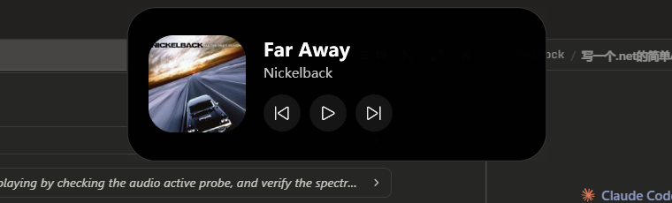

# IslandX

Windows 平台的「流体云」灵动岛 —— 屏幕顶部一枚近黑色胶囊，随系统事件在**灵动点 → 收起胶囊 → 展开卡片**之间弹性形变，承载媒体播放等实时活动。



**下载**：[Releases](../../releases) 里有打包好的单文件 `IslandX.exe`，
目标机器**不需要安装 .NET 运行时**，下载直接双击即可。

**运行要求**：Windows 10 1809+ 或 Windows 11，x64。
自己编译则另需 .NET 10 SDK —— 见「[快速开始](#快速开始)」。

> 每一处取舍的理由见 [docs/DESIGN.md](docs/DESIGN.md)，
> 按时间顺序的实施记录（含踩过的坑）见 [docs/PLAN.md](docs/PLAN.md)。

---

## 当前状态

计划中的 M0（骨架）～ M4（流体桥）与 M7（打包）已完成，
媒体 / 歌词 / 天气 / 电源 / 音量 / 剪贴板 / Phira 七路 Provider 在跑。
剩下的 M5 增量（蓝牙、网络、文件传输、计时器）见下表。

| 能力 | 状态 |
|---|---|
| 透明置顶悬浮窗（不抢焦点 / 不进 Alt+Tab / 不占任务栏） | ✅ |
| 弹簧形变引擎（三态互切） | ✅ |
| **过冲与错峰**（宽高各自的弹性不同步，形变中途出现挤压/拉伸形态） | ✅ |
| **G3 连续曲率圆角**（squircle，非普通圆弧圆角） | ✅ |
| **宽度随内容自适应**（收起态与展开态都按实测文本宽度撑开） | ✅ |
| **切歌交叉淡化**（旧内容淡出上移 / 新内容淡入就位，约 180ms） | ✅ |
| 系统媒体播放（标题 / 艺人 / 封面 / 播放控制） | ✅ |
| 收起态封面缩略图（无封面时回落为字形图标） | ✅ |
| 封面主色提取（色相直方图取主导色，用于频谱条着色） | ✅ |
| 活动优先级仲裁（媒体压过时钟） | ✅ |
| **媒体会话选取**（同一播放器挂多个会话时挑信息量最大的那个） | ✅ |
| 进度条 | ✅（取决于播放器是否上报时长，见「已知限制」） |
| **鼠标穿透**（仅岛体轮廓与感应区接收点击，其余让给下方窗口） | ✅ |
| 全屏游戏自动让位 / 置顶权巡检 / 多分辨率重定位 | ✅ |
| 全局热键（含被占用时自动回退） | ✅ |
| 托盘驻留与退出 | ✅ |
| **频谱条**（收起态右侧 6 根竖条，1024 点 FFT 分 6 段） | ✅ |
| **随音乐律动**（WASAPI 环回采集驱动频谱条） | ✅ |
| **瞬时活动**（浮现几秒自动退场，仲裁器统一计时） | ✅ |
| **电源**（插拔充电器、低电量分档提醒） | ✅ |
| **音量**（WASAPI 端点回调，键盘/合成器/程序调节都能捕获） | ✅ |
| **剪贴板 / 截图**（图片带缩略图，文本带预览，文件带名字） | ✅ |
| **配置持久化 + 开机自启 + Provider 逐项开关 + 自定义热键** | ✅ |
| **设置窗口**（全部选项可视化，含热键录入与「按一下试试」验证） | ✅ |
| **右键视图工具栏**（临时把岛体切到降水 / 电量 / 时间等，指针离开即还原） | ✅ |
| **双活动并列 + 流体桥接（Split）** | ✅ M4 |
| **逐句歌词**（可开关，默认关闭；需联网） | ✅ |
| **歌词换行动画**（模糊进出 + 位移过冲，宽度随每句伸缩） | ✅ |
| **外语歌自动显示翻译**（双行 / 只译文 / 只原文三选一） | ✅ |
| **降水提醒**（系统定位 + 分钟级预报 + 柱状图，可开关，默认关闭） | ✅ |
| **气象灾害预警**（中国气象局，无需 API key，按行政区筛本地） | ✅ |
| **Phira 成绩提醒**（单方面联动，读本地存档，不联网，默认关闭） | ✅ |
| 蓝牙 / 网络 / 文件传输 / 计时器 Provider | ⬜ M5 |

**实测数据**（本机 2560×1600 @ 240Hz，.NET 10 Release）

- 展开形变：宽度 160ms / 高度 231ms 走完 95%，之后回弹收敛；切歌转场约 180ms
- 形变期间：**快段约 200fps（WPF 分层窗口的呈现上限）**，亚像素回弹尾段自动降到约 55fps；
  纯形变单核 **19.3%**，形变与频谱律动同时进行 **20.1%**，静止后归零
- 静止：**约 0.3% 单核**（弹簧全部静止即摘除渲染回调）；静止 + 频谱律动约 3.4%
- 频谱律动：**约 34fps / 单核 3.4%**（几何零重建，只改竖条高度）
- 几何构建：0.02ms/帧（G3 轮廓，StreamGeometry）
- 内存：约 160 MB

## 快速开始

**只想用**：去 [Releases](../../releases) 下载 `IslandX.exe`，双击运行，不需要装任何东西。

**要自己编译**：需要 .NET 10 SDK（x64）与 Windows 10 1809+ / Windows 11。

```powershell
dotnet build IslandX.slnx -c Release
.\src\IslandX.App\bin\Release\net10.0-windows10.0.19041.0\win-x64\IslandX.exe
```

启动后岛体出现在屏幕顶部居中。放一首歌，它会自动显示当前曲目；没有媒体时回落为时钟。

要拷给别人用就打包成**单文件**（目标机器不需要装 .NET）：

```powershell
.\tools\pack.ps1              # 189MB，常驻内存 182MB
.\tools\pack.ps1 -Compress    # 78MB，常驻内存 341MB
```

产物是 `dist\IslandX.exe` 一个文件。两者的权衡见「打包」一节。

## 交互

| 操作 | 行为 |
|---|---|
| 悬停岛体 | peek，胶囊轻微放大 |
| 单击岛体 | 展开 / 收起 |
| **右键岛体** | **弹出视图工具栏**：临时切到 正在播放 / 降水 / 时间 / 电量 / Phira，指针离开即还原 |
| 鼠标离开展开态 | 2.5s 宽限期后自动收起 |
| `Ctrl+Alt+I` | 展开 / 收起 |
| `Ctrl+Alt+D` | 切换灵动点模式（细横条，不干扰） |
| 托盘左键 | 展开 / 收起 |
| 托盘右键 | 菜单：热键提示、频谱律动、**显示歌词**、**歌词翻译**、**降水提醒**、**Phira 成绩提醒**、**显示哪些事件**、**开机自启**、**设置…** |

## 默认关闭的三项

代价写在开关标题上，不默认替你决定：

| 开关 | 代价 |
|---|---|
| 显示逐句歌词 | 会把**曲目名**发到 music.163.com 换歌词。关掉之后不会有任何请求发往第三方；缓存只在内存里，退出即消失，不落盘 |
| 降水提醒与气象预警 | 要**系统定位 + 联网**。坐标发出前降到 2 位小数（约 1km）—— 天气只需要城市级精度 |
| Phira 成绩提醒 | 读 Phira 的本地存档 `data/data.json`。**只解析曲目与成绩，存档里的账号与登录凭据一律不读**，全程本地不联网 |

存档里的 token 本可以拿去调 Phira 的云端 API 拉排行，**没有这么做**，
也不打算在没有明确同意的前提下这么做。


## 诊断日志

查"UI 卡住"类问题用的。默认不开，`ISLANDX_DIAG=1` 打开，或者直接：

```powershell
pwsh -File tools\diag.ps1            # 启动并开日志（-Release 用发布版）
pwsh -File tools\diag.ps1 -Show      # 打印日志
pwsh -File tools\diag.ps1 -Stop      # 停掉
```

日志在 `%APPDATA%\IslandX\diag.log`，每次启动截断重写 —— 手动复现时只关心这一次。

两个设计点都是被"卡死不是崩溃"这件事逼出来的：

- **每写一行就落盘**（`AutoFlush`）。进程还活着，带缓冲的话卡住那一刻缓冲区里的内容
  永远看不到，而那几行恰恰最关键。代价是每行一次系统调用，所以只在右键这条路径上记，
  不在每帧的渲染回调里记。日志的**最后一行**就是"卡在哪之前"。
- **另起一个线程当看门狗**：每 500ms 向 UI 线程投一个 `DispatcherPriority.Send`
  的空活儿，2 秒内没回话就往日志里写"UI 线程无响应"，之后每秒一行，恢复时再写一条。
  UI 线程卡住时它自己报告不了这件事，只有别的线程能。
  用 `Send` 优先级是为了区分**忙**和**卡** —— 只是忙的话它照样插得进去。

还挂了三个未处理异常钩子（UI / 后台线程 / 未观察的 Task）。它们**只记不吞**。

第一次跑起来就抓到了 —— 右键那一下抛 `InvalidOperationException`，
栈里直接指到 `HighlightRange` 的哪一行（见「一个视图坏掉，不该赔上整个应用」）。
在此之前我按"卡死"的思路查了半天锁竞争，方向是错的。

---

## 打包

`tools\pack.ps1` 产出**一个 exe**，目标机器不需要安装 .NET 运行时。

实测四种方案（本机，从进程创建到岛体窗口出现）：

| 方案 | 体积 | 文件数 | 到窗口 | 工作集 | 私有内存 |
|---|---|---|---|---|---|
| 框架依赖（需装 .NET） | 24.5MB | 6 | 0.60s | 177MB | 116MB |
| **单文件，不压缩**（默认） | **189.2MB** | **1** | **0.58s** | **182MB** | **116MB** |
| 单文件，压缩（`-Compress`） | 77.9MB | 1 | 0.74s | 341MB | 202MB |
| 单文件 + ReadyToRun | 94.5MB | 1 | 0.94s | 322MB | 233MB |

**默认不压缩，这是刻意的。** 压缩把体积砍掉 111MB，代价是**常驻内存翻倍**
（182 → 341MB）：压缩的单文件启动时要把程序集解压到内存并常驻，
不压缩的则能直接内存映射、按需分页。对一个开机就挂着的常驻小工具，
天天多占 160MB 去换一次性省下的 111MB 下载量，不划算。要小体积就加 `-Compress`。

**ReadyToRun 三项全输** —— 体积 +17MB、内存 +120MB，启动反而慢 0.2s。
它的收益本来是省去 JIT，但在这里被"更大的镜像要解压更多"抵消了，没有采用。

两个必须做对的开关：

- `IncludeNativeLibrariesForSelfExtract=true` —— 不开的话 WPF 的 5 个原生 DLL
  （`wpfgfx` / `D3DCompiler_47` / `PresentationNative` / `PenImc` / `vcruntime140`，共 8MB）
  会留在 exe 旁边，那就不是单文件了。开了之后首次启动会解压到 `%TEMP%\.net\IslandX\`。
- `--self-contained true` —— 项目里 `SelfContained` 默认是 `false`，命令行覆盖它。

> **裁剪（`PublishTrimmed`）不可行**，不是"没做"而是**做不了**：
> SDK 直接拒绝构建（`NETSDK1175`，WinForms/WPF 不支持剪裁）。
> 这条曾经写在 M7 计划里当作压内存的手段，实测后证伪 —— 那条计划基于错误假设。

验证方式是把单个 exe 拷到一个与源码无关的临时目录运行，确认它不依赖旁边任何文件。
WinRT 是这里最大的风险点（媒体会话与系统定位都走它），单独验过：
把 `WeatherProbe` 也打成单文件，定位权限、坐标、22 项判据自检全部正常。

---

## 代码结构

```
src/IslandX.App/
├─ Contracts/IslandActivity.cs     活动模型 + Provider 接口（架构枢纽）
├─ Contracts/ActivitySet.cs       常驻 + 瞬时两路活动（Split 的数据结构）
├─ Core/Hotkey.cs                  热键文本 ↔ RegisterHotKey 参数
├─ Core/SpringValue.cs             弹簧求解器（含超调/到位耗时统计）
├─ Core/ActivityScheduler.cs       优先级仲裁 + 瞬时活动统一计时
├─ Core/AppConfig.cs               配置持久化（%APPDATA%\IslandX\config.json）
├─ Core/SettingsBridge.cs          设置的统一接线面（托盘与设置窗口共用同一个对象）
├─ Core/MediaSessionPick.cs        多媒体会话时挑哪个（纯函数，有自检）
├─ Settings/SettingsWindow.xaml    设置窗口（六节一页，即时生效）
├─ Settings/SettingsWindowHost.cs  设置窗口的单例入口（不开出第二个）
├─ Core/AutoStart.cs               开机自启（HKCU\...\Run）
├─ Core/Lyrics.cs                  LRC 解析 + 原文/译文配对 + 三种显示模式（纯函数，有自检）
├─ Core/ChineseText.cs             繁体 → 简体（LCMapStringEx），给 Spotify 的繁体元数据兜底
├─ Core/Weather.cs                 降水预报解析 + 「要不要提醒」判据（纯函数，有自检）
├─ Core/GeoLocation.cs             系统定位 + 手填坐标回落 + 发出前降精度
├─ Core/PhiraRecords.cs            Phira 存档解析 + 「哪条算刷新」判据（纯函数，有自检）
├─ Core/LyricsService.cs           歌词获取（ID 精确 / 标题搜索两路，一次带回原文与译文；默认不启用）
├─ Rendering/Squircle.cs           G3 连续曲率圆角
├─ Rendering/LyricLayer.cs         歌词单层自绘（水平方向模糊，BlurEffect 做不到）
├─ Rendering/MiniChart.cs          展开态的迷你柱状图（天气用它画降水预报）
├─ Rendering/FluidBridge.cs        两个胶囊的平滑并集（metaball，暂未启用，留给 Merged）
├─ Rendering/IslandShape.cs        岛体自绘元素（绕开布局系统）
├─ Rendering/SpectrumBars.cs       频谱竖条（同样自绘，每帧改高度不走布局）
├─ Core/AudioPulse.cs              WASAPI 环回采集 + FFT 分频段
├─ Interop/AudioInterop.cs         WASAPI 的最小 COM 定义（环回采集 + 端点音量）
├─ Providers/MediaSessionProvider  WinRT 全局媒体会话（GSMTC）
├─ Providers/ArtworkColor.cs       封面主色提取（HSL 空间提饱和度），用于频谱条着色
├─ Providers/ClockProvider.cs      兜底时钟活动
├─ Providers/PowerProvider.cs      插拔充电器与低电量（SystemEvents + GetSystemPowerStatus）
├─ Providers/VolumeProvider.cs     系统音量（IAudioEndpointVolume 回调，非轮询）
├─ Providers/ClipboardProvider.cs  剪贴板 / 截图（AddClipboardFormatListener）
├─ Providers/WeatherProvider.cs    降水提醒与气象预警（默认关闭，需定位 + 联网）
├─ Providers/PhiraProvider.cs      Phira 成绩提醒（默认关闭，读本地存档，不联网）
├─ IslandToolbar.cs                岛体右键视图工具栏（IslandWindow 的 partial）
├─ Core/IslandView.cs              工具栏里的一个视图（图标 + 钉哪个 Provider + 怎么合成）
├─ Interop/                        Win32 悬浮窗改造、全屏检测、热键、电源、剪贴板
├─ Tray/TrayIconHost.cs            托盘（图标运行时绘制，无外部资源）
├─ Tray/TrayOptions.cs             托盘接线参数
└─ IslandWindow.xaml[.cs]          岛体渲染与状态机

tools/MediaProbe/                  独立 GSMTC 探针，见下文
tools/BridgeViz/                   流体桥几何验证台，见下文
tools/ShotBurst/                   动画连拍器（在动画起点起拍 + 自动拼对照图），见下文
tools/WeatherProbe/                天气链路探针 + 判据自检 + 字形对照表，见下文
tools/hit-probe.ps1                鼠标穿透验证（坐标先自校验再测量）
tools/probe.ps1                    读一次探针标题（-Field 只取某一段）
tools/win-shot.ps1                 把某个窗口强制置顶 / 滚动 / 点击，便于截图验证
tools/click.ps1                    延迟后点一下左键（配合 ShotBurst --burst 拍动画）
tools/pack.ps1                     打包成单文件（见「打包」一节）
```

所有系统事件都归一化为 `IslandActivity`，Provider 只把系统状态翻译成活动流、完全不碰 UI。
**加新功能 = 加一个 Provider**，不需要改渲染层 ——
电源、音量、剪贴板三个是这句话的实测：加它们没有改动渲染层的任何一行，
只在 `IslandActivity` 上补了一个 `AutoDismissAfter` 字段。

## 已知限制

1. **媒体进度取决于播放器**。不少播放器（网络电台、部分国产客户端）完全不上报 timeline，
   GSMTC 返回全零且 `LastUpdatedTime` 停在 FILETIME 纪元。此时进度条会正确隐藏，而不是显示假进度。
   网易云原生 SMTC 即属这种情况，装 [InfLink](https://github.com/apoint123/inflink-rs) 插件后
   才有真实进度（详见 [DESIGN.md](docs/DESIGN.md) 的「歌词」一节，那里也记着一次版本失配踩坑）。
   歌词在无 timeline 时回落到内置计时器，代价是拖动进度条后会错位。
2. **内存约 176MB**（开歌词 +10MB），高于计划中 <120MB 的目标。
   主要是 WPF + WinRT 投影的基线开销。
   原计划靠"自包含裁剪 / ReadyToRun"来压，**实测两条都不成立**：
   裁剪被 SDK 拒绝（WPF/WinForms 不支持），ReadyToRun 反而让内存涨了 120MB。
   见「打包」一节。真要压下来只能减少 WPF 依赖本身。

3. **形变最高约 200fps，到不了 240**。WPF 分层窗口的呈现路径每帧固定 ~5ms
   （逐项对照证明不在我们的代码里），这是硬上限；要跑满 240Hz 只能换渲染后端
   （DirectComposition + SDF 着色器，M6）。形变期单核约 19%（预算 25% 之内），
   持续约 650ms，静止后归零。偶发 20–30ms 长帧（Gen0 为 0，非 GC，
   应为系统调度与 DWM 合成抖动）同样归 M6。
   在意功耗可把 `MorphTargetFps` 从 240 降回 120（快段 ~105fps，CPU ~17%），
   改一个常量即可，尚未做成设置项。
   **Vulkan 不适合这个场景**：其 WSI 的 swapchain 不支持 per-pixel alpha 参与桌面合成，
   透明窗口必须经 DirectComposition，而 DComp 只接受 D3D surface。
4. **多显示器只锚定主屏**，跟随鼠标所在屏的策略在 M5。
5. **Esc 收起未实现**。窗口带 `WS_EX_NOACTIVATE`，不获得焦点因而收不到键盘事件；
   请用热键或点击收起。
6. **热键极易被占用**。本机 `Ctrl+Alt+D` 与回退项 `Ctrl+Alt+J` 都被别的程序抢走了
   （`RegisterHotKey` 报成功，但按下去没反应，说明是被低级键盘钩子截住的）。
   托盘菜单里能看到实际注册到哪一组，切换灵动点态也可以直接用托盘菜单。
   解决办法是在 `config.json` 里自己指定（见「交互」一节），实测可用。
7. **设置窗口没有搜索与分组折叠**。目前是一页滚到底，六节。项数再涨就该分标签页了。
   （原来这一条是"尚无设置界面"，现在有了。）
8. **气象预警的本地化依赖反向地理编码**。预警按行政区组织，而系统定位只给坐标，
   中间要查一次 Nominatim。它不可用时会沿用上次的结果；长期不可用可以直接填
   `WeatherRegion` 绕过。
9. **降水提醒依赖系统定位权限**。非打包桌面应用能否定位，取决于系统隐私设置里
   「位置服务」与「让桌面应用访问你的位置」两个开关。拿不到时可以在 `config.json`
   里手填经纬度绕过。用 `WeatherProbe` 能直接看出是哪一种情况。

## 下一步

M0–M5 的主体、M4 的 Split、M7 的打包都已落地。剩下的按价值排：

1. **逐个活动类型的视觉普扫** —— 已经修掉三个同类布局 bug（量宽度的模型与渲染模型
   不一致），其中两个是用户看图发现的。而 8 类活动 × 3 个形态里，真正看过图的只有
   媒体、歌词、时钟、预警。剩下的走同一段代码，同类错法很可能还在。
   电源那一类要先补一个演示钩子（照 `ISLANDX_WXDEMO` 的样子），其余都能程序触发。
2. **M5 余下的 Provider** —— 网络切换与蓝牙是真正的纯增量；
   计时器缺设定入口、文件传输没有明确触发源，这两项要先想清楚交互。
3. **多显示器跟随鼠标所在屏** —— 当前只锚定主屏。**本机只有一个显示器，改完没法验**，
   所以排在后面：这个不像会话选取那样能换一种验证方式。
4. **M6 渲染后端** —— DirectComposition + SDF。收益是真 240fps（当前 WPF 分层窗口
   卡在 ~200fps）与消除偶发长帧。**不再是 M4 的前置条件** —— 流体桥用解析几何做完了。

---

## 文档

| | |
|---|---|
| [docs/DESIGN.md](docs/DESIGN.md) | **设计笔记** —— 每一处取舍的理由、试过哪些别的做法、哪些被实测推翻 |
| [docs/PLAN.md](docs/PLAN.md) | **实施记录** —— 按时间顺序，含踩过的坑与结论 |

## 许可

暂未指定许可证。这意味着**保留所有权利** —— 可以阅读，但没有使用、修改或分发的授权。
