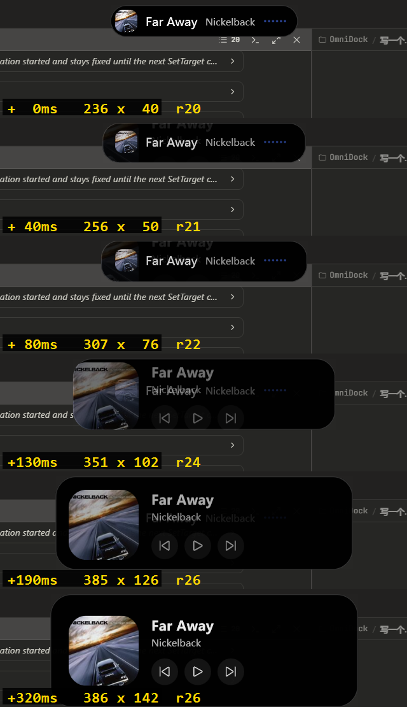
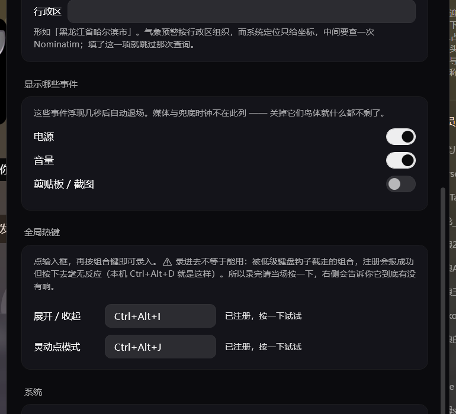
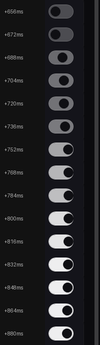
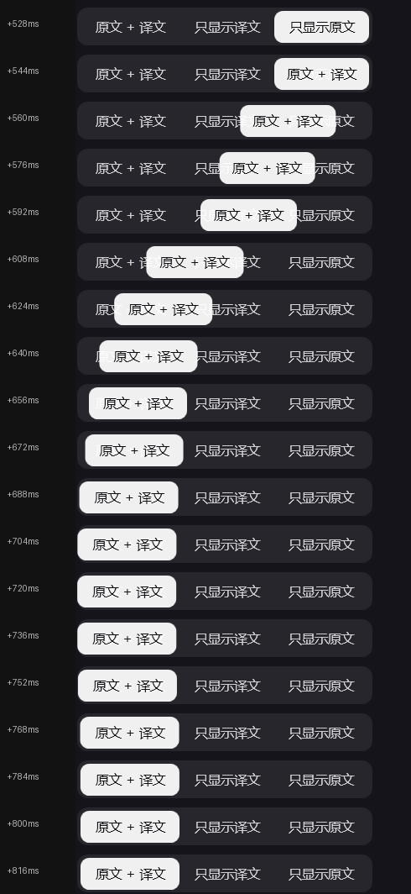
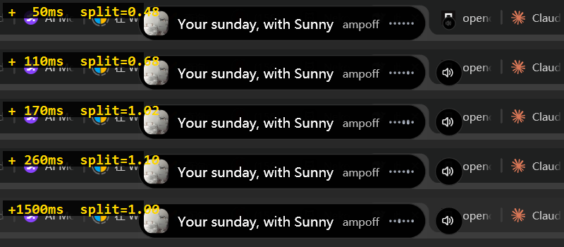
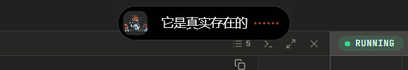
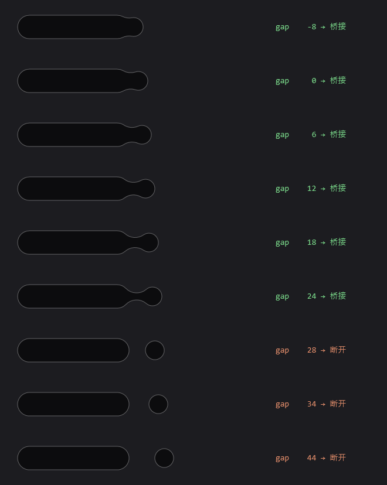

# IslandX 设计笔记

README 里只讲「它是什么、怎么用」；这里是**每一处取舍的理由**——
为什么这么做、试过哪些别的做法、哪些是被实测推翻的。

按时间顺序的实施记录（含踩过的坑）在 [PLAN.md](PLAN.md)。

---

## 性能优化历程

优化历程（同一测试脚本，16 次形变；标注※的行受当时未受控的外部音频干扰，仅供趋势参考）：

| 版本 | 形变期帧率 | 进程 CPU |
|---|---|---|
| 初版（跟随 vsync，有布局 + 光晕） | 179fps | 65% |
| 仅限帧 90fps | 55fps | 26% |
| 零布局 + 限帧 144fps | 65fps | 20% |
| 移除环境光晕 | 65fps | 17.4%※ |
| 去掉限帧 + 放宽静止阈值 | 190fps | 27.2%※ |
| vsync 分频（目标120）+ 尾段降帧 + 窗口瘦身 | 快段 105fps | 16.6%※ |
| **除数 1（跟满回调）+ 频谱重画限流** | **快段 200fps** | **19.3%（纯形变，受控测量）** |

四处关键：

1. **每帧不触发布局** —— 元素尺寸全部恒定，形变只改几何数据与 `RenderTransform`。
2. **不画大面积半透明** —— 光晕那一层是纯填充率开销，删掉省下 13%。
3. **限帧只能按 vsync 整数倍分频**，绝不能拿绝对时间当阈值卡 ——
   阈值一接近 vsync 周期，浮点抖动会让约一半回调被跳过，帧率减半且节奏不均
   （实测限 240fps 反而只剩 92fps）。分频锁在回调流上，间隔恒为整数个 vsync。
   回弹尾巴的运动低于每帧半像素后除数再翻倍 —— 尾巴占形变时长一半，肉眼零差别。
4. **窗口不留白** —— 分层窗口每帧要把整个表面推给 DWM，面积直接就是钱。
   光晕删掉后把窗口从 700×240 缩到 640×168（-36% 面积）。
   窗口尺寸与弹簧过冲有耦合：最坏路径（灵动点直接展开）宽度会瞬间冲到 619，
   窗口必须给过冲留余量，账算在 `BodyCanvasWidth` 的注释里。
5. **每层动画各按自己的数据帧率重画** —— 形变期渲染跑 200fps，频谱条若跟着
   每帧重画，就是拿 200fps 去画 21ms 才更新一次的 FFT 数据，纯重复劳动
   （实测在"形变 + 律动"组合场景白吃约 9 个百分点）。频谱重画独立限流在 ~36fps。

**为什么不是 240fps**：逐项跳过（`ISLANDX_SKIP`）证明我们自己的每帧操作各只占
0.3–0.5ms，大头是 WPF 分层窗口的呈现路径（渲染线程 → 表面拷贝 → DWM）每帧固定
~5ms —— 上限约 200fps，这已是 WPF 能给的全部。要真跑满 240 只能换
DirectComposition 渲染后端（M6）。详细定位过程见 PLAN.md。

---

### 视觉

岛体轮廓用 **G3 连续曲率圆角**而非普通圆弧圆角。普通圆角在圆弧与直线交接处曲率突变，眼睛能看出那道"接缝"；G3 让曲率及其变化率都平滑过渡，形状更饱满。实现见 [`Rendering/Squircle.cs`](src/IslandX.App/Rendering/Squircle.cs)，每个角由「七次多项式混合曲线(30%) → 真圆弧(55°) → 镜像混合曲线(30%)」三段构成。


收起态形态参考了 [WinIsland](https://github.com/WinIslandProject/WinIsland)：封面缩略图 + 单行大字，宽度随内容伸缩。


岛体是**纯黑胶囊，没有外发光**。早先照 WinIsland 加过一圈封面主色的环境光晕，后来整体删掉了——
真机上的灵动岛（iOS Dynamic Island、ColorOS 流体云）都不发光，靠形状和内容说话；
而那一层半透明渐变既吃填充率，又反复制造鼠标穿透问题。详见 PLAN.md。

### 形变手感：过冲与错峰

三个维度（宽 / 高 / 圆角）**刻意用不同的弹簧参数**。这是"流体"与"整体缩放"的分界：
参数一致时每一帧都只是上一帧的等比放大，形状看着硬；错开之后形变中途会经过一个
被拉伸或挤压的中间形态，那才是液体铺开的样子。



错峰方向跟着形变方向走 —— **变大时宽度先冲出去、高度慢半拍跟上**（水先铺开再涌起），
**变小时高度先塌下去、宽度慢半拍收拢**（反过来会在中途得到一个窄而高的方块，很难看）。

阻尼比 ζ = damping / (2√stiffness) 决定弹性，首次超调约 exp(-πζ/√(1-ζ²))。
原先三个维度统一用 ζ≈0.88，那 1% 的超调肉眼根本看不出来，所以形变一直是"到位就停"。
现在的实测值（由弹簧自己记录，不靠肉眼判断）：

| 形变 | 宽超调 | 高超调 | 宽到位 | 高到位 | 错峰 |
|---|---|---|---|---|---|
| 灵动点 → 胶囊（入场） | 12.0% | 8.8% | 138ms | 159ms | 宽先到 21ms |
| 胶囊 → 卡片（变大） | 7.7% | 2.0% | 160ms | 231ms | 宽先到 71ms |
| 卡片 → 胶囊（变小） | 0.1% | 3.9% | 280ms | 177ms | 高先到 103ms |

内容的透明度弹簧**不参与过冲**：透明度冲过 1 再回落会让文字闪一下。

**打断**（形变到一半改主意）走的是弹簧的天然优势：目标随时可换，速度连续，不会跳变。
但纯物理有个副作用 —— 反向打断时弹簧带着旧速度，得先减速、停住、再掉头，
这期间形状仍朝旧方向走，用户看到的是"点了没反应，它还在往外张"。
所以反向打断时把速度衰减到三成（同向打断不动，那时动量正好帮忙）：

| 打断时机 | 纯物理逆行 | 衰减后 |
|---|---|---|
| 展开 60ms（最活跃） | 35.0%，43ms 才掉头 | **2.5%，15ms** |
| 展开 100ms | 12.0%，30ms | **1.2%，9ms** |
| 展开 160ms | 1.3%，12ms | **0%，4ms** |

衰减而非清零 —— 清零会看出速度断层。正常形变起步速度为零，不触发这条路径，
超调与错峰数字分毫未变。

静止判定按量纲分档（`SpringValue.RestScale`）。尺寸弹簧用 0.25 像素级、透明度弹簧用 0–1 级 ——
共用一个绝对阈值的话，0.01 像素的收敛精度远超肉眼可辨，而指数衰减的尾巴很长，
为这点看不见的余量要多跑约 250ms 的满帧渲染。放宽后形变期从约 900ms 缩到 620ms。

### 音频律动

频谱条的数据来自 **WASAPI 环回采集**（抓系统播放出去的声音），
1024 点 FFT（Hann 窗）分 6 个对数频段，**每段独立归一化** ——
高频能量天然比低频低一个数量级，共用增益的话高频那几根永远趴着不动。

归一化用缓慢衰减的峰值跟踪而非固定增益，否则效果完全取决于系统音量旋钮的位置；
平滑是"上升快下降慢"，跟得上敲击又不会抽搐。静止时留一排小圆点而非整排消失。

律动需要持续渲染，因此单列了一档更低的帧率（目标 36fps，实测约 34fps），
并且**只改竖条高度、不重建岛体几何**（实测几何重建增量为 0），CPU 约 3.4%。
频谱的重画有自己的 ~36fps 限流，不跟随形变期的 200fps —— FFT 数据 21ms 才出一帧，
画得再勤也是重复画同一组数。在意功耗可以在托盘菜单里关掉「频谱随音乐律动」。

### 鼠标穿透

只有**岛体轮廓内**与**灵动点态的感应区**接收鼠标，其余区域一律让给下方窗口。

分层透明窗口里，鼠标能否落到窗口上由**像素 alpha** 决定：`alpha == 0` 时系统直接放行、
连 `WM_NCHITTEST` 都不发；`alpha > 0` 就把消息投给窗口。岛体周围现在是真正的
`alpha == 0`，所以那里根本不经过本进程——这是删掉光晕之后白捡的：
半透明的光晕曾把周围一圈的点击全接下来，而 WPF 那边没有元素响应，点击就被吞掉。

仍需处理的是感应区：它的背景必须是 `#01FFFFFF` 而不是 `Transparent`
（后者渲染出 `alpha == 0`，感应区形同不存在），于是那块矩形会收到消息。
胶囊/卡片态把它设为不可命中，`WM_NCHITTEST` 回答 `HTTRANSPARENT` 让出去；
灵动点态才启用，给细横条一个 150×22 的可命中范围。细节见 PLAN.md。

---

### 右键工具栏

在岛体上右键弹出。它是**视图切换器，不是设置面板** —— 点一下把岛体**临时**切到那个视图，
指针离开岛体与工具栏就还原。


想知道雨几时停就点云，想知道还剩多少电就点电池 —— 看完就走，什么都不会被改掉。
改「以后怎样」的开关在托盘菜单和设置窗口里，那才是它们该在的地方。

| 图标 | 视图 | 内容 |
|---|---|---|
| ♫ | 正在播放 | 当前曲目 / 逐句歌词 / 进度 |
| ☁ | 降水预报 | 雨几时到、还要下多久；展开还有 4 小时的柱状图 |
| 🕐 | 时间 | 时间与日期 |
| 🔋 | 电量 | 剩余百分比、充电状态、可用时长 |
| 🎮 | Phira 最好成绩 | 当前最高分那一首 |

再点同一个按钮切回来。**按完不关** —— 这一排就在岛体正下方，
关掉反而要重新右键才能换下一个视图。真正的结束条件是指针离开。

置灰 = 此刻没内容可看（没在放歌、Phira 没运行、台式机没电池）。
**弹一条空的比按钮点不动更糟**，所以宁可让它点不动。

#### 「它来找你」与「你去找它」是两条不同的活动

天气、电量、Phira 这三个 Provider 平时**只在事件发生时说话**：要下雨了、插上充电器了、
刷新纪录了。它们没有一条"常驻"的活动可以钉住 —— 而
「未来四小时不下雨」「还剩 97%」恰恰是主动点开时想知道的答案。

所以它们各有一个 `BuildPeek()`，现合成一条**主动查看专用**的活动。两者的区别是结构性的：

| | 自动弹出的那条 | `BuildPeek()` 那条 |
|---|---|---|
| 触发 | 事件发生 | 用户点按钮 |
| 不下雨 / 没进步 / 电量正常 | **不发** | **照样给答案** |
| `AutoDismissAfter` | 有，几秒后自撤 | **没有** —— 主动看的东西不该自己跑掉 |
| 收起时机 | 计时器 | 指针离开岛体 |

媒体与时钟不需要合成器：仲裁器里本来就有一条实时的，钉住它即可 ——
钉的是 **Provider Id 而不是某条活动**，所以钉住期间歌词照常走字。

#### peek 优先于实时活动，不能反过来

天气那一路的实时活动是**气象预警**，而它自己会弹出来。用户点开天气想看的是
「雨几时到 / 几时停」那份降水时间线 —— 不主动问就看不到的那份。

第一版写成了"有实时活动就用实时的、没有才用合成的"，结果一挂预警，
天气视图就只能看见预警本身。而**雷雨预警期间恰恰是最想看降水时间线的时候**。

#### 一条被这个功能照出来的旧约束

`WeatherProvider` 原先是这样的：

```csharp
var alerted = await CheckAlertsAsync(here);
if (!alerted) await CheckRainAsync(here);      // 有预警就整个跳过
```

理由写在注释里，而且是对的：仲裁器的 `_current` 按 providerId 索引，
**一个 Provider 同时只能有一个活动**，后发的直接覆盖先发的，
所以有预警时不能再发降水。

但那条约束管的是**发什么**，不是**取不取数据**。跳过整个 `CheckRainAsync`
的副作用是连预报都不拉了 —— 加了天气视图才显形：一挂预警，按钮直接变灰。

改成照常拉、照常记，只是不播报：

```csharp
var alerted = await CheckAlertsAsync(here);
await CheckRainAsync(here, announce: !alerted);
```

静默那条分支里有个必须写对的细节：**不能顺手把这场雨记进 `_announcedRain`**。
那个字段是"已经报过了"的意思，记了的话预警撤销之后这场雨就再也报不出来 ——
而那要等到"预警结束但雨还在下"才会显形，几乎不可能在开发期撞见。

#### 样式来源：WinIsland 里其实没有这个东西

参照物是 [WinIsland](https://github.com/Fon-Enthusiast/WinIsland)，但**它没有右键工具栏** ——
它岛体上的右键是「右键长按移动」（`src/window/app/input.rs:36-76`，4px 阈值，设置里可关），
全仓 `WM_CONTEXTMENU` / `TrackPopupMenu` 零命中，唯一的菜单是托盘的**系统原生**菜单，
没有任何可抄的样式数值。

所以这里是**外观数值照抄它、动效走本项目的规矩**，每个常量在代码里标了出处：

| 取自 | WinIsland 出处 | 数值 |
|---|---|---|
| 外壳内边距 | `utils/settings_ui/items.rs:25` | `POPUP_MENU_PAD = 5` |
| 外壳描边 | `settings/renderer.rs:474-480` | `argb(40,255,255,255)`，0.5px |
| 外壳阴影 | `settings/renderer.rs:445-451` | `argb(60,0,0,0)`，偏移 (0,+2)，尺寸 +2，**无高斯模糊** |
| 卡片底 / 描边 | `ui/widget/expanded/mod.rs:87-113` | `argb(α·0.05, 28,28,30)` / `argb(α·0.16, 255,255,255)` 1px |
| 卡片圆角 | 同上 `:111-113` | `min(12, 短边/2)` |
| 图标 | `ui/widget/expanded/settings.rs:17-25` | 占卡片短边 **38%**，不透明度 **0.72** |

三处**没有**照抄：

- **外壳底色**。它那个 `rgb(50,50,52)` 是**设置窗口里**下拉菜单的颜色。这条工具栏贴在岛体上，
  属于它 widget 卡片那一类，而那类表面的底就是岛体自己的近黑。
  灰底贴在近黑岛体下面，看着像另一个程序的部件 —— 这里用与岛体相同的 `#FA000000`。
- **外壳圆角**。它的 `POPUP_MENU_R` 是 10，但它的下拉菜单里装的是文字行不是圆角卡片。
  这里要在外壳里嵌卡片，10 会让卡片比外壳还圆。
  同心圆角的规矩是**外圆角 = 内圆角 + 内边距**，于是 12 + 5 = 17。
- **选中态与置灰态**。WinIsland 的组件卡片没有这两种状态。

动效也不抄：它那个下拉是**纯 opacity 指数淡入**（`settings/input.rs:26`，每帧走剩余距离的 30%）。
紧挨着弹簧驱动的岛体放一个只会淡入的浮层很出戏，所以走本项目的
「进场要弹、退场不回弹」——
进场 `BackEase` 缩放 0.86→1（340ms，11% 行程过冲）+ 不过冲的透明度淡入；
退场缩到 0.94、140ms、`CubicEase` 不回弹。

#### 过冲不能靠估

第一版凭手感把 `BackEase.Amplitude` 写成 0.35，注释里断言"大约 11% 过冲，和岛体一致"。
连拍实测只有 **5.8%**。

WPF 的 `BackEase` 是 `f(t) = t³ − t·a·sin(πt)`，`EaseOut` 取 `1 − f(1−t)`，
**过冲量与 amplitude 不是一回事、也不成正比**：

| amplitude | 行程过冲 |
|---|---|
| 0.18 | 1.7% |
| 0.35 | 6.9% |
| **0.45** | **11.0%** |
| 0.60 | 17.7% |

数值反解出 11% 对应 0.451，取 0.45。理论值也被实测印证过 ——
a=0.35 时算出 6.92%、连拍量到 5.8%（25ms 采样 + 抗锯齿边缘的误差）。

#### 一个视图坏掉，不该赔上整个应用

工具栏是在 **UI 线程**上调各个 Provider 的 `Build()`。那边抛出来的异常会一路冒到
WPF 的输入处理里，成为 UI 线程的未处理异常 —— 表现**不是"这个按钮不好用"，
而是整个岛体卡死**。

这个坑踩过一次，值得记下来：`WeatherProvider.HighlightRange` 里有个
`outlook.StartsIn!.Value`。那个 `!` 原本是成立的 —— 它只在播报路径上被调用，
而播报只在"正在下"或"即将下"时才发生。

「主动查看」打破了这个前提：不下雨也要给答案，那时 `RainingNow=false`
且 `StartsIn=null`，`.Value` 直接抛 `InvalidOperationException`。
于是**天晴时右键必卡**，而开发期一直在下雨，从没碰到。

**一个函数的隐含前提会被新调用方悄悄打破，而编译器不会说话。**

两层都改了：

- 真 bug 修掉，并把 `HighlightRange` 从 Provider 的 private 方法**搬到 `Weather`** ——
  它是纯逻辑，搬过去自检就能直接喂样本。补的 7 条里有 2 条在修复前是红的。
- 加了 `SafeBuild` 兜住这个边界：一个视图抛异常就只是那一个按钮置灰，
  日志里留证据。全局的未处理异常钩子**只记不吞** ——
  吞掉会把真 bug 变成"莫名其妙不工作"，那比崩溃更难查。该兜的是这种
  **已知会调到外部代码**的具体边界。

#### 窗口只在它打开时才撑高

岛体展开态是 140 高，工具栏要落到 y=154…204，而窗口是 640×**168** —— 装不下，
实测会被硬切成一条。

但窗口尺寸是**算过账的**：分层窗口每帧要把整个表面推给 DWM，面积直接就是钱，
所以它只比"形状可能到达的最大范围"大一圈（见 `BodyCanvasWidth` 的注释）。
为一个偶尔弹一下的工具栏永久加高 48，等于让**每一帧**都多付近三成表面。

所以只在工具栏打开期间把窗口撑到 222（实测 800×277 物理），收起立刻还原成 168（800×210）。
高度里算进了展开入场约 9% 的首摆过冲 —— 工具栏开着时左键展开岛体是允许的。

#### 一个自己给自己下的套

工具栏最初把外壳几何挂在 `SizeChanged` 上、按 `ActualWidth` 建轮廓。那是个反馈环：
阴影的几何比容器**大 2px**（照抄 WinIsland 的 `w+2, h+2`），Path 把它报成自己的期望尺寸 →
Grid 跟着长大 → 再次 `SizeChanged` → 每轮涨 2px，一直涨到撞上窗口边界。
第一次跑起来是一整块铺满半个窗口的灰板。

**容器的尺寸不能由它自己的装饰层决定。** 改成从按钮数量正算并显式写死 `Width`/`Height`。

#### 收起判定：轮询，不是等某个事件

工具栏跟着岛体底边走 —— 岛体高度是弹簧驱动的，展开／收起时工具栏**跟着滑**而不是跳。
代价是：指针一动不动，工具栏却可能从指针底下挪走，那一刻发不出可靠的离开事件。

判定因此有两条都必须做对：

- **按当前几何实测**（`InputHitTest`），不读 `MouseEnter/Leave` 留下的缓存标志。
- **条件不满足就重排一轮**，而不是就此作罢。原先满足时直接 `return`，
  于是"工具栏 → 岛体 → 移开"这条路上第一轮被消耗掉，之后再没有事件重新启动它，
  工具栏就一直挂着 —— 而"指针离开岛体就还原"正是它的约定。


### 设置窗口

托盘右键 →「设置…」。七节一页滚到底：外观、歌词、天气、联动、显示哪些事件、全局热键、系统。


**每一项即时生效、即时保存，没有「确定 / 取消」。** 这些设置的效果都能立刻在岛体上
看到（歌词出现、频谱停下、岛体收成细横条），攒一批再提交只会让人不确定改动落地了没有。

三件事只有这里能做，原来必须手改 `config.json`：

| 项 | 说明 |
|---|---|
| **手填坐标** | 留空 = 用系统定位。填了就不再调定位 API，可以只给个大概的地点 |
| **行政区** | 预警按行政区组织，填了就跳过一次 Nominatim 反查 |
| **全局热键** | 点输入框再按组合键录入 |

**「检测一次」**：当场跑一遍定位 + 反查，把结果**填进输入框**而不是直接生效 ——
让用户看清即将保存的是什么，再决定要不要留，想模糊化就自己改粗。
存在的理由是这件事门槛不低：多数人不知道自己的经纬度，也不知道行政区该怎么写才匹配得上。

#### 热键：录进去 ≠ 能用



`RegisterHotKey` **报成功不代表按下去有反应** —— 被低级键盘钩子截走的组合注册照样成功
（本机 `Ctrl+Alt+D` 与 `Ctrl+Alt+J` 都是这样，README 别处也记着这一条）。
所以录完之后界面会说「现在按一下它，验证真的能用」，然后：

- 按到了 → `✓ 收到了，这组热键可用`
- 6 秒没按到 → `没收到 —— 注册是成功的，但按键被别的程序截走了。换一组试试。`

**只看注册返回值等于什么都没验**，这是这一节存在的全部理由。
超时那一条同样重要：没有它的话"按了没反应"和"还没按"在界面上是同一个样子，
而这两件事的含义完全相反。

换热键失败时**保持原来那组不变**：换不上就把旧的也弄丢，用户会连唤回岛体的途径都没有
（灵动点态只有 8px 高，几乎点不到）。

#### 开关的动画



手感照岛体那条规矩：**进场要弹，退场不回弹**（Split 一节的实测值 —— 进场 ζ≈0.58
过冲约 11%、退场 ζ≈0.92 且更快）。打开是"东西来了"，值得弹一下；
关闭是"结束了"，还慢悠悠回弹只是拖着人等。实测可见位移约 130ms 到位、145ms 稳定，
与岛体形变的 138–160ms 同档。

两处偏离直觉的决定，都是连拍逼出来的：

**过冲比岛体大，17% 而不是 11%。** 那个百分比是在 200–600px 的宽高上调出来的，
换算到 18px 的行程只剩 2px —— 比例一样，知觉上等于没有。
**同一个比例不能跨 20 倍的尺寸照搬**，小元件要更大的相对过冲才看得出弹性。

**旋钮的颜色不参与动画，只有轨道变。** 第一版是旋钮（亮→暗）与轨道（暗→亮）
同时反向变，连拍里能看到有一帧旋钮整个糊进轨道 —— 两条反向的渐变**必然相交**，
调曲线解决不了，只能去掉一条。代价是 OFF 态的轨道要抬亮一档（`#1F` → `#3D`），
否则近黑的旋钮在近黑的轨道上看不见。少一个动画，还顺手解决了问题。

位移走 `RenderTransform` 而不是改 `Margin` 或对齐 —— 后者是 `AffectsMeasure`，
翻一次开关就走一次布局。另外模板里的 `TranslateTransform` **起了名也不能当
`TargetName`**（命名只对元素生效），所以得预先挂一个实例、再走属性路径
`(RenderTransform).(TranslateTransform.X)` 去动它。

#### 分段条：滑动的指示器



三选一不是"三个背景各自亮灭"，是**一枚白胶囊滑过去**。前者会撞上和旋钮一样的
相交问题（中途两个半亮的白胶囊），滑动只有一个元素在动，不存在交叉。

难点是文字的对比度：白胶囊经过时，底下的浅色字会有一段白底白字。解法是
**指示器自己带一份暗色的选中标签**，居中放在胶囊里；亮字那层铺满整行、
被不透明的胶囊盖住它经过的那一段。于是"胶囊上是暗字、胶囊外是亮字"任何时刻都成立。
标签在动画**开始时**就换成目的地那一段 —— 飞过去的胶囊带着终点的文字，到位不用再闪一下。

位移用 `BackEase`：它顺着行进方向掠过终点再回来，**方向自动正确**，
不必判断是往左还是往右。宽度则不过冲 —— 三段宽度不同，换段时胶囊本来就要伸缩，
再让宽度弹一下会像在"喘气"。实测 +544 → +704ms 约 160ms 到位，尾段能看到掠过再回落。

> **走过的弯路**：第一版做的是"整行暗字层 + 按胶囊裁剪 + 反向平移"。
> 思路没错，但那要两条互相抵消的位移动画严格同步，一旦对不上暗字就整个跑到裁剪区外 ——
> 实测就是这样，落位后胶囊里只剩透过 93% 白露出来的一点亮字，几乎看不见。
> 改成一份居中的标签之后，**没有需要保持同步的第二个量**了。
> 少一个耦合，少一类 bug；这和旋钮那边"去掉一条反向渐变"是同一种收敛。

#### 托盘与设置页共用一套接线

两处都消费同一个 [`SettingsBridge`](src/IslandX.App/Core/SettingsBridge.cs)，不各接一遍。
两处各自接线的话，加一个开关就得改两处，而漏改的那处**不会有编译错误** ——
只会表现为"从设置页改了、托盘里没跟着变"。

当前值也不存快照，一律实时从 `AppConfig` 读。托盘原来是构造时抓一次快照的，
那在只有托盘一个入口时看不出问题；有了设置页之后，从一处改完另一处的勾就会停在旧值上。
所以托盘的勾选状态改成**在菜单弹出时重读**（`ContextMenuStrip.Opening`）——
顺带修掉一个原有隐患：开机自启的真值在注册表里，别的程序改了之后快照式菜单会一直显示旧值。

#### 形状语言必须和岛体一致

第一版用的是系统标题栏 + DWM 的 `DWMWA_USE_IMMERSIVE_DARK_MODE`，理由写的是
"自绘要重做拖动、双击最大化、贴边分屏、系统菜单，为一条标题栏不值得"。

**那个判断错了 —— 代价算对了，收益算漏了。** 系统标题栏那一条白边让整页立刻
看着像另一个程序，而这个项目的卖点恰恰是形状。设置面板不是文档窗口，
丢掉贴边分屏和双击最大化并不疼。

现在是自绘窗口装饰：

- **轮廓走产品里那份 [`Squircle`](src/IslandX.App/Rendering/Squircle.cs)**，不是 `CornerRadius`。
  窗口剪影是贴着桌面看的，最容易看出圆弧接缝的地方就是这里。
  卡片内部仍用 `CornerRadius` —— 12px 圆角嵌在暗色卡片里，G3 与圆弧肉眼分辨不出，
  不值得每张卡都挂一个 `Path`。
- **开关是胶囊，不是勾选框。** 岛体本身就是一枚胶囊，同一个形状语言复用一次，
  两者才像一个产品。开启时轨道近白、旋钮近黑，正好是岛体"白字黑底"的反转。
  旋钮位移换整个 `RenderTransform` 而不是改 `Margin` —— 后者是 `AffectsMeasure`，
  翻一次开关就走一次布局。
- **三选一是分段条**，也是个胶囊，和开关、和岛体同一族。
- **配色只有白色的不同 alpha 档**（`#EDFFFFFF` / `#A6FFFFFF` / `#73FFFFFF`），
  出错才上红。第一版凭空挑了个 `#8AB4F8` 蓝，它不在岛体的调色板里，
  所以怎么摆都像外来的。
- `CheckBox` / `RadioButton` / `ScrollBar` / `TextBox` 全部自绘 ——
  WPF 默认模板取的是系统颜色，在纯黑上会画出白方块和一条刺眼的宽滚动条。

自绘要自己补回来的：标题栏拖动（`DragMove`，必须在按下那一刻调，晚一步会抛）、
关闭按钮、**Esc 关闭**（正在录热键时 Esc 让给录入路径，不关窗），
以及把高度夹在工作区内 —— 窗口不可调整大小，顶出屏幕就等于底部几节永远看不到。

### 系统事件

除了媒体和兜底时钟，这些系统事件会**浮现几秒后自动退场**（瞬时活动）：

| 事件 | 触发 | 显示 |
|---|---|---|
| 电源 | 插拔充电器 | 「正在充电 / 使用电池 / 已充满」+ 电量与进度条 |
| 电源 | 电量跌破 20% / 10% | 「电量偏低 / 电量严重不足」，后者用 Critical 优先级 |
| 音量 | 键盘音量键、系统合成器、程序自己调 | 音量百分比 + 四档扬声器图标；静音显示「已静音」 |
| 截图 | Win+Shift+S、PrtSc、任何截图工具 | 「已截图」+ 缩略图 + 像素尺寸 |
| 剪贴板 | 复制文本 / 文件 | 「已复制」+ 前 28 字预览，或文件名 |

每一项都能在托盘的「显示哪些事件」里单独关掉，选择写进配置文件。

### Split：双活动并列

正在播歌时来了个瞬时事件，岛体**不会把歌顶掉**，而是在右侧弹出一个独立的圆 ——
主体保持原样，事件挂在旁边。这就是 Split 态。



圆用**原地缩放**弹出，不是从主体里滑出来：滑出会有一段圆与主体重叠的时期，
那时并集边界上会冒出两个尖角接缝；缩放全程两个形状都不相交，干净。
字形跟着圆一起缩放，否则圆还没长大、里面已经挤着一个满尺寸图标。

进场与退场的手感不同：**进场要弹**（ζ≈0.58，过冲约 11%，胀一下再收住），
**退场不回弹**（ζ≈0.92）且更快 —— 事件已经结束了，圆还慢悠悠缩只是拖着人等，
而回弹会像"缩回去又想再冒出来"。退场中途再来事件会从当前大小平滑弹回，不跳变。

Split 只在收起态成立：展开态是张卡片、右边挂个小圆很怪；灵动点态本就是"别打扰我"。

> **走过的弯路**：最初把主体和事件圆用流体桥连成一体（metaball 式的平滑并集，
> 见 [`FluidBridge.cs`](src/IslandX.App/Rendering/FluidBridge.cs)）。
> 几何是对的、也有验证台，但挂到岛体上是个哑铃形，笨重、不像灵动岛 ——
> 真机的 Split 就是两个分离的形状。那段代码保留给 M4 的 Merged 聚合态，
> 那才是"两个活动融合成一块"该用桥的地方。

**为什么截图走剪贴板而不是钩 PrintScreen**：Win+Shift+S、PrtSc、各家第三方工具
最终都会把图片放进剪贴板，盯剪贴板一处全覆盖；钩键只认得一种触发方式。

**瞬时活动的计时归仲裁器管**，不是每个 Provider 各起一个定时器 ——
插电、调音量、截图都是同一个模式，各写一遍就是重复五份；
而且「连续事件要**续期**而不是各自倒计时」这条特别容易漏，
漏了的表现是连按音量键时第一次的定时器把还在显示的活动提前撤掉。

> 热键在不同机器上常被显卡驱动、输入法、录屏工具占用。注册失败会**自动回退**到备选组合
> （`Ctrl+Shift+I` / `Ctrl+Alt+Y`；`Ctrl+Alt+J` / `Ctrl+Shift+D`），最终生效的组合标注在托盘菜单上。
>
> 内置候选兜不住时可以自己指定 —— 在 `config.json` 里写 `ExpandHotkey` / `DotHotkey`：
>
> ```json
> { "ExpandHotkey": "Ctrl+Shift+F9", "DotHotkey": "Ctrl+Shift+F10" }
> ```
>
> 支持 `Ctrl` / `Alt` / `Shift` / `Win` 加字母、数字、`F1`–`F24`、`Space`、方向键等；
> 大小写与空格不敏感。**必须带至少一个修饰键** —— 单个键做全局热键会把它在整个系统里吞掉。
> 填的组合注册不上时不会静默作废，仍会回落到内置候选，托盘菜单显示的才是实际生效的那个。
>
> 注意 **`Win+` 开头的组合多半注册不上**：系统保留了大量 Win 组合
> （实测 `Win+Alt+K` 被拒），换成 `Ctrl+Shift+` 系列更稳。
>
> 本机实测 `Ctrl+Alt+D` 与回退项 `Ctrl+Alt+J` 都被低级键盘钩子截了 ——
> `RegisterHotKey` 报成功但按下去没反应，这种情况只能靠自己指定。

### 歌词

收起态的副标题槽位（平时显示艺人）可以换成**跟着播放进度走的当前那句词**。
在托盘菜单「显示歌词（需联网获取）」里开关。

> **默认关闭，这个开关同时是隐私开关。**
> GSMTC 只给标题和艺人，歌词得另找来源 —— 本实现走网易云的公开接口，
> 也就是说**开启后会把你正在听的曲目名发到 `music.163.com`**。
> 这属于该由用户自己点头的事，所以不预设为开；关掉之后不会再有任何请求发往第三方
> （`LyricsService` 连对象都不创建）。缓存只在内存里，退出即消失，不落盘。

两条匹配路径，优先走前者：

| 路径 | 触发条件 | 可靠性 |
|---|---|---|
| **按 ID 精确取词** | SMTC 的 `Genre` 字段里带 `NCM-{歌曲id}` | 准确，无歧义 |
| **按标题 + 艺人搜索** | 没有上述 ID 时的回落 | 同名翻唱 / Live 版 / remix 可能配错 |

搜索路径会做**标题校验**（归一化后要求一方包含另一方），对不上就宁可不显示 ——
一句不相干的歌词比没有歌词更碍眼。查不到的曲目连 `null` 一起缓存，
否则每 500ms 的发布循环会对同一首歌反复发请求。

**歌词要能同步，播放器必须上报 timeline**（播放位置）。没有位置就无从知道唱到哪，
这时会回落到自己数秒的内置计时器 —— 能用，但**用户拖动进度条之后会错位**，
因为播放器不会告诉我们它跳了。所以有真实 timeline 时一定优先用真实值。

#### 网易云需要 InfLink 插件

网易云原生的 SMTC **既不给 timeline 也不给歌曲 ID**，两条件全缺，
歌词功能等于没有。装 [InfLink](https://github.com/apoint123/inflink-rs)（BetterNCM 插件）
可以同时补上这两样：它会接管 SMTC 上报，塞进真实进度和 `NCM-{id}`。

⚠ **注意版本**：InfLink 靠正则匹配网易云的代码来禁用其原生 SMTC，
网易云更新后正则可能失配。本机在 **网易云 3.1.38 + InfLink 3.2.11** 上遇到过
hijack 失效 —— 结果是**两个媒体会话同时挂着**（原生的没 timeline、插件的有），
而 `GetCurrentSession()` 只返回其中一个、挑谁取决于谁最近更新，
于是播放时读到没 timeline 的、暂停时才读到有的。**降到 3.1.27 后恢复正常。**
用 `MediaProbe` 可以直接看到会话数（正常应为 1）。

现在这种情况**不必再靠降版本躲**：岛体自己会挑。见下一小节。

#### Spotify：繁体元数据搜不到简体曲库

Spotify 按**原始曲库**给元数据，华语歌常常是繁体。实测它上报的是：

```
标题=我還年輕 我還年輕   艺术家=老王樂隊   专辑=吾十有五而志於學
```

而网易云索引的是简体（`我还年轻 我还年轻 / 老王乐队`）——拿繁体串去搜，
**一条结果都没有**；换成简体，91 行歌词整整齐齐。

所以搜索改成**变体阶梯**，命中即止：

| 级 | 查询 | 什么时候用得上 |
|---|---|---|
| ① | 标题 + 艺术家（原样） | 绝大多数 |
| ② | 简体(标题) + 简体(艺术家) | ① 落空，且转换后确实不同 |

转换用 Windows 自带的 `LCMapStringEx`（`LCMAP_SIMPLIFIED_CHINESE`），不引第三方库。

**为什么不一上来就转成简体？** 它是逐字映射，日文汉字一样会被改：

```
月が綺麗ねと言われたい！ → 月が绮丽ねと言われたい！
```

那会把本来搜得到的日文歌搜坏。所以顺序必须是"原样优先、转换兜底"，
而不是"统一规范化"。自检里专门有一条断言**记录这个限制**——
哪天它变红了，说明转换行为变了，这套顺序也得重新想。

比对那一步也要跟着改：阶梯用简体去搜，网易云返回的自然是简体曲名，
而手上的标题是繁体原文 —— `Normalize` 不统一到简体的话，搜到了也会被判成
"不是这首"，等于阶梯白加。

阶梯只放**有实测依据**的两级。曾想过再加"去掉艺术家"和"剥掉
`- Remastered 2011` 这类 Spotify 后缀"，但实测那些形状本来就搜得到
（Bohemian Rhapsody / Shape of You / Viva La Vida 全命中），
没有证据的一级只会白白多发一次请求。

> Spotify 的**封面**没问题 —— 实测 300×300、79KB、解码正常，时间轴也有。
> 一开始以为要修封面，是探针把这一路单独查出来才排除的。

#### 封面：三种失败原因，界面上长得一模一样

"没有封面"背后是三件不同的事，不分清楚就不知道往哪修：

| 原因 | 该怎么办 |
|---|---|
| 播放器没给 `Thumbnail` 引用 | 没辙，也不该重试 |
| 给了引用但流读不出来（还没准备好） | **重试** |
| 读出来了但解不了码 | 重试无用，但**不能污染缓存** |

原先只覆盖了一种情形：换歌了而缩略图还是上一首的。两个缺口：

- **解码失败会被永久固化。** 哈希是在解码**之前**记的，所以解码一失败，
  这串字节就被当成"已经处理过"，之后每次读到同样的字节都直接判"没变"——
  这首歌到换歌为止都不会再有封面。更糟的是它返回 `true`（变了），
  于是追查被当场取消，自断退路。改成**解码成功才记哈希**、失败返回 `false`。
- **读失败只在换歌时才追。** "引用在、图没有"几乎总是"还没好"而不是"没有"，
  是最该重试的情形，却要等到下一次换歌才有机会恢复。

`MediaProbe` 现在会把这三种分开打印，例如：

```
[0] Spotify.exe   Playing  时间轴=有  流派=-  分=5  标题=山海
     艺术家=[草東沒有派對] / [草東沒有派對]   专辑=[醜奴兒]
     搜索串 → "山海 草東沒有派對"
     封面: 79742 字节，300×300，解码正常
```

追查节奏 `180 / 400 / 800 / 1500 / 2600 / 4000 / 6000` 毫秒，累计约 15 秒。
后两档是给**图还在下载**留的 —— 流媒体首次播一首歌时封面可能要好几秒才落地。
每一档只是一次属性读取，成功或换歌立刻取消。

#### 会话选取：同一播放器挂多个会话时挑哪个

`GetCurrentSession()` 返回哪个会话，取决于**谁最近更新** —— 上面那种双会话状态下，
它会在"有 timeline"和"没有"之间来回摇，表现为进度条和歌词忽有忽无。

所以不再无条件相信它。判据在 [`Core/MediaSessionPick.cs`](src/IslandX.App/Core/MediaSessionPick.cs)：

```
分数 = 有timeline×4 + 有Genre×2 + 有标题×1
```

位权重拉开是为了形成严格的字典序：**有 timeline 的一定压过没有的**。
没有位置就不知道唱到哪，歌词一句都显示不出来，这一项比什么都重要。

**只在同一个 AppId 内部改选，绝不跨应用。** 这是安全底线：
"哪个应用是当前的"是用户意图，系统比我们清楚 —— 浏览器在放视频、音乐软件暂停着，
该显示哪个不该我们猜。要修的只是同一个应用内部的重复会话，
而那些会话来自同一个进程，AppId 天然相同（实测网易云 + InfLink 都报 `cloudmusic.exe`）。

平分时不换 —— 严格大于才换，否则两个等价会话之间每次事件都来回跳，
每跳一次都要退订/重订加刷新一遍。

`SessionsChanged` 也要订，不能只订 `CurrentSessionChanged`：
更丰富的那个会话可能**后到**（InfLink 比网易云原生 SMTC 晚注册），
它到达时"当前会话"没变，`CurrentSessionChanged` 不会响，
只订前者就会一直挂在先到的那个残缺会话上。

> **一个实测出来的坑**：`GetSessions()[0]` 与 `GetCurrentSession()` 返回的
> **不是同一个投影包装**（各自反复调倒是稳定的）。所以"哪个是当前会话"不能靠引用比较，
> 得按 AppId 比 —— 那不是保险，是主路径。`MediaProbe` 会把这三行对照直接打出来。

判据有 **12 项自检**（`WeatherProbe --sessions`，纯函数、不碰 WinRT），
`MediaProbe` 则在真会话上显示"系统给的是哪个 / 判据挑了哪个 / 各自几分"——
自检喂的是手写特征，只有在真会话上跑一遍才能确认那些特征是从对的字段读出来的。

探针里 `sess` 字段可以直接看：`1sess/trust` 表示只有一个会话、沿用系统判断；
`2sess/cur0/pick1/37` 表示两个会话、系统给的是 0、判据改选了 1，两者评分 3 和 7。

本机实测（网易云 3.1.27 + InfLink，探针 `lyr` 字段）：

```
67line/smtc@50s/c1/n1/m0/id
 └行数  └真实timeline@第50秒  └缓存1/网络1/失败0  └走ID精确匹配
```

#### 外语歌自动显示翻译

外语歌会在原文下面多一行中文译文，**中文歌不受影响**（自动是单行）。


**"是不是外语"这件事不由我们判断，也不需要。** 网易云的歌词接口在同一次响应里
就带着 `lrc`（原文）与 `tlyric`（译文）两份，而中文歌的 `tlyric` 直接是空的 ——
换句话说语言判断是数据源做的，我们只管有就用。实拉四首验证过：

| 歌 | 行数 | 带译文 |
|---|---|---|
| 《晴天》周杰伦 | 41 | **0** |
| Hey There Delilah | 61 | 61 |
| 夜に駆ける YOASOBI | 56 | 56 |
| Spring Day BTS | 80 | 77 |

所以这个功能**不额外增加任何请求**：`tv=-1` 参数本来就在，只是以前没解析返回里的
那一半。也不需要接翻译服务，曲目名之外没有新数据发出去。

托盘「歌词翻译」子菜单里三选一（配置项 `LyricTranslation`）：

| 模式 | 岛体 | 中文歌 |
|---|---|---|
| `Both`（默认） | 原文（14px）+ 译文（11.5px，暗一档） | 自动退化成单行 |
| `TranslationOnly` | 只有译文，单行 | **回落显示原文** |
| `OriginalOnly` | 只有原文，单行 | 无区别 |



`TranslationOnly` 那个回落是必须的：不回落的话中文歌会整个空掉，
而"空掉"在岛上和"前奏还没唱到"、"歌词没拉到"长得一模一样，用户只会以为歌词坏了。

几个不显然的点：

- **译文按时间戳配对，容差 ±500ms**，不要求严格相等。实测网易云两边完全一致
  （都是 `[00:07.410]`），但译文常由另一个投稿者上传 —— 赌"必须相等"的话，
  差几十毫秒就会让整首歌一行都配不上，而那表现为"这首没有翻译"，与真的没有无从区分。
  超出容差则宁可判为没有：**硬配到隔壁那句比不配严重得多**，整首都会驴唇不对马嘴。
- **译文里的 `-` 是占位符**（那句不需要翻译，比如 "Oh oh oh"），滤掉，
  否则第二行会显示一个孤零零的减号。《Spring Day》80 行里有 3 行如此。
- **双行时胶囊加高到 54（圆角 27）**，单行仍是 40/20，走的是同一根高度弹簧。
  不硬塞进 40 里：那样两行各只剩 16px，字号得压到 11 以下，小到不如不显示。
  判据取**渲染层的实际状态**（`LyricIn.HasSub`）而不是活动字段 ——
  换句动画期间两层内容不同步，看活动会在"旧句双行、新句单行"那一瞬把高度提前改掉。
- **宽度取两行中较宽的那个**。英译中常常比原文长，只按原文算的话译文会溢出被裁。

#### 歌名让位与逐句换行

开了歌词之后，**歌名只在换歌时站 1.5 秒**，然后整块让位 —— 位置交给"现在唱的这句"。
同一个槽位里它的信息量远大于曲名 + 艺人，而"换歌了，是这首"恰恰只在开头那一下重要。
前奏未到第一句、间奏、歌词还没拉到时歌名自动回来（这些情形 `Lyric` 都是 null，同一条路径）。

**胶囊宽度跟着每句歌词伸缩**，不是固定预算。宽度跟着内容走才有"流体"的意思。


换句是「旧句退场」与「新句进场」同时进行，参数对齐
[WinIsland](https://github.com/WinIslandProject/WinIsland)（Rust + Skia）的做法：

| 量 | 进场 | 退场 |
|---|---|---|
| 位移 | 从下方 10px 上来，**过冲约 8% 掠过终点 0.8px 再落回** | 向上飘 10px |
| 不透明度 | 线性 `t` | 线性 `1 − t`（与进场严格互补） |
| **水平模糊** | 6px → 0（由糊转清） | 0 → 6px（越飘越糊） |

**模糊只在水平方向**，这是整个效果的灵魂。垂直方向保持清晰，文字不是"失焦"，
是"横着被抹开" —— 观感差别很大，各向同性模糊看着像没对上焦，方向性模糊才有速度感。

WPF 的 `BlurEffect` 只有一个各向同性的 `Radius`，做不到这件事。所以歌词两层是
**自绘元素**（[`Rendering/LyricLayer.cs`](src/IslandX.App/Rendering/LyricLayer.cs)）：
把同一行字画 N 份、各自水平偏移并按高斯权重分配不透明度，手工做一次一维卷积。
采样间隔恒定 2px（中文笔画间距约 2–3px，再疏就能数出重影了），份数随强度伸缩，
不模糊时只画一份。附带好处是常态没有 Effect 挂在元素上，ClearType 不被降级。

几个不显然的取舍：

- **两层的不透明度严格互补，不错峰**。这与切歌转场刻意相反 —— 那里两层内容完全不同、
  必须靠错开区分；而这里两层是同一位置的连续歌词，靠"一个在糊掉、一个在变清"
  就足以区分，再错峰反而拖沓。
- **`sigma` 用 6 而不是 WinIsland 的 12**，尽管它的字号（12）比这里（14）还小。
  不能照抄的原因是实现不同：它走 Skia 的真高斯，而多份叠加走的是 source-over
  （`1−(1−a₁)(1−a₂)…`），文字笔画之间的空隙会被相邻份**完整填满**，很快糊成一团；
  真高斯只让空隙得到低强度的能量。实测 12 时中间帧完全看不出是文字。
- **整句切换比时间戳提前 170ms**（`LyricLeadMs`）。不提前的话人是先听到下一句、
  再看到岛上开始动，慢半拍；提前之后退场发生在时间戳之前，新句完全显形时才对准它。
- **换句期间岛体宽度取 `max(旧句, 新句)`**，等旧句淡尽才收窄。立刻收窄的话，
  还在场上的旧句两端会被正在收拢的岛体裁掉。
- 歌词开启时发布间隔从 500ms 收到 **110ms**：500ms 的粒度下切句时刻最多偏半秒，
  完全跟不上唱。每次 tick 只是读一次 timeline 加一次二分查找，没有网络也没有解码。

#### 封面与频谱钉在两端，位置也跟着弹簧走

收起态的三样东西是**居中放置、再用 `RenderTransform` 推到位**的，不靠 `StackPanel`
横向排列：封面钉在岛体左缘、频谱钉在右缘、歌词居中于中间（与 WinIsland 一致 ——
它给左边留 30、右边留 29，歌词在剩余空间里居中）。两个理由：

1. 横向排列时频谱紧跟在文本右侧，**歌词一短就跟着左移贴上来**，而它该待在边上。
2. 布局宽度是**瞬间**生效的，而岛体宽度走弹簧。靠布局定位就会看到封面与频谱
   瞬间跳到新位置、岛体却还在平滑收拢 —— 两者节奏对不上，边上那两样东西看着在抽。

改用 Transform 之后它们每帧跟着 `_width.Current` 走，与岛体全程同步；
顺带**换句一次布局都不触发**（文本槽宽度恒定，只有岛体的目标宽度在变）。

探针可以直接验算：读到 `w237 封面-98 频谱90` 时，封面应为 `−w/2+20` = −98.5、
频谱应为 `w/2−28` = 90.5。两个独立的量反解出同一个 w，才说明它们真挂在同一个弹簧上
（而不是各自算各自的，那样在动画中途就会分家）。

**居中的是"内容整体"，不是文本。** 两侧占用不等宽，所以文本槽自己也要偏移：

```
左侧占用 = 6 + 28 + 10 = 44          （padLeft + 封面 + gap）
右侧占用 = 14 [+ 12 + 28 有频谱时]   （padRight [+ gap + 频谱]）

胶囊宽       = 左侧占用 + 文本宽 + 右侧占用
文本槽偏移 X = (左侧占用 − 右侧占用) / 2      → 无频谱 +15、有频谱 −5
```

文本的可用区是 `[左, 宽−右]`，它的中心相对胶囊中心偏 `(左−右)/2` ——
不偏的话文本就会往占用多的那一侧压过去。这两个量必须**同源**
（都由 `CompactSides()` 给），各算各的就会错位。

这里原本只有宽度那一半、没有偏移：文本按胶囊中心居中，等于默认两侧占用相同。
有频谱时勉强能看（左 44 / 右 54，差得不多），**没有频谱时就露馅** ——
左要 44、右只有 14，文本左边只分到 29px，直接压进图标里 15px。
长标题的气象预警（`⚠ 雷雨大风黄色 · 辽宁省沈阳市`，文本 198px）就是这么叠上的；
短标题看不出来，只是被 `PillMinWidth` 兜住了。

> 中间还走错过一次：先按"两侧取较大者对称留白"改（`文本宽 + 2×max(左,右)`）。
> 那样确实不重叠了，但没有频谱时右边会空出整整 44px，图标贴着左缘 ——
> 整条看着往左歪，用户一眼就看出来了。
> **不重叠**和**看着平衡**是两个要求，只满足前者是不够的。

探针里 `txt` 就是这个偏移，可以直接断言：无频谱应为 `+15`、有频谱应为 `−5`。

顺带补上的一件事：**歌名以前没有宽度上限**（歌词有 `LyricMaxWidth` 兜着）。
超长曲名会把总宽顶过 `PillMaxWidth`，胶囊被钳住而文本照旧按原宽居中 ——
同一个病，只是触发条件更少见。现在文本宽按文本槽（340）封顶，
并且给 `CompactTitle` 设了 `MaxWidth` 让它真的截成省略号 ——
`TextTrimming` 只在**测量被约束**时生效，而横向 `StackPanel` 给孩子的是无限宽，
光在 XAML 里写 `TextTrimming` 是不够的。

**性能**（受控压测：`ISLANDX_LYRICBEAT=500` 强制 500ms 换一句，动画占约 71% 时间）：

| 实现 | CPU | 快段帧率 | 模糊的增量 |
|---|---|---|---|
| TextBlock + BlurEffect（各向同性） | ~28% | ~230fps | 1.9pp |
| **自绘水平模糊（当前）** | **~21%** | **~168fps** | ~1.3pp |
| 自绘 + DrawGeometry（试过，已回退） | ~34% | ~149fps | — |

帧率的下降**与模糊无关** —— 关掉模糊的对照组同样是 163fps。它来自自绘元素每帧
`InvalidateVisual` 相对 TextBlock 只改渲染属性的差异，把重绘阈值放宽到三分之一也没回升。
168fps 仍在 WPF 分层窗口约 200fps 的上限附近，240Hz 下观感流畅。

> 试过用「预制 alpha 画刷 + `DrawGeometry`」省掉 `PushOpacity` 的合成节点，结果大幅变差
> （CPU 21% → 34%）：`DrawText` 走的是字形位图缓存（一次 GPU 纹理 blit），
> 而 `DrawGeometry` 每份都要矢量填充。`PushOpacity` 根本不是瓶颈，假设错了，已回退。

改成 Transform 定位（换句不再触发布局）之后复测过一轮，但**那轮数据不可信**：
本机背景负载升到 24–34%（另有多个进程常驻），三轮的最长帧中位数读到 74 / 278 / 265ms，
而 278ms 那轮恰恰是**关掉模糊**的对照组 —— 方向反了，说明测到的是系统抢占。
能读的只有快段帧率 204 / 198 / 189fps，彼此无显著差异：没有测出退化，
但"少两次布局"的收益也没能量出来。要重做这个对照得先有个干净的环境。

**常驻开销**：110ms 的发布间隔**测不出来** —— 不是"没有开销"，是它小于测量噪声。
A/B/A 三轮（歌词开 / 关 / 开）读到 5.63% / 6.69% / 6.69%：
同配置两轮自身就差 1.06 个百分点，而配置之间的差落在这个区间里。
本机背景负载当时在 26–27% 波动，这个量级的噪声压不下去，只能如实说测不出来。
内存的差是一致的：**歌词开启多约 10MB**（HttpClient + 歌词缓存 + 两层自绘元素）。

### 天气

快下雨时浮现一条提醒：几时下、下多久，展开还有未来 4 小时的降水柱状图。
在托盘菜单「降水提醒（需定位 + 联网）」里开关。


> **默认关闭，这个开关同时是隐私开关。**
> 它要读**系统定位**（`Windows.Devices.Geolocation`），并把坐标发到天气服务商。
> 位置比曲目名敏感得多，更该由用户主动点头。
> 坐标在发出前**降到 2 位小数**（约 1km）—— 天气只需要城市级精度，
> 而系统给的是 ±100m 级，那足以定位到具体楼栋，发出去没有任何必要。
> 不想用系统定位的话，可以在 `config.json` 里手填一个大概的经纬度，填了就不再调定位 API。

两条数据链路，**都不需要 API key**：

| 链路 | 数据源 | 说明 |
|---|---|---|
| **降水提醒** | [Open-Meteo](https://open-meteo.com/) | 15 分钟粒度的分钟级预报 |
| **气象灾害预警** | [中国气象局](https://www.nmc.cn/) | 一次给全国 1300+ 条，按行政区筛本地 |

配置全都可选：

```json
{
  "WeatherEnabled": true,
  "Latitude": 41.8,
  "Longitude": 123.4,
  "WeatherRegion": "辽宁省沈阳市"
}
```

`Latitude` / `Longitude` 留空则走系统定位；`WeatherRegion` 留空则反查（见下）。


#### 全国 1300 条，怎么筛成本地的

预警接口给的是**全国**列表，而系统定位只给坐标（实测 `CivicAddress` 在桌面上是空的，
只返回国家 CN）。所以中间要一次**反向地理编码**（OpenStreetMap Nominatim，同样不需要 key，
6 小时才查一次，远在它的速率限制之内）。拿到「辽宁省 / 沈阳市 / 浑南区」之后再筛。

筛选规则是三条，每一条都是被真实数据打出来的：

| 规则 | 不这么做会怎样 |
|---|---|
| 省名必须匹配 | 不同省有同名县，只按市县名匹配必然误报 |
| **发布单位的最后一级**要等于本地的市 / 区县 | 只做包含匹配的话，「沈阳市康平县」因含"沈阳市"而命中 —— 而康平县距市区 130km，法库 180km、新民 220km。实测一次放进来 5 条全是外县的 |
| 发布超过 12 小时的丢掉 | nmc.cn 的列表里带着隔夜的条目，而去重是按 id 的 —— 不过滤则**每次重启都把陈旧预警当新消息连弹一串**。实测启动时一次弹了 5 条昨晚 21:50–23:50 的 |

省级预警（「辽宁省气象台发布山洪灾害预警」）单独一组，只需省名命中 —— 那种确实覆盖本地。

同时挂多条时**只显示最严重的那条**（红/橙 > 蓝/黄），其余静默去重。
实测沈阳新民市同时挂 5 条，逐条弹要占掉一百多秒，而其中最重的那条才是要人看到的。

不想让坐标经过第三方地理服务的话，直接填 `WeatherRegion` 跳过反查。

#### 什么算"要下雨了"

判据是**两个条件同时满足**：降水量 ≥ 0.1mm/15min（约 0.4mm/h，会想拿伞的程度）
**且**概率 ≥ 50%。只看概率会把「70% 概率的毛毛雨」报成大事，只看量又会漏掉
「30% 概率下一场大雨」里的不确定性 —— 后者该等它更确定再说。
门槛定低了的代价很实在：为空气里的湿意弹一次提醒，用户很快就学会无视这个提醒。

其余几处不显然的：

- **中间断一格就算两场雨**。15 分钟的间歇在体感上就是"停了"，
  接成一场会报出虚高的时长（「持续 1 小时」其实中间停过）。
- **窗口尾部仍在下时，时长是下限**，文案说"至少还要 1 小时"而不是给一个确切的停雨时间 ——
  那是我们不知道的事，报出来就是编。
- **起始时刻按格子自己的时间戳算**，不是「第几格 × 15 分钟」。预报格子对齐在
  :00/:15/:30/:45 上，按格数乘间隔会系统性地把"还有多久"报晚最多一格。
- **同一场雨只提醒一次**。预报每 10 分钟刷一次，而一场雨会在好几次刷新里持续存在，
  不去重的话同一场雨每 10 分钟弹一次，比不提醒更烦人。
  雨停之后去重标记要清掉，否则表现是"第一场雨报了，之后再也不报"。

#### 占主位而不是 Split 小圆

降水提醒有标题、时长、柱状图三层信息，塞进 32px 的事件圆里等于没显示。
所以 `IslandActivity` 上加了 `WantsMainSlot`：**带自动撤下、但要占主体位置**，
几秒后让回给媒体。优先级用 `High` 压过媒体的 `Normal` —— 临时地，
"要下雨了"确实比"正在播什么歌"重要。

> 加这个功能时撞出一个既有的 bug：仲裁器的顺序号**每次推送都刷新**，
> 而媒体开着歌词是每 110ms 推一次的，于是它永远是"最新的那个"，
> 任何同优先级的活动一发出就被挤掉。改成只在**实质变化**时刷新。
> 这个 bug 要有"一路高频推送"才显形，加天气之前根本碰不到。

柱状图里空降水的时段留一条**暗底座**而不是零高度：否则没有降水的格子整段消失，
柱状图变成断断续续的几根，读不出"雨从哪一格开始"。这一场雨的区间单独高亮 ——
光看柱子高低分不清哪几格算作一场。

### Phira 联动

[Phira](https://github.com/TeamFlos/phira)（TeamFlos 的音游）刷新个人最好成绩时，
岛上弹一条「曲名 · 难度 · 分数 · 准度 · 评级」。
在设置页「联动」或托盘「Phira 成绩提醒（读本地存档）」里开关，**默认关闭**。


**单方面联动** —— 游戏那边不改一行代码，也不需要装任何插件。

> ⚠ **隐私边界。** 它要读 Phira 的存档 `data/data.json`，而那个文件里
> **同时存着 `me.email` 和登录用的 `tokens`**。
> `PhiraRecords.Read` **只解析 `charts[]`**，其余字段不读、不留、不外发。
>
> 存档里的 token 本可以拿去调 Phira 的云端 API（拉排行、拉完整成绩表），
> **没有这么做**，也不打算在没有明确同意的前提下这么做 ——
> 用户开的是"读本地存档"这个开关，不是"用我的账号访问服务器"。
> 全程本地，一个请求都不发。

#### 能被外部观察到的通道只有一个

上手前先把 Phira 0.8.2 能观察到的通道挨个查了一遍，结论是只剩存档一条路：

| 通道 | 结论 |
|---|---|
| SMTC 媒体会话 | 不注册（`MediaProbe` 实测） |
| Discord RPC | 源码里没有 |
| WebSocket / 命名管道 | 源码里没有，系统里也没有 |
| 本地端口 | 无任何 TCP 连接 |
| 窗口标题 | 恒为 `Phira`（`MINIQUADAPP`，miniquad 框架） |
| `data/data.json` | **唯一会随游玩变化的东西** |

存档位置**按运行中的 `phira-main` 进程的 `MainModule.FileName` 推**，不扫盘：
Phira 是绿色包，可能解压在任何地方，扫盘既慢又可能扫到别人的副本。
没在跑就只有 8 秒一次的进程枚举，**找到之后才会去建文件监视**。

#### 它报的是「刷新纪录」，不是「打完一局」

这是功能的语义边界，不是缺陷。Phira 的 `song.rs::update_record` 写死了保存时机：
**只在这首第一次打、或刷新个人最好成绩时**才调 `save_data()`。
打了没进步就不写文件，这边也就不会有反应 —— 没有别的通道能知道"你刚打完一局"。

#### 评级照抄游戏自己的那套

阈值与图标名都取自 `prpr/src/judge.rs::icon_index` 与 `resource.rs` 里
`rank/*.png` 的加载顺序（`F / C / B / A / S / V / FC / phi`），**逐条对着源码核过**：

| 分数 | 评级 |
|---|---|
| < 700000 | F |
| < 820000 | C |
| < 880000 | B |
| < 920000 | A |
| < 960000 | S |
| 960000–999999，非 FC | V |
| 960000–999999，FC | FC |
| 1000000 | φ |

注意五个分数档**排在 full-combo 判断之前** —— 所以 93 万的 FC 显示的是 `S` 而不是 `FC`，
和游戏结算画面一致。自己发明一套评级会和结算画面对不上，那比不显示评级更糟。

#### 三条"宁可不报"的闸

「该报没报」在界面上是**什么都没发生**，「多报了」是**莫名弹一屏**。
后者没法撤回，用户只能等它们一条条走完，所以三处都倒向沉默：

- **启动先建基线再监视。** 不然启动那一刻会把存档里已有的 27 条历史成绩
  全当成"刚刷新"，一口气弹一屏。
- **一次变超过 3 首就一条都不报。** 打一局只会改一首；一次变好几首说明不是游玩，
  多半是导入谱面、换账号或者恢复存档。
- **只认变好。** 分数变低不是一次游玩，是存档被还原或替换了。

真有两条同时进来（导入 + 游玩会撞上）时**排队轮流上岛**，分高的先来 ——
同时发两条的话仲裁器只会留下后到的那条，前一条等于没显示。

#### 用 `local_path` 当键，不用曲名

真存档里 `download/66612` 和 `download/75854` **是同一首歌的两个不同上传**
（`月が綺麗ねと言われたい！`，一个 IN Lv.12 一个 IN Lv.14）。
拿曲名当键的话这两条会塌成一条，丢掉其中一个的成绩。
`id` 也不合适 —— `local_path` 对下载谱和本地导入谱都在，而且天然唯一。

#### 难度标签是上传者手打的自由文本

真存档里见过 `IN  Lv.14`（两个空格）、`BT+CBD Lv.?`、`HD`（没有 Lv）、`LV.13`。
只**压掉多余空白**，不改写内容 —— 把 `LV.13` 规范成 `IN Lv.13` 就是在猜，
而猜错的难度标签比原样照搬更糟。

#### 自检喂的是我以为的格式

判据部分是纯函数，14 项自检（`WeatherProbe --phira`）覆盖了三条闸与评级阈值。
但**自检证明不了格式判断是对的** —— 样本是我手写的，编码的正是我以为的格式。
这个坑本轮之前在歌词上踩过一次（`tlyric` 格式看错，自检全绿而线上一行译文都没有）。

所以另有 `WeatherProbe --phiraread`，拿**真存档**过一遍解析器。
它的判据是"解析出 0 条就算失败" —— 形状看错的表现是**静默为零而不是抛异常**，
那正是最难归因的那种失败。实测 27 条成绩全部解出。

整条链路（监视 → 去抖 → Diff → 上岛）也验过，但**没有拿真存档试** ——
那是别人的游戏进度。`ISLANDX_PHIRA_DATA` 这个 Debug 钩子指向一份临时副本，
改副本、看岛体反应，真存档一个字节都不碰。

#### 存档可能被读到一半

Rust 的 `std::fs::write` 是"截断再写"，一次保存会触发多个 `Changed`，
而且事件到达时文件很可能只写了一半（那时 JSON 解析会抛）。两道处理：
**400ms 去抖**等它安静下来再读，以及用 `FileShare.ReadWrite` 打开 ——
Phira 正持有写句柄时，默认的独占读会直接失败。

---

## 调试探针

Debug 构建会把实时状态写入窗口标题（窗口无边框，标题不可见，仅供脚本读取）：

```
IslandX|Expanded|380x140|r26|p0.454|hkI=Ctrl+Alt+I,D=Ctrl+Alt+J/2|aA780DA|tier2|hov1|…
        状态     尺寸    圆角 进度  生效热键/触发次数              主色  渲染层级 悬停

…|hitIslandShape@240,21|os0.077/0.020/0.034|ms160/231/202|bt0.025@15/0.021@11|mf36/331+17/365/max28.5/gc0/dv4|box160,6,380x140|hz161,6,380x140/0|rf6481|geo0.020ms/1446
   命中元素@本地坐标      宽/高/圆角超调      各自到位耗时  宽/高逆行量@掉头ms  快段帧/ms+尾段帧/ms/最长帧/Gen0/除数  岛体轮廓      感应区/可命中    渲染帧数  几何耗时/重建次数
```

用 `EnumWindows` + `GetWindowText` 按进程 ID 读取即可断言形变、进度、取色是否真的在工作。
`tier` 是 `RenderCapability.Tier`（2 = 完全硬件加速），`rf` 可反推实际帧率，
`geo` 的重建次数用来确认律动帧确实没在重建轮廓，
`os` / `ms` / `bt` 让「有没有真的过冲、谁先到、打断后倒退了多远」变成可断言的数字而不是观感
（这三个量都由弹簧在子步级别自记，不受采样频率与机器负载影响），
`mf` 把「观感卡」拆成帧率、最长帧、GC 三个量 —— 平均帧率会把偶发的 30ms 长帧完全抹平；
快段与尾段分开记，否则尾段刻意的半帧率会把快段的真实帧率拉低、读数失真。

另外三个字段与后加的功能对应（未画进上面的对齐图，那会撑破行宽）：

- `split<0–1>/<事件id>` —— Split 圆的缩放进度与当前挂着的事件。
  退场动画那个 bug 就是靠它看出来的：值一直是 `0.00`，说明弹簧压根没跑。
- `swap<0–1>@<旧层不透明度>/<新层不透明度>` —— 切歌交叉淡化的进度，
  `@` 后面是**转场刚起步那一帧**两层的实测不透明度。诊断"闪一下"全靠它：
  两个值同时为 `1.00` 就是双层齐亮，也就是转场晚了一帧。
- `lsw<换句>/<让位>/i<进场不透明度>@<模糊>pk<模糊峰值>/o<退场>@<模糊>pk<峰值>/w<槽宽>` 与
  `lsn<换句次数>@<起步两层不透明度>/os<位移过冲>` —— 歌词的两级动画。
  `os` 与 `pk` 都是**累积峰值**（由弹簧/图层自记），因为探针限流 20fps，
  而模糊只在换句那 100ms 里由大变小 —— 瞬时值采不到峰，读到 `@0.0`
  分不清是"已经走完了"还是"压根没模糊过"。这个区别实际咬过一次。
- `lyr<状态>` —— 歌词链路。歌词"没显示"有五种原因（功能关、没拉到、匹配失败、
  播放器没给进度、正在间奏），肉眼完全分不清，所以这一项**不加 `#if DEBUG`**，
  Release 下也能问出来：

  | 取值 | 含义 |
  |---|---|
  | `off` | 功能未开启 |
  | `fetching/c1/n2` | 正在拉取；缓存命中 1 次、发过 2 次网络请求 |
  | `nomatch/…/HttpRequestException` | 拉到了但没有匹配的歌词，附最近一次失败原因 |
  | `67line/smtc@50s/c1/n1/m0/id` | 67 行，真实 timeline 走到第 50 秒，走 ID 精确匹配 |
  | `67line/timer@80s/…/search` | 同上，但位置来自内置计时器、歌词靠标题搜索匹配 |
  | `…/bo+t` / `…/tr` / `…/or` | 翻译模式（Both / TranslationOnly / OriginalOnly）；`+t` = 这句确实配到了译文 |
  | `…/intro` | 一切正常，只是还没唱到第一句（前奏） |

  同段里还有 `w<宽>@<封面偏移>,<频谱偏移>txt<文本槽偏移>` —— 三个偏移必须与
  `CompactSides()` 同源，断言见「封面与频谱钉在两端」一节。
- `sess<状态>` —— 媒体会话选取。同样不加 `#if DEBUG`：
  "进度条/歌词忽有忽无"最可能的原因就是挑错了会话，而那在界面上完全看不出是选取问题。

  | 取值 | 含义 |
  |---|---|
  | `1sess/trust` | 只有一个会话，沿用系统的 `GetCurrentSession()` |
  | `2sess/cur0/pick1/37` | 两个会话；系统给的是 0、判据改选了 1；两者评分 3 和 7 |
  | `fail/COMException` | 选取时抛异常，已回落到 `GetCurrentSession()` |
- `lyr` 的 `off` 与 `nosession` 是两回事：前者是歌词功能被关掉，
  后者是压根没有媒体会话。不区分的话"没在放歌"读起来就像"你把歌词关了"。

  另有 `…/sub0` `…/sub1`（在 `lsw` 段里）—— 渲染层此刻画的是单行还是双行。
  它和 `bo+t` 是两个不同的量：前者是**屏上实际状态**，后者是**数据侧的结论**，
  换句动画期间两者会短暂不一致，这正是双行胶囊高度要看前者的原因。

探针本身**限流到 20fps**：拼一条 300 字符的标题再 `SetWindowText`（同步窗口消息）
每帧跑一次，足以把形变帧率压下去，那样测出来的"帧率低"是探针造成的。

`box` / `hz` / `hit` 的坐标系都是**窗口客户区 DIP**，而 `WM_NCHITTEST` 的 lParam 是
**屏幕物理像素** —— 125% 缩放下差 1.25 倍。这个换算手推错过两次，两次都得出
「命中判定错位」的假结论。所以穿透测试不要自己推：用 [`tools/hit-probe.ps1`](tools/hit-probe.ps1)，
它先发两个已知点、用 `hit` 回读的本地坐标反解换算关系，再用第三点自检，
自检不过就直接报错、不出结论。

另外注意探针平时挂在渲染回调上，而**弹簧静止后回调会被摘除**，标题就停在最后一帧。
命中测试在那之后照常工作，所以 `WM_NCHITTEST` 处理里会就地刷新一次探针 ——
否则读到的是陈旧的 `box`，等于拿旧尺子量新东西。

开发期靠这条通道定位过多个肉眼看不出来的问题（见 PLAN.md 的实施记录）。

另有两个 Debug 环境变量，Release 下编译为常量、分支被消除：

- `ISLANDX_SKIP=size|geo|clip|content|blur` —— 逐项跳过每帧操作做性能对照。
  `blur` 单独摘掉歌词的模糊、其余三个量照旧，是唯一能量出"模糊值不值这个钱"的办法
- `ISLANDX_FPS=<数值>` —— 覆盖形变的目标帧率（分频除数据此计算），`0` 表示不限帧
- `ISLANDX_REVERSAL=<0..1>` —— 反向打断保留的速度比例，`1.0` 即纯物理旧行为
- `ISLANDX_WXDEMO=<秒>` —— 用假数据立即发一条降水提醒并停留指定秒数（`0` = 不撤下）。
  天气的触发条件**不受控**（得真的快下雨才看得到），而视觉那一层要反复调 ——
  假数据只替换"从哪来"，走的仍是完整的判据 → 活动 → 渲染链路
- `ISLANDX_LYRICBEAT=<毫秒>` —— 按固定间隔强制换句（长短句轮换）。
  **真实歌词的换句次数不受控**：同一首歌不同段落密度差得多，而每轮测量重启岛体、
  播放器却一直在走，各轮采到的根本是歌曲的不同段落 —— 实测 A/B/A 三轮分别换了
  13 / 6 / 8 句，这个混杂变量的权重远超被测的模糊开销，那组数据得不出任何结论

## MediaProbe

`tools/MediaProbe` 是一个**不经过 IslandX 任何缓存**的 GSMTC 探针，用来做 ground truth。
它还会直接显示**产品的选取判据会挑哪个会话**、以及各会话的 AppId 分组 ——
选取判据本身有 12 项纯函数自检，但自检喂的是手写特征，
只有在真会话上跑一遍才能确认那些特征是从对的字段读出来的。

```powershell
dotnet build tools/MediaProbe/MediaProbe.csproj
.\tools\MediaProbe\bin\Debug\net10.0-windows10.0.19041.0\win-x64\MediaProbe.exe [导出目录]
```

它打印当前会话的来源进程、标题、艺人、播放状态、timeline、`Genre`，以及缩略图字节数与
SHA-256 前 8 字节；给了目录还会把缩略图导出成图片。哈希与调试探针里的 `sha` 同格式，
可直接对比 —— 封面显示不对时，用它区分「GSMTC 给的就是旧图」和「IslandX 取错了图」。

它还会**先枚举全部会话**（`GetSessions()`）再打印 `GetCurrentSession()` 选中的那个：

```
=== 共 1 个媒体会话 ===
  [0] cloudmusic.exe   Playing  时间轴=有  流派=NCM-1817894178  标题=Way Less Sad
```

这一段是为排查「同一个播放器挂着两个会话」加的（见「歌词」一节的 InfLink 版本注记）——
只看 `GetCurrentSession()` 的话，症状表现为"播放时没 timeline、暂停时又有了"，
根本想不到是**两个会话在轮流被选中**。会话数不为 1 就该起疑。

排查封面错位也是靠它定位的（见 PLAN.md）：只看"封面对象变了没有"会得出错误结论，
因为每次加载都是新对象、哈希必然变化。

## BridgeViz

`tools/BridgeViz` 把 `FluidBridge` 在一系列间距下的输出画成一张对照图。
（该几何目前未在岛体上启用，见上文 Split 一节；工具留着，等 Merged 态用它。）

```powershell
dotnet run --project tools/BridgeViz -- bridge.png
```



存在的理由是这段是**解析几何**：算错了不抛异常，只会画出一个怪形状 ——
而它在产品里只在"媒体 + 瞬时事件同时存在"那几秒露面，靠碰运气截图去看不现实。
自相交那个 bug（腰宽算出 −16.5px）就是这张图一眼看出来的。

工具通过 `InternalsVisibleTo` 直接调产品代码里的 `internal` 类型，
而不是复制一份几何过去 —— 验证的必须是真正跑在岛体上的那份实现。

## ShotBurst

`tools/ShotBurst` 在某个动画**起始的那一刻**开始按固定节拍连拍，并把帧序列拼成一张
带探针读数的对照图（上面「歌词」一节那张就是它生成的）。

```powershell
# 输出目录  触发字段  x  y  宽  高  帧数  间隔ms
dotnet run --project tools/ShotBurst -- out lsn 1035 4 490 52 8 40

# 不等事件，即拍一张（托盘菜单之类不进探针的东西）
dotnet run --project tools/ShotBurst -- --rect shot.png 990 0 580 100

# 无触发连拍：立刻开始按节拍拍若干帧（设置窗口不在探针里，等不到计数变化）
dotnet run --project tools/ShotBurst -- --burst out 1540 330 110 46 56 16
```

> `--rect` 存在的理由是 **.NET 10 上 `Add-Type` 拼不起 `System.Drawing` 的依赖链**
> （`CS0012 IBitmap/IGraphics`）。凡是要落像素的活都得在真项目里做，
> PowerShell 那边只能干 user32 的活。本项目为此栽过三次。

触发字段是探针标题里的某个计数（`lsn` 换句次数、`n` 切歌转场次数），
出现变化即视为动画开始。三件事都是踩过坑才这么做的：

1. **不用固定延迟起拍**。动画由播放器/定时器触发，与拍摄没有共同时基 ——
   曾用「换歌后 30/90/150ms」连拍，一帧转场都没抓到：GSMTC 事件本身有 270–370ms
   的不定延迟，而转场只有 170ms，窗口根本对不上。
2. **计时在 C# 里，不在 PowerShell 里**。PowerShell 的忙等/Sleep 间隔漂移到几十毫秒，
   而被拍的动画只有 200–350ms，帧间时间不可比。这个坑踩过两次，两次都得出了错误结论。
3. **必须拼图**。逐帧看图很难判断动画对不对 —— 差别在相邻帧之间，
   靠来回切窗口比对根本比不出来。拼起来才能一眼看出两句有没有错开、
   模糊有没有真的在退、宽度是哪一帧开始收的。

已知限制：探针自身限流 20fps，所以"看到计数变化"最多滞后 50ms，起拍点不是动画的 0ms。
这个偏差无法消除（提高探针频率会反过来干扰被测动画），所以标注写的是相对起拍的时刻，
不假装它就是 0ms。要抓更早的帧只能多跑几次碰运气。

## WeatherProbe

名字叫 Weather，实际是这个项目里**唯一引用了产品代码的自检宿主** ——
歌词那组判据也跑在这里。另起一个项目只为多跑十几条断言不划算，
而把判据复制一份到别处，正是这套自检要避免的事。

```powershell
dotnet run --project tools/WeatherProbe -- --selftest    # 全部判据自检，不联网不定位
dotnet run --project tools/WeatherProbe -- --lyrics      # 只跑歌词翻译那 13 项
dotnet run --project tools/WeatherProbe -- --sessions    # 只跑会话选取那 12 项
dotnet run --project tools/WeatherProbe                  # 自检 + 定位 + 拉预报（会联网）
dotnet run --project tools/WeatherProbe -- --glyphs out.png E700 E8FF   # 字形对照表

# 实拉一首，看 tlyric 有没有一路带到 LyricLine（⚠ 会把曲名发到 music.163.com）
dotnet run --project tools/WeatherProbe -- --lyricfetch "Hey There Delilah" "Plain White T's"
```

1. **判据自检**（55 项：降水与行政区 30 + 歌词翻译 13 + 会话选取 12）。三组判据都是纯函数，
   可以喂固定样本断言 —— 每一种错法都有一个用例，注释写的是"错了会怎样"，
   因为这些错在界面上全都长成同一个样子：**什么都没发生**。
   这一项放在最前面：链路探测挂了的时候，至少知道判据本身是好的。

   `--lyricfetch` 补的是自检管不到的那一半：自检喂的是我手写的样本，
   而样本编码的是我以为的格式 —— **格式判断错的话自检全绿、线上却一行译文都没有**。
   实拉四首（中/英/日/韩）确认过链路，结果见「歌词」一节的表。
2. **链路可行性**。定位权限、坐标、精度、来源，以及 Open-Meteo 的响应与
   未来 3 小时的降水表（带字符柱状图）。加天气功能前先跑它，是因为这条链路上
   有两个环节不受我们控制：系统隐私设置里的定位开关，和数据源可达性。
   任何一个不通，功能就无从谈起 —— 而这从代码里看不出来。
3. **字形对照表**。Segoe Fluent Icons 的图标散落在几个不连续的段，
   靠记忆挑一个的结果通常是岛体上出现一个空方框。渲染成图，一眼挑。

> 第 3 项是踩出来的：先按"数格子"的方式从对照表里挑了 `EC48` 当伞，
> 装上去发现是个**仪表盘** —— 16 列的表里数错了列。
> 后来直接改码位跑一次截图（所见即所得）才定下 `E753`（云）。
> 教训是对照表用来**缩小范围**，最终确认还得看它装在产品里的样子。
> 另外 Segoe Fluent Icons 里**没有**专门的降雨图标，扫了四段都没有。

---
