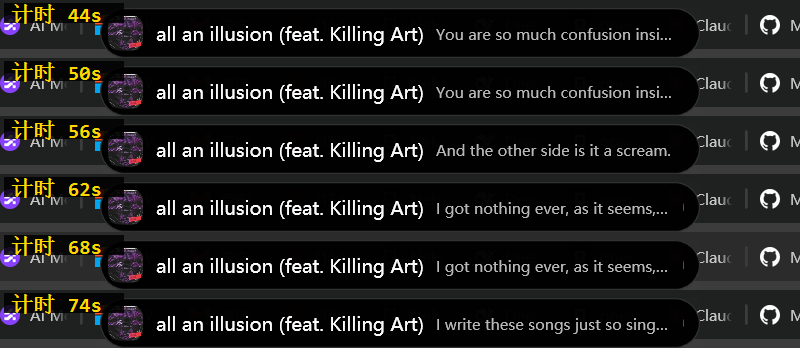
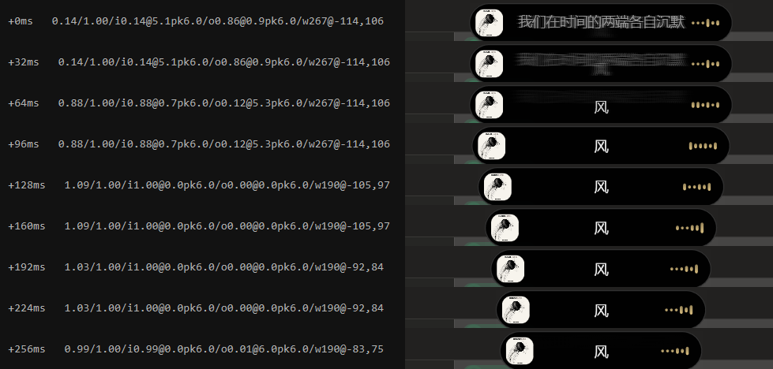

# IslandX —— Windows 平台「流体云」灵动岛 实施计划

> 目标：在 x64 Windows 上复刻 OPPO ColorOS「流体云」的交互与视觉语言 —— 屏幕顶部一枚近黑色胶囊，随系统事件**流体形变**（点 → 胶囊 → 卡片 → 双活动分裂/合并），承载媒体、电量、计时、传输、蓝牙、通知等实时活动。

---

## 1. 技术选型（结论先行）

| 层 | 选择 | 理由 |
|---|---|---|
| 运行时 | **.NET 10 (LTS)**，`net10.0-windows10.0.19041.0` | 本机已装 SDK 10.0.204；该 TFM 自动生成 CsWinRT 投影，可直接调 WinRT（媒体会话、蓝牙、电源） |
| UI 框架 | **WPF** | 无边框 + 逐像素透明 + Topmost 最成熟；Storyboard/自定义动画可控；Win32 互操作生态最全 |
| 形变渲染 | WPF `DrawingVisual` + 自定义 `ShaderEffect`（HLSL ps_3_0，SDF smooth-min） | 流体桥接是签名效果，SDF 平滑并集比"模糊+阈值"更锐利可控 |
| 动画 | 自研**临界阻尼弹簧**求解器，`CompositionTarget.Rendering` 驱动 | 系统级"活的"手感靠弹簧而非贝塞尔曲线 |
| 打包 | 单文件 exe（自包含 x64）+ **稀疏 MSIX**（仅为拿包标识） | 通知监听等 API 需要包标识，见 §7 风险 1 |
| 分发 | Inno Setup / MSIX 双轨 | |

**关键简化认知**：流体云是**不透明近黑**（贴合挖孔摄像头），不需要亚克力毛玻璃。所以 v1 只需在透明窗口上画一个抗锯齿的黑色形状即可，避开了 Windows 上做"胶囊形毛玻璃"的所有坑（`SetWindowRgn` 会产生硬锯齿边）。亚克力仅作为后期主题变体。

**未选 WinUI 3 / Tauri 的原因**：WinUI 3 的透明置顶悬浮窗支持很差；Tauri/Electron 虽然 CSS 做胶水效果容易，但全局热键、低层输入、WinRT 媒体会话都要再穿一层桥，且内存占用不符合"常驻悬浮件"定位。

---

## 2. 系统架构

```
IslandX.sln
├─ src/
│  ├─ IslandX.Contracts/      活动模型、Provider 接口、插件契约（纯 POCO，无依赖）
│  ├─ IslandX.Core/           活动调度器、状态机、弹簧引擎、配置、日志
│  ├─ IslandX.Rendering/      岛体几何、SDF 着色器、主题、取色
│  ├─ IslandX.Providers/      数据源适配器（媒体/电源/蓝牙/网络/剪贴板/文件/通知）
│  ├─ IslandX.Views/          各业务卡片 UserControl + ViewModel
│  └─ IslandX.App/            WPF 宿主、托盘、单实例、自启动、DI 容器
├─ tests/
│  ├─ IslandX.Core.Tests/     调度仲裁、状态机、弹簧收敛（纯单元测试）
│  └─ IslandX.Providers.Tests/
├─ docs/
└─ build/                     打包脚本、稀疏包清单、签名
```

### 2.1 核心抽象

一切系统事件都归一化为 `IslandActivity`，这是整个项目的枢纽：

```csharp
public sealed record IslandActivity
{
    public required string Id { get; init; }              // 稳定标识，用于更新/去重
    public required string ProviderId { get; init; }
    public ActivityPriority Priority { get; init; }       // Critical / High / Normal / Low
    public ActivityKind Kind { get; init; }               // Transient 一闪即逝 / Live 持续 / Sticky 常驻
    public TimeSpan? Ttl { get; init; }                   // Transient 的自动收起时长
    public required CompactVisual Compact { get; init; }  // 收起态：图标 + 短文本 + 进度环
    public ExpandedVisual? Expanded { get; init; }        // 展开态：卡片模板 + 交互控件
    public IReadOnlyList<IslandAction> Actions { get; init; } = [];
    public Color? AccentColor { get; init; }              // 环境光晕（如专辑封面主色）
}
```

Provider 只管把系统状态翻译成活动流，完全不碰 UI：

```csharp
public interface IIslandProvider
{
    string Id { get; }
    IObservable<ActivityChange> Activities { get; }   // Upsert / Remove
    Task StartAsync(CancellationToken ct);
    Task InvokeActionAsync(string activityId, string actionId, CancellationToken ct);
}
```

### 2.2 状态机

```
Hidden ──┬──► Dot（灵动点，仅一枚 4px 呼吸点）
         │       │
         ├──► Pill（收起胶囊，图标 + 一行字）
         │       │  hover ↕ peek（宽度 +8%，轻微上浮）
         │       ▼
         ├──► Expanded（展开卡片，可交互）
         │
         └──► Split（双活动并列，中间保留流体桥）
                 │
              Merged（三个及以上，聚合为 "N 项" 计数胶囊）
```

迁移全部由弹簧驱动，同时形变的属性：`width / height / cornerRadius / offsetX / offsetY / opacity / bridgeStrength`。

### 2.3 活动仲裁（调度器）

同时来多个事件时的决策规则，写成纯函数便于单测：

1. `Critical`（低电量、来电）**抢占**并打断当前展开态；
2. 同 Provider 的同 Id 活动是**更新**而非新增（媒体切歌不重播入场动画）；
3. 两个 `Live` 活动 → 进入 `Split`，各占半边，中间流体桥连接；
4. 三个及以上 → `Merged` 计数胶囊，展开后列表展示；
5. `Transient` 排队串行播放（每个 ≥1.2s 可读时长），不打断 `Live` 的收起态，只临时覆盖；
6. 用户手动展开的活动获得 8s **保护期**，期间不被 `Normal` 抢占。

---

## 3. 窗口与系统集成（Win32 层，坑最多）

| 需求 | 做法 |
|---|---|
| 不抢焦点 | `WS_EX_NOACTIVATE`，并在 `WM_MOUSEACTIVATE` 返回 `MA_NOACTIVATE` |
| 不进 Alt+Tab / 任务栏 | `WS_EX_TOOLWINDOW` + `ShowInTaskbar=false` |
| 空闲时鼠标穿透 | 动态加/去 `WS_EX_TRANSPARENT`；Dot/Pill 态穿透非命中区，Expanded 态全接管 |
| 置顶且压住任务栏 | `Topmost` + 定时 `SetWindowPos(HWND_TOPMOST)` 巡检（防被其他置顶窗抢） |
| 高 DPI | `PerMonitorV2` 清单声明；响应 `WM_DPICHANGED` 重算几何 |
| 多显示器 | 锚定"主显示器 / 当前鼠标所在屏 / 指定屏"三种策略；响应 `WM_DISPLAYCHANGE` |
| 任务栏在顶部 | 读 `SHAppBarMessage(ABM_GETTASKBARPOS)`，自动改锚点或下移 |
| 全屏游戏/放映 | `SHQueryUserNotificationState()` == `QUNS_RUNNING_D3D_FULL_SCREEN` / `QUNS_PRESENTATION_MODE` → 自动隐藏 |
| 息屏/锁屏 | 监听 `WM_WTSSESSION_CHANGE`、`WM_POWERBROADCAST`，暂停渲染循环省电 |

---

## 4. 数据源清单（按实现优先级）

| Provider | Windows API | 备注 |
|---|---|---|
| **媒体播放** | `GlobalSystemMediaTransportControlsSessionManager` (WinRT) | 标题/艺人/封面/进度 + 播放暂停上下曲回控；非打包应用可用。封面流取主色做光晕 |
| **音量** | CoreAudio `IAudioEndpointVolume` + 回调 | 替换系统音量 OSD；岛上滚轮直接调音量 |
| **电源/电量** | `GetSystemPowerStatus` / `Windows.System.Power` | 插拔充电器、低电量告警、剩余时间 |
| **计时器/番茄钟** | 自研 | 进度环 + 到点强提醒 |
| **文件传输/下载** | `FileSystemWatcher` 监视下载目录 | 新文件出现 → 进度/完成卡片 + "打开所在文件夹" |
| **蓝牙设备** | `Windows.Devices.Bluetooth` + `DeviceWatcher` | 连接/断开提示；BLE GATT 电池服务读耳机电量 |
| **网络切换** | `NetworkInformation.NetworkStatusChanged` | Wi-Fi 切换、断网提示 |
| **剪贴板** | `AddClipboardFormatListener` | 复制文本/图片的一闪提示 + 快速粘贴 |
| **截图** | 监视 `Pictures\Screenshots` + 剪贴板位图 | 缩略图预览 + 拖出使用（iOS 灵动岛式） |
| **系统通知镜像** | `UserNotificationListener` | ⚠️ 需包标识，见风险 1 |
| **CapsLock/输入法** | `RawInput`（不用低层钩子） | 状态切换一闪提示，避开杀软误报 |

---

## 5. 视觉与动效规范

- **形状**：胶囊，`cornerRadius = height / 2` 全程保持；展开时 radius 收敛到 `24px` 的圆角矩形，radius 与尺寸同步弹簧插值。
- **底色**：`#0A0A0BF2`（近黑，微透以让下方内容有极淡透出）；边缘 1px `#FFFFFF14` 内描边提升"实体感"。
- **流体桥接**：分裂/合并瞬间，两个胶囊的 SDF 做 `smoothMin(d1, d2, k)`，`k` 随距离衰减 —— 靠近时形成液态颈缩，超过阈值断开。这是「流体」二字的全部来源，值得单独调参。
- **弹簧参数基线**（后续按手感微调）：
  - 展开/收起：`stiffness=220, damping=26, mass=1`（约 380ms，微量回弹）
  - 入场：`stiffness=300, damping=22` + 从 0.85 缩放起跳
  - 位移跟随：`stiffness=180, damping=24`
- **内容转场**：文字/图标不参与形变，用 8px 上移 + 淡入淡出错峰 60ms，避免"被拉扯"的廉价感。
- **主题**：跟随系统深浅色；亮色模式下岛体仍为深色（同流体云），仅强调色与文字层级调整。

### 交互
| 操作 | 行为 |
|---|---|
| 悬停 | peek，宽度微增、轻微上浮，露出更多文字 |
| 单击 | 展开卡片 |
| 再次单击 / Esc / 点击外部 | 收起 |
| 向下拖 | 展开；向上拖 | 收起并静音该活动 30 分钟 |
| 滚轮 | 音量（媒体活动时）/ 列表滚动（聚合态） |
| 右键 | 上下文菜单（设置、暂停该 Provider、退出） |
| 全局热键 | 默认 `Ctrl+Alt+I` 唤出/收起 |

---

## 6. 里程碑

| 阶段 | 内容 | 验收标准 |
|---|---|---|
| **M0 骨架**（1）| 解决方案搭建、DI、日志、托盘、单实例、自启动、配置持久化 | 能常驻运行，托盘可退出，配置改了重启保留 |
| **M1 窗口**（1–2）| 透明置顶窗、Win32 扩展样式、DPI、多屏、全屏自动隐藏、鼠标穿透切换 | 顶部出现一枚静态黑胶囊；游戏全屏时自动消失；换缩放/换屏位置正确 |
| **M2 形变引擎**（2–3）| 弹簧求解器、岛体几何、SDF 着色器、状态机、Dot/Pill/Expanded 三态 | 键盘触发三态互切，60fps 无掉帧，手感有回弹但不晃 |
| **M3 首个 Provider**（2）| 媒体播放全链路（含封面取色、进度、控制按钮） | 放歌自动出岛，切歌不重播入场，点按钮能控播放器 |
| **M4 调度与分裂**（2）| 仲裁器、Transient 队列、Split 流体桥、Merged 聚合 | 媒体 + 计时器同时存在时并列显示，桥接动画连续无跳变 |
| **M5 Provider 铺开**（3–4）| 电源、音量、蓝牙、网络、剪贴板、截图、文件传输、计时器 | 每个 Provider 有独立开关；全开时无冲突、无闪烁 |
| **M6 打磨**（2–3）| 设置界面、主题、动效参数面板、性能优化、内存与功耗 | 空闲 CPU <0.5%、内存 <120MB；连续运行 72h 无泄漏 |
| **M7 打包分发**（1）| 单文件自包含、稀疏 MSIX、签名、安装器、自动更新 | 干净机器双击即用，无需装运行时 |

括号内为人日估算（单人）。M0–M3 是可演示的最小闭环，约 6–8 人日。

---

## 7. 风险与对策

1. **`UserNotificationListener` 需要包标识** —— 非打包应用调 `RequestAccessAsync()` 直接返回 `Denied`。
   对策：制作**稀疏 MSIX 包**（只声明 identity + `userNotificationListener` 能力，主体仍是外部 exe）。若不可行，v1 直接砍掉"系统通知镜像"，用 Provider 开关屏蔽，不阻塞其他功能。

2. **WPF `AllowsTransparency=true` 的性能争议** —— 会走分层窗口路径，且不允许承载子 HWND。
   对策：岛体尺寸小（最大约 720×280），实测足够；同时把渲染逻辑封装在 `IIslandSurface` 接口后面，若实测掉帧，M6 阶段可替换为 DirectComposition + 逐像素 alpha 交换链，不影响上层代码。

3. **HLSL ps_3_0 指令数限制** —— WPF `ShaderEffect` 只支持 ps_3_0，复杂 SDF 可能超限。
   对策：着色器只处理"两个胶囊的平滑并集"这一件事（指令数很低）；三个及以上走 `Merged` 聚合态，本就不需要多体桥接。若仍受限，退路是 SkiaSharp + SkSL 离屏渲染。

4. **置顶权争夺** —— 其他置顶软件（输入法候选窗、部分播放器）会盖住岛。
   对策：低频 `SetWindowPos` 巡检 + 检测到被遮挡时上抬；提供"激进置顶"开关（默认关）。

5. **杀软误报** —— 全局钩子 + 常驻托盘 + 读其他进程媒体信息，容易被启发式判定。
   对策：**不使用 `WH_KEYBOARD_LL` 低层钩子**，改用 RawInput；代码签名证书；README 明示所有敏感 API 用途。

6. **手感主观且难量化** —— 弹簧参数是这类项目最容易反复返工的部分。
   对策：M2 就做**运行时参数调节面板**（滑块实时改 stiffness/damping 并热重载），把调参从"改代码重编译"降为"拖滑块"。

---

## 8. 待你确认的三个决策

1. **通知镜像要不要做？** 要做就得引入稀疏 MSIX 打包，M0 的构建流程会复杂一些；不做则整个项目可以纯 exe 分发。
2. **锚点默认在哪？** 顶部居中（最像流体云，但会压住部分应用标题栏），还是顶部居中偏下 8px 悬浮，或者跟随任务栏那一侧？
3. **插件化要到什么程度？** 内部 Provider 接口化是必做的；要不要额外支持**第三方 DLL 热插拔**（需要 `AssemblyLoadContext` 隔离 + 权限约束，约多 2 人日）？

---

*文档版本：v1 · 2026年08月22日*

---

## 附：MVP 实施记录（2026年08月22日）

M0–M3 已实现并实测，详见 [../README.md](../README.md)。此处只记录**计划之外的发现**，供后续里程碑参考。

### 实施中偏离计划的决定

| 项 | 计划 | 实际 | 原因 |
|---|---|---|---|
| 光晕实现 | `BlurEffect` 模糊 | 径向渐变 `RadialGradientBrush` | 分层透明窗口对 `Effect` 的 alpha 合成不可靠，会间歇性把岛体渲染成**反相的不透明白块**；渐变是纯几何渲染，且更省 GPU |
| 全局热键 | M2 交互规范里的一条 | 提前到 MVP 实现，并加候选回退 | 灵动点态只有 8px 高，没有键盘途径几乎无法唤回；且实测 `Ctrl+Alt+D` 在本机已被占用，硬编码单一组合不可行 |
| 项目结构 | 6 个独立项目 | 单项目内部分层 | MVP 阶段构建与调试更快；`Contracts/` 已隔离，后续拆分成本低 |

### 三个靠肉眼发现不了的问题

这三个都是靠**窗口标题探针**（见 README「调试探针」）定位的，纯看截图全都会漏掉：

1. **光晕层撑大父容器，把岛体整体推下 36px**
   `GlowLayer` 比岛体高 72px，作为 `Grid` 子元素参与布局测量，使垂直居中的岛体从 y=6 被推到 y≈42。
   后果不只是位置偏移 —— 感应区与点击判定全部落空，hover peek 和单击展开**完全失效**，
   而截图上岛体看着"只是位置低了一点"。
   修复：光晕与感应区尺寸恒等于岛体，放大改用 `RenderTransform`（不参与布局测量，但仍影响命中测试，正合感应区所需）。

2. **进度条从未被验证过**
   当时的播放器完全不上报 timeline，`Progress` 恒为 null，进度条正确隐藏 ——
   但这意味着渲染路径一直没跑过。给时钟加了真实进度值（当前小时已过去的比例）才测通。
   教训：**"正确地不显示"和"有 bug 不显示"在截图上完全一样**，必须让数据链路有可断言的输出。

3. **封面取色只提亮度不提饱和度**
   加权平均常得到低饱和灰调（白底插画类封面尤其如此），提亮后仍是一团灰，
   压在近黑岛体上等于没有光晕。改为在 HSL 空间把饱和度拉到下限 0.55、亮度收进 0.45–0.68，
   实测 `#B7AAC8`(s=0.21) → `#A780DA`(s=0.55)，光晕才真正可见。

---

## 附：参考 WinIsland 的视觉升级 + 性能调查（2026年08月22日）

参考实现：[WinIsland](https://github.com/WinIslandProject/WinIsland)（Rust + Skia + D3D，GPLv3）。
只借鉴视觉与算法思路，代码为独立实现。

### 移植过来的东西

| 项 | 参考实现的做法 | 本项目的实现 |
|---|---|---|
| **G3 连续曲率圆角** | `utils/shape.rs` 的 `g3_rounded_rect_path`，三段式角：七次多项式混合(30%) → conic 圆弧(55°) → 镜像混合(30%) | `Rendering/Squircle.cs`，同一套数学，圆弧段改用 WPF `ArcTo` |
| 收起态形态 | 封面缩略图 + 单行大字（18px），无副标题 | 同结构，标题 15px + 淡色副标题（保留艺人信息） |
| 宽度自适应 | 胶囊宽度随歌词/标题长度伸缩 | `MeasurePillWidth` / `MeasureExpandedWidth` 用 `FormattedText` 实测文本宽度 |
| 描边 | `argb(30,255,255,255)`，1px，路径内缩 0.5px 做像素对齐 | 同做法，但 alpha 提到 48 —— 参考实现岛体外没有散光，而这里光晕会盖在边缘上，alpha 30 的白线亮度（30）反而低于光晕（46），会被完全淹没 |
| 主色提取 | 8×8 缩放后纯平均 + brighten(1.3/1.5) 得双色 | 保留原有的饱和度加权，但改为在 HSL 空间提饱和度（下限 0.55），并派生第二色做双色渐变 |

**未移植**：音频频谱可视化（需要 WASAPI loopback 采集 + 分频段能量，参考实现有 `core/audio.rs` 33KB）、
实时歌词（`core/lyrics.rs` 25KB）、`dynamic` 背景（模糊封面旋转漂移，WPF 的 `Effect` 在分层窗口不可靠）。

### 切歌交叉淡化

原先切歌是硬切（直接改 `Text` / `Source`）。改为交叉淡化，但**不引入第二套控件树** ——
那会让每帧都多遍历一套文本与布局，而每帧成本正是帧率的瓶颈。

做法是切歌瞬间用 `RenderTargetBitmap` 把当前内容拍成一张位图，作为"旧的那一半"：
常态零额外开销，代价只是切歌时一次约 1–3ms 的软件渲染，转场期间也只多一个 `Image` 的渲染。

两层刻意**错峰**而非等比交叉（`fadeOut = (1-swap)*1.5`，`fadeIn = (swap-0.25)/0.75`）：
等比交叉会让新旧两段文字在中途糊成一团，错峰把重叠期从全程压到约四成。
转场刚度也调得比形变高（约 180ms），拖沓只会延长糊在一起的时间。

### 性能调查：三个假设被数据推翻

把 Border 换成每帧重建的 Path 后，形变期 CPU 达 **65%**。定位过程值得记录，因为**前三次假设全错**：

| # | 假设 | 验证方式 | 结果 |
|---|---|---|---|
| 1 | 几何构建太贵（`PathGeometry` 是 DependencyObject 对象树） | 换成 `StreamGeometry`，并给几何构建单独计时 | ❌ 构建只花 **0.032ms/帧**（占 16.7ms 预算的 0.19%），换完 CPU 反而升到 69.6% |
| 2 | 分层透明窗口每帧要把整个画布拷给 DWM | 画布 820×300 → 660×200（面积降 46%） | ❌ CPU 几乎不变（69.6% → 68.3%） |
| 3 | 某一项每帧操作是热点 | 加 `ISLANDX_SKIP` 开关，逐项跳过做五组对照 | ❌ **没有单一热点** —— 跳过任何一项只降 1.5%~13% |

真正的原因藏在对照实验的**帧数**里：1259 帧 / 7.04 秒 = **179fps**。
查显卡确认这台机器是 **240Hz 屏**，`CompositionTarget.Rendering` 按刷新率触发，
一次 300ms 的形变要渲染 72 帧；而每帧管线成本约 3.6ms 已超过 240Hz 的 4.2ms 预算，
于是它满负荷追赶，吃掉大半个核。

**瓶颈从来不是单帧成本，而是帧数。** 加 90fps 上限后 CPU 从 65% 降到 **26%**
（被跳过的 vsync 时长累积后一次性喂给弹簧，动画时长不受影响）。

### 第二轮：定位到布局，帧率与 CPU 双赢

上面第 3 个对照实验有个漏洞：`GlowLayer` 的 `Width/Height` 赋值在 `glow > 0.001` 分支里，
**没有被 `size` 开关跳过**，所以布局成本被低估了。每帧实际改了三处元素的尺寸
（岛体、感应区、光晕），每一处都触发布局失效。

改成**每帧零布局**：

- 岛体画布尺寸恒定（`BodyCanvasWidth/Height`），形状画在其中居中位置
- 整体上移由一个 `TranslateTransform`（`LayoutShift`）完成，使形状顶边始终贴 y=6
- 感应区与光晕改为固定 100×100 基准 + `ScaleTransform` 撑开
- `Path` 换成自绘的 `IslandShape`（`Path` 换 `Data` 会触发 `InvalidateMeasure`）

结果每帧成本 6ms → **2.2ms**，帧率 55 → **72fps**（形变期约 120fps），CPU 26% → **20%**。
**帧率更高的同时 CPU 更低**，因为省掉的是布局，不是渲染。

一个随之而来的回归：自绘 `FrameworkElement` 的默认命中测试按**布局边界**判定，
而这里的边界是整块恒定画布（560×140），远大于岛体 —— 那会让岛体四周的透明区域也拦下鼠标、
挡住下方窗口。必须重写 `HitTestCore` 用 `FillContains` 按轮廓判定。
实测形状内 `hov=1`、形状外全部 `hov=0`（已穿透）。

### 一个反直觉的结论

顺手做的另一个"优化"让性能**变差**了：把 `Opacity=0` 的内容切成 `Visibility.Collapsed`，
想省掉渲染遍历 —— 结果 CPU 从 32% 涨到 40%。原因是 `Visibility` 是 `AffectsMeasure`，
每次翻转触发一次完整布局传递（含所有 `TextBlock` 的文本测量），
而 `Opacity=0` 的元素布局是缓存的。**在 WPF 里重新布局比多一次渲染遍历贵得多。** 已回滚。

### 封面与歌曲错位：一次「测试方法本身是错的」

**现象**（用户肉眼发现）：标题正确，但封面是上一首歌的，且会一直错下去。

**根因**：封面缓存键用了「标题 + 艺人」。GSMTC 上报新标题与新缩略图**不保证在同一刻**，
于是切歌时走出这样一条路径：

1. 拿到 props：标题已是新的，`Thumbnail` 仍是上一首的
2. key 变了 → 加载封面 → 装进去的是**旧图**
3. key 已更新为新标题 → 后续所有事件都判定「key 没变」→ 跳过加载
4. 这张旧封面就**永久固化**，直到下次换歌 —— 于是封面永远慢一首

**修复**：改用**缩略图字节的 SHA-256 前 8 字节**做键 —— 判据是内容而不是标题。
另加一层保险：换歌了但缩略图哈希没变时，在 180/400/800/1500/2600ms 追查五次
（有播放器确实会晚几百毫秒才换图）。本机网易云实测上报及时，追查命中数为 0，
它是为其他播放器兜底的。

**真正的教训在验证方法上。** 我先后用两种方式"验证"过封面更新，都得出了"正常"的结论：

| 我的判据 | 为什么没用 |
|---|---|
| `Artwork` 对象的哈希是否变化 | `BitmapImage` 每次加载都是新对象，**哈希必然变** —— 加载的是旧图也一样变。指纹变化只证明"加载过"，不证明"加载对" |
| 连续切歌，看指纹每轮是否都不同 | 同上，一路显示"OK 同步"，而屏幕上封面全是错的 |

有效的做法是引入一个**不经过被测代码的 ground truth**：`tools/MediaProbe`
直接调 GSMTC 读当前缩略图、算同格式的哈希并导出图片，再与岛体的哈希逐轮对比。
一旦这样比，第一轮就暴露了 —— GSMTC 给的是梵高《盛开的杏花》，岛体显示的是另一张深蓝色的图。

教训：**验证"值变了"几乎总是不够，要验证"值是对的"**；而判断对错需要一个独立于被测实现的参照物。

### 分层窗口的鼠标穿透：两个由 alpha 决定的坑

**现象**（用户提出）：辉光区域点击应该穿透，实际被吞。

分层透明窗口里，鼠标消息能否落到窗口上，由**该像素的 alpha** 决定，而不是 WPF 的命中测试：

- `alpha == 0`：系统直接穿透，**连 WM_NCHITTEST 都不发**，WPF 完全不参与
- `alpha > 0`：系统投递消息给窗口，交由窗口决定

由此引出两个方向相反的坑，而且它们互相掩盖：

**坑一：辉光吞点击。** 光晕是渐变半透明（alpha 110→0），属于 `alpha > 0`，
系统把它当实体投递消息；而 WPF 那边 `GlowLayer` 是 `IsHitTestVisible="False"`、
形状外也没有别的元素响应 —— 点击既不展开岛体，也传不到下方窗口，**被黑洞吞掉**。

修法：自己处理 `WM_NCHITTEST`，用 `InputHitTest` 判断，命中不到就返回 `HTTRANSPARENT`
把这一点让给下方窗口。

**坑二：`Background="Transparent"` 的感应区根本收不到鼠标。**
灵动点态岛体只有 8×8，靠一个放大到 150×22 的 `HoverZone` 提供可命中范围。
`Transparent` 在普通 WPF 窗口里是"可命中但不可见"的标准手法，
但在分层窗口里它渲染出的是 `alpha == 0` —— 系统直接穿透，WPF 的命中测试没有机会参与，
**感应区形同不存在**。必须用 `#01FFFFFF`（alpha=1，肉眼不可见）才能让系统把消息投过来。

这个 bug 实际上是自己引入的：早期版本用的正是 `#01FFFFFF`，
后来"顺手改成 `Transparent` 更干净"，把功能改坏了。
更糟的是当时的验证选点落在岛体形状**内部**，测到的是形状本身在响应，
于是得出"感应区正常"的结论 —— 直到处理坑一时把命中元素打进探针，才看到命中的一直是 `IslandShape`。

两者配合后各司其职：`HoverZone`（alpha=1）让系统投递消息、由 WPF 判定为命中；
辉光区域没有可命中元素，`WM_NCHITTEST` 返回 `HTTRANSPARENT` 让出去。

### 光晕失效：三个原因叠在一起

**现象**（用户提出）：光晕直接坏了 —— 屏幕上完全看不到光。

三个独立原因同时作用，各自都足以让它不可见：

**1. 形状退化成椭圆。** 零布局重构时，光晕从「跟随岛体尺寸的圆角矩形」
改成了「固定 100×100 的圆形 + `ScaleTransform` 放大」。Scale 会把圆拉成椭圆，
而且两轴比例差得很远（Pill 态垂直放大 2.8 倍、水平只有 1.24 倍），
于是上下扩散远多于左右，完全不像沿轮廓散出的光。

**2. 渐变的浓部被岛体挡住。** 径向渐变把 alpha 峰值放在中心，
可那正是不透明岛体所在的位置 —— 露出来的只有最外圈。
实测岛体边缘处的有效 alpha 只剩 3%–10%，在深色桌面上等于没有。

**3. 部分封面根本拿不到主色。** `ArtworkColor.Extract` 有两条会返回 null 的路径：
饱和度低于阈值的「灰度封面」，以及**所有像素都被亮度过滤掉**的情况 ——
一张近乎纯白的封面（实测 489 字节的网易云封面）会让每个像素的 `lumCenter` 都趋零，
加权统计全为 0，于是没有主色、也就没有光晕。

对应的三个修复：

- 光晕改用与岛体**同款 G3 几何**，沿轮廓等距外扩 36px、圆角同步加大，四周扩散一致
- 渐变改成四个停靠点，alpha 峰值移到 `0.5–0.8` 那一段，也就是岛体轮廓外侧那一圈
- 取色改用**色相直方图取主导色**（平均会让不同色相互相抵消，鲜艳但色相分散的封面
  也会算出接近灰的结果），并补两条兜底：真灰度封面给中性冷白，
  极亮/极暗封面按整体亮度给白光或中性光 —— **少一圈光比一圈错色的光更糟，但完全没有更糟**

定位过程同样是靠探针：先看 `accent` 与 `glow` 两个字段排除"数据没到"，
再在取色函数的每个返回点打上分支标记（`why` 字段），
一次切歌就看到了 `no-weight src=192x192 px=16x16` —— 直接指向亮度过滤吃掉了全部像素。

### 光晕随音乐律动

用户要求光晕像频谱一样跳动。实现是 **WASAPI 环回采集 + 低频能量驱动**。

**光晕不做 FFT。** 律动感几乎全部来自鼓点与贝斯，一阶低通（截止约 180Hz）再取 RMS
就足以表现节拍，成本比 FFT 低一个量级、观感看不出差别。
**频谱条则必须做 FFT**：6 根条要分辨 6 个频段，用 6 个 IIR 带通的话频段间串扰太重。
1024 点 FFT（Hann 窗）在 48kHz 下约 21ms 一帧、bin 宽约 47Hz，成本约 0.05ms，可忽略。
频段按对数分布（120/300/700/1600/4000/10000Hz）—— 线性分布会让 5 根条全挤在高频。
每段**独立**跟踪峰值：高频能量天然比低频低一个数量级，共用增益的话高频那几根永远趴着不动。

**为什么用低频而不是整体音量。** 整体音量在人声长音上会一直顶高，看不出节奏；
低频跟着鼓点走，起伏才是"拍子"。

**归一化必须自适应。** 用缓慢衰减的峰值跟踪而不是固定增益 ——
固定增益下小音量时光晕几乎不动、大音量时一直顶满，效果完全取决于系统音量旋钮的位置。
平滑同样是上升快、下降慢（0.5 / 0.11），这是频谱类可视化的通用手感。

**帧率要分档。** 形变是短暂的（约 300ms），律动是持续的 —— 用同一档帧率跑，
常驻占用会很难看。所以形变 144fps 上限、纯律动 48fps 上限（实测约 28fps），
并且律动帧**只改透明度与缩放、不重建几何**：加了形状脏检查后实测几何重建增量为 0，
律动期 CPU 5.7% 单核。托盘里还留了开关给在意功耗的人。

**一个只在运行期暴露的坑：COM GUID 不能凭记忆写。**
`IID_IAudioCaptureClient` 我按记忆写成 `C8ADBD64-5F1D-4F3F-8B49-3F5E4B0B1B4C`，
只有前 8 位碰对，`GetService` 于是返回 `0x80004002`（E_NOINTERFACE）——
这个错误既不指向哪个 GUID 有问题，也不会在编译期暴露。
正确值 `C8ADBD64-E71E-48A0-A4DE-185C395CD317` 是从
`Windows Kits\10\Include\<ver>\um\Audioclient.h` 里查出来的。
定位靠的是给采集流程每一步打上标记（探针 `err` 字段直接给出 `get-capture-service:0x80004002`），
否则只能对着一堆 COM 调用逐个试。

### 关于「为什么不用硬件加速 / 能不能用 Vulkan」

探针里的 `tier2` 说明 WPF 本就在**完全硬件加速**下运行（`RenderCapability.Tier == 2`），
光栅化走 GPU。CPU 上花的是几何构建（0.02ms，可忽略）与 WPF 渲染管线的托管侧开销
（布局、脏区计算、可视树遍历、分层窗口更新）——布局那部分已经消除，剩下的分散且无热点。

**Vulkan 不是这个场景的解**：其 WSI（`VK_KHR_win32_surface`）创建的 swapchain
不支持 per-pixel alpha 参与桌面合成。要做透明悬浮窗必须走 DirectComposition，
而 DComp 只接受 D3D 的 surface（`IDXGISwapChain` / `IDCompositionSurface`）；
Vulkan 要接进去得靠 `VK_KHR_external_memory_win32` 导出成 D3D11 资源再交给 DComp，
代码量翻倍还要处理跨 API 同步，而换不来任何性能 —— 画一个 SDF squircle 根本不是 GPU 瓶颈。

真正的升级路径是 **DirectComposition + D3D11 交换链 + SDF 着色器**：
superellipse 的 SDF 有解析式，圆角与形变全部变成 shader uniform，零几何零 tessellate，
半透明交给 DComp 而不是分层窗口。这即是 §7 风险 2 里写的 M6 路径，
工作量约 600–900 行 interop + HLSL。当前形变只持续约 300ms、静止时 CPU 归零，
且它与 M4 的流体桥接是同一件事，建议合并做。

### 对后续里程碑的提示

- **风险 2 已部分兑现**：`AllowsTransparency` 本身性能可接受（静止 0% CPU、形变无掉帧），
  但它与 `Effect` 的组合确实有问题。M6 若要加毛玻璃主题，不能走 WPF `Effect`，
  须直接上 DirectComposition 或 Win2D。
- **弹簧手感偏稳重**：当前阻尼比约 0.88，实测几乎无过冲。规范里写的"微量回弹"没有体现出来，
  想要更弹需把 damping 降到 18–20。这正是 M6 参数调节面板要解决的问题。
- **媒体刷新可以更省**：无 timeline 时仍每 500ms 发布一次，白耗 CPU。
  Provider 可在检测到无 timeline 后把间隔放大到 5s。
- **限帧上限应可配置**：当前硬编码 90fps。低端机可以降到 60，
  真要上高刷则必须先换渲染后端，否则每帧 3.6ms 撑不住 120fps+。
- **M4 的流体桥接正好适合上 SDF 着色器**：两个胶囊的 `smoothMin` 平滑并集用几何很难表达，
  用 shader 是自然解。届时可以顺带把整个岛体的渲染迁到 DirectComposition，
  一次解决形变 CPU 与流体桥接两个问题。
- **频谱条已经差最后一步**：`AudioPulse` 现在只暴露整体与低频两个标量，
  要做参考实现那种收起态右侧的竖条，把一阶低通换成 6 段带通（或一个 256 点 FFT）即可，
  渲染侧用同一套「上升快下降慢」的平滑。

---

## 实施记录：移除环境光晕

### 决策

光晕（沿轮廓外扩的封面主色径向渐变）**已整体删除**。

理由是产品性的，不是技术性的：真机上的灵动岛没有这个东西。
iOS Dynamic Island 与 ColorOS 流体云都是纯黑胶囊，靠形状与内容说话，不靠发光。
它是照着 WinIsland 加的，加进来之后一直在制造问题（见下），而它本身并不属于要仿的形态。

删除范围：`GlowShape` 元素与 `GlowPulse` 变换、`_glowBrush` 径向渐变、`_glowOpacity` 弹簧、
`SetGlowColor` / `Brighten`、`GlowSpread` / `PulseOpacityDepth` / `PulseScaleDepth` 常量、
每帧的光晕几何构建，以及 `AudioPulse` 里只为光晕存在的低频那一路
（`BassAlpha` 一阶低通、`_peakBass`、`_smoothBass`、`Bass` 属性）。

**保留**封面主色提取（`ArtworkColor`）—— 频谱条要用它着色，只是把
`NeutralGlow`/`BoostForGlow` 改名为 `NeutralAccent`/`BoostForAccent`，术语跟着走。

实测收益（Release，同一台机器、同一脚本 16 次形变）：形变期单核 CPU **20% → 17.4%**。
省下的是一块大面积半透明径向渐变的填充率。律动期 4.8% → 4.9%（无变化，
光晕本来就只改 Opacity/Scale、不重建几何）。

### 连带收益：鼠标穿透问题从根上消失

分层透明窗口里，鼠标能否落到窗口上由**像素 alpha** 决定：`alpha == 0` 系统直接放行、
连 `WM_NCHITTEST` 都不发；`alpha > 0` 就把消息投给窗口。
光晕正是一大片 `alpha` 从有到无渐变的像素 —— 它把周围一圈的点击全接了下来，
而 WPF 那边没有元素响应，点击既不展开岛体、也传不到下方窗口，就这么被吞掉。
这个问题反复出现过三轮。

光晕删掉后，岛体周围恢复成真正的 `alpha == 0`，系统在那里根本不会发消息给本进程 ——
不是"我们答得对"，而是"我们压根不参与"。这比任何 hit-test 修补都彻底。

`WM_NCHITTEST` 处理仍然保留，但服务对象换成了感应区：
`HoverZone` 的背景是 `#01FFFFFF`（`alpha == 1`，肉眼不可见但足以让系统投消息 ——
用 `Transparent` 会渲染成 `alpha == 0`，感应区就形同不存在，这个坑单独踩过一次）。
同时给它加了状态门：

```csharp
// 感应区只在灵动点态可命中。它是个矩形，而岛体是 G3 圆角 ——
// 胶囊/卡片态留着它，四个圆角外那几片 alpha=1 的小三角就会吞掉点击。
HoverZone.IsHitTestVisible = state == IslandVisualState.Dot;
```

三态实测（网格逐点发 `WM_NCHITTEST`，与探针报出的轮廓矩形逐格比对）：

| 状态 | 岛体 | 感应区 | 轮廓/感应区之外误收点击 |
|---|---|---|---|
| Pill | 308×40 | 不可命中 | **0** |
| Expanded | 380×140 | 不可命中 | **0** |
| Dot | 68×8 | 150×22 可命中 | **0** |

端到端复核（记事本置于岛体下方，先把焦点交给第三个窗口，再点击）：
点岛体正下方 14px、点岛体左侧 18px（都是原来光晕最浓的位置）→ 记事本被激活，穿透成立；
点岛体本身 → 前台不变（`WS_EX_NOACTIVATE` 生效）且岛体展开。

### 教训：探针自己错了最难发现

这一轮真正浪费时间的不是光晕，是**测试脚本用错了坐标空间**。

探针原本有个 `o` 字段，报的是 `IslandBody.PointToScreen(...)` 得到的屏幕坐标。
脚本拿它算测试点，再把点塞进 `SendMessage(WM_NCHITTEST, lParam)`。
但 `WM_NCHITTEST` 那条路径上，坐标要经 `ScreenToClient` 落到窗口客户区 ——
本机 125% 缩放下，这两个空间差一个 DPI 因子。于是采样点整体偏移，
测出来是"轮廓内不响应、轮廓外反而响应"，看着像命中判定彻底错位。

按这个假象改了一轮命中代码（把 `PointFromScreen` 换成 `ScreenToClient` + `TransformFromDevice`），
重测——**症状一模一样**。症状不随被改的代码变化，说明改错了地方：错的是观测端。

修法是让探针只报**命中测试自己坐标系**里的数据，并删掉那个会误导的 `o`：

```
|box196,6,308x40|hz197,6,308x40/0
     岛体轮廓            感应区/是否可命中     ← 全部是窗口客户区 DIP
```

`hz` 一开始还犯了同一类错误的缩小版：只变换左上角、宽高直接取 `ActualWidth`，
于是把靠 `ScaleTransform` 撑开的感应区报成未缩放的 100×100。
改用 `TransformBounds` 变换整个矩形才对。

这和之前封面错位那次是同一个病：**验证时观测的量不是要断言的量**。
那次是"封面对象变了没有"（每次加载都是新对象，必然变），这次是"坐标算在哪个空间"。
两次都是自动化脚本报告通过、而屏幕上明摆着是坏的。可用的解药只有两条：
让探针输出与被测逻辑**同源**的量，以及在改动后确认**症状确实随之变化** ——
症状纹丝不动时，先怀疑观测端。

---

## 实施记录：非线性与过冲

### 问题

形变一直是"到位就停"，没有弹性。原因在参数，不在求解器：

```csharp
var stiffness = entering ? 300.0 : 220.0;
var damping   = entering ? 22.0  : 26.0;
_width .Configure(stiffness, damping).SetTarget(targetWidth);
_height.Configure(stiffness, damping).SetTarget(targetHeight);
_radius.Configure(stiffness, damping).SetTarget(targetRadius);
```

两处毛病：

1. **阻尼比太高**。ζ = damping / (2√stiffness) = 26/(2√220) ≈ 0.88，
   首次超调约 exp(-πζ/√(1-ζ²)) ≈ 1% —— 肉眼完全看不出来。
2. **三个维度参数完全相同**，等于严格同步。形状全程是等比缩放的胶囊，
   每一帧都只是上一帧的放大版。这才是"硬"的根源 —— 比不过冲更致命，
   因为它让形变退化成一次缩放，而不是一个形状在变形。

### 做法

按**方向**和**维度**分别给参数（`ConfigureFeel`）。错峰方向跟着形变方向走：

- **变大** —— 宽度先冲出去（k=260, ζ=0.62），高度慢半拍跟上（k=190, ζ=0.76）。
  中途是个"宽而未高"的扁形，像水先铺开再涌起。
- **变小** —— 高度先塌下去（k=270, ζ=0.70），宽度慢半拍收拢（k=200, ζ=0.88）。
  反过来（宽先收）会在中途得到一个窄而高的方块，非常难看。
- **入场**（细横条 → 胶囊）是"冒出来"的动作，两个维度都更跳（ζ≈0.55 / 0.60）。

圆角始终取宽高之间的中间值，跟着高度走但略快 —— 形变中途轮廓更饱满。

透明度弹簧**不动**：冲过 1 再回落会让文字闪一下，过冲在这里只有坏处。

### 怎么确认它真的在过冲

这类改动最容易自我说服 —— 阻尼比动一点点，观感差别很微妙，
盯着屏幕看很容易觉得"嗯好像是弹了一下"。所以让弹簧自己记录两个可断言的量：

- `PeakOvershoot` —— 越过目标后朝原方向还走了多远，按总行程归一化
- `SettleMs` —— 首次走完 95% 行程的耗时，用来看"谁先到"

峰值出现在速度过零那一刻，可能落在两个子步之间，所以统计要放在子步循环**内**，
放外面会漏掉真正的峰。

一开始想用外部脚本高频轮询窗口标题来采轨迹，这条路是错的：
`GetWindowTextW` 对别的进程走 `WM_GETTEXT`，紧密轮询会阻塞 IslandX 的 UI 线程，
反过来干扰被测的形变 —— 观测行为改变了被观测对象。改由弹簧自记后没有这个问题。

实测：

| 形变 | 宽超调 | 高超调 | 圆角超调 | 宽到位 | 高到位 | 错峰 |
|---|---|---|---|---|---|---|
| 入场 Dot→Pill | 12.0% | 8.8% | 8.3% | 138ms | 159ms | 宽先 21ms |
| Pill→Expanded | 7.7% | 2.0% | 3.4% | 160ms | 231ms | 宽先 71ms |
| Expanded→Pill | 0.1% | 3.9% | 2.5% | 280ms | 177ms | 高先 103ms |

按固定相位连拍展开过程（每帧独立触发、忙等到指定延迟再截屏，相位可比）：

```
  +  0ms   236 x  40   起点
  + 40ms   256 x  50   宽 14%  高 10%
  + 80ms   307 x  76   宽 49%  高 36%   ← 中间态明显是"宽而扁"
  +130ms   351 x 102   宽 80%  高 62%
  +190ms   385 x 126   宽 103% 高 86%   ← 宽已冲过目标，高还差 14%
  +320ms   386 x 142   都到位并微微过冲
```

开销：Release 下形变期单核 17.4%，与加过冲前**完全一致**。
过冲让形变多持续几十毫秒，但限帧与几何脏检查把这点成本吸收了。

### 又一次：错的是观测端

改完跑穿透回归，5040 点里冒出 473 处误收，而手动点击一切正常。

第一反应是过冲把形状撑大、命中区域跟着变了。不对 —— 探针里渲染帧数 `rf` 全程 `+0`，
形状根本没动，`box` 扫描前后都是 `232,6 236x40`。

真相要靠探针的 `hit` 字段（它报命中测试内部看到的本地坐标）才看得见：
发 x=200 它算出 160，发 300 算出 240，发 600 算出 480 —— 恒定 0.8 倍。
那正是 1/1.25。`WM_NCHITTEST` 的 lParam 是**屏幕物理像素**，而 `box` 是**客户区 DIP**。
换算回去，命中范围 240–464 DIP 与轮廓 232–468 完全吻合：**命中判定一直是对的**。

网格脚本漏了 ×1.25；同一轮的端到端穿透测试和交互测试写对了，所以那两项通过。
两个脚本对同一件事给出相反结论时，先怀疑脚本。

排查途中还撞上两个纯属自伤的坑，都值得记下来：

- **PowerShell 变量名不区分大小写**。截图脚本里 `$FH` 本来写作 `$H`，
  把窗口句柄 `$h` 覆盖成了 190，于是每次 `Hotkey` 都打在无效句柄上。
  症状是连拍出来六帧全是收起态 —— 幸好足够明显，没导致误判产品代码。
- **探针挂在渲染回调上，而弹簧静止后回调会被摘除**，标题于是停在最后一帧。
  命中测试在那之后照常工作，拿那份陈旧的 `box` 去判定当前命中结果，
  等于拿旧尺子量新东西。现在 `WM_NCHITTEST` 处理里会就地刷新一次探针。

固化成了 `tools/hit-probe.ps1`：**先标定坐标空间，再测量**。
发两个已知点、用 `hit` 回读的本地坐标反解出换算关系，再用第三点自检，
自检不过直接报错退出、不出结论。至此这个换算已经手推错过两次，不该再有第三次。

---

## 实施记录：形变帧率

反馈是"展开/缩小的观感帧率有点低"。实测确实低，但低的原因和预期完全不同。

### 限帧机制是净损失

先量。给探针加了形变期的帧间隔统计（帧数 / 时长 / 最长帧），
因为"观感卡"可能是帧率低，也可能是帧率够但有长帧 —— 平均帧率会把偶发的长帧完全抹平。

第一次测出 71fps、最长帧 30ms。但那是 Debug 构建，探针每帧拼一条 300 字符的标题
再 `SetWindowText`（同步窗口消息），嫌疑很大 —— 又是观测可能改变被观测对象。
把探针限流到 20fps 后重测：**帧率没变**，所以探针不是瓶颈。

然后用 `ISLANDX_FPS` 扫描不同的帧率上限（Debug，240Hz 屏）：

| 上限设定 | 实测帧率 | 平均间隔 | 形变期 CPU |
|---|---|---|---|
| 不限（跟随 vsync） | **194fps** | 5.3ms | 26.2% |
| 240fps | 92fps | 10.9ms | 18.9% |
| 144fps | 65fps | 15.4ms | 18.3% |
| 120fps | 62fps | 16.2ms | 18.6% |
| 90fps | 49fps | 20.4ms | 16.9% |

**限 240fps 反而只有 92fps，比不限帧的 194fps 差一倍。**

病根在"累积时间超过阈值才渲染"这种阈值法：阈值一旦接近 vsync 周期，
浮点抖动会让约一半的回调落在阈值下方被跳过，帧率直接减半。
真要限帧必须按 vsync 整数倍分频，而不是拿绝对时间去卡。

而且限帧换来的 CPU 节省很有限（26.2% → 18.3%），却砍掉了三分之二的帧率。
这笔账在**当初是划算的** —— 限帧是光晕还在、且每帧都会触发布局的年代定下的，
那时不限帧要 65% 单核。零布局与去掉光晕把单帧成本压下来之后，
前提没了，结论也就跟着失效。**旧优化会随着它针对的成本消失而变成负担。**

改为形变期不限帧、律动期保留 48fps 限帧（20.8ms 远大于 vsync 周期，不会病态）。

### 顺带修掉的一个 bug

```csharp
var interval = _springsMoving ? MaxFrameInterval : PulseFrameInterval;
```

`_springsMoving` 是**上一帧**算出的。形变刚启动时它还是上次静止时留下的 `false`，
于是**第一帧按律动档**，要等一个 20.8ms 的间隔才动 —— 形变开头凭空多出一次停顿。
改成当场遍历弹簧判断有没有未静止的。

### 静止阈值按量纲分档

不限帧把 Release 形变期 CPU 从 17.4% 抬到 30.5%。这笔开销里有一部分是白花的：
形变要跑约 900ms 才判定静止，而视觉上 250ms 就到位了，剩下的是肉眼不可辨的回弹尾巴，
却在以 190fps 满帧渲染。

原因是静止阈值 `RestDelta = 0.01`（0.01 像素）对尺寸弹簧严苛得离谱。
但它不能简单调大 —— `SpringValue` 同时用于透明度（0–1 量纲），
0.25 的阈值对透明度就是 25% 的误差。所以加了 `RestScale`：
位置阈值 = 0.01 × RestScale，速度阈值 = 0.05 × RestScale，尺寸弹簧取 25、透明度取默认 1。

形变期 900ms → 620ms，Release CPU 30.5% → 27.2%，视觉无差别。

### 结果

| | 改动前 | 改动后 |
|---|---|---|
| 形变期帧率 | 65fps | **190fps** |
| 平均帧间隔 | 15.4ms | **5.3ms** |
| 形变期时长 | 约 900ms | **620ms** |
| Release 形变 CPU | 17.4% | 27.2% |

长帧仍有 20–30ms 的偶发，但探针里 Gen0 回收次数为 **0** —— 不是 GC，
应为系统调度与 DWM 合成抖动，WPF 层面没法再压，归入 M6 的 DirectComposition。

### 一个测量上的教训

中途一度以为"静止时 CPU 从 0.8% 涨到 7.6%"是回归，查下去发现探针里 `act1` ——
当时有音乐在放，那 7.6% 是频谱律动，跟改动无关（律动期 33.8fps/7.5%，
与改动前的 32.6fps/7.4% 同口径持平）。

**测性能必须先确认环境状态**，否则会把环境差异算到自己头上。
探针里那个不起眼的 `aud` 字段就是干这个的。

---

## 实施记录：形变 CPU 从 27.2% 压回 16.6%，帧率几乎不掉

上一轮不限帧换来了 190fps，代价是形变期 27.2% 单核。这轮的问题是：
能不能把 CPU 压回去、又不明显掉观感。答案是三刀，合计 **27.2% → 16.6%**，
快段帧率 190 → 105fps（240Hz 屏上节奏均匀，肉眼无差别）。

### 第一刀：按 vsync 整数倍分频（27.2% → 19.1%，与第二刀合并计量）

上轮已证明"累积时间超过阈值才渲染"的限帧法病态。正确做法是**分频**：
数渲染回调，每 N 个渲染一帧。240Hz 除 2 ≈ 目标 120fps，间隔恒为整数个 vsync，节奏均匀。

除数 = round(1 / (vsync周期 × 目标帧率))，其中 vsync 周期需要在线估计。这里连栽两次：

1. **衰减最小值**方案：`min(rawDt, 之前值 × 1.02)`。想法是"渲染帧的回调会被自己
   的耗时拖长，只有被跳过帧的间隔才是干净的 vsync，取最小值天然只信它们"。
   结果**刚挂上回调时第一次几乎立刻就来**（rawDt ≈ 0），最小值被咬死，
   除数算到几百，渲染一停就是一秒多（实测最长帧 1113ms，形变全靠 dt 夹断续命）。
2. 加了 2.5–50ms 的接受窗口再测：好了一点但快段只有 ~50fps —— WPF 的补偿调度
   会把回调**提前**到 2.5–3.3ms，这些是真实存在的间隔，窗口挡不住，最小值仍被拽低。

教训：Rendering 回调的间隔向两个方向都撒野，均值会被渲染耗时拽高、最值会被
提前回调拽低。**换滚动中位数**（最近 9 次，环形缓冲 + 栈上排序）后两侧离群值都免疫：
快段稳定 ~105fps（目标 120，WPF 回调打滑略低），尾段 ~55fps。
另加除数上限 8 作保险丝 —— 估计器再出问题，最多慢到 vsync/8，不会再一停一秒。

### 第二刀：亚像素尾巴降半帧

形变 650ms 里后一半是回弹尾巴，每帧运动不足半像素，满帧渲染纯属浪费。
所有弹簧的 |速度| 都低于 `2.4 × RestScale`（尺寸弹簧即 60px/s ≈ 120fps 下每帧半像素）
时把除数再乘 2。尾巴占形变时长一半，这一刀省的帧比分频本身还多。

判据挂在速度而不是位置上：位置离目标近但速度还高的时刻（过冲穿越目标的瞬间）
运动依然剧烈，按位置判会在最活跃的时刻降帧。

### 第三刀：窗口瘦身（19.1% → 16.6%）

分层窗口每帧要把表面推给 DWM，**面积直接就是钱**。光晕删掉后 700×240 的窗口
只剩岛体在用，缩到 640×168（物理 800×210，面积 -36%）。

但不能按静态最大尺寸缩 —— **过冲会让形状暂时越出目标尺寸**。最坏路径是
灵动点直接展开（入场 ζ≈0.55，首摆 ~12–13%）：
宽 560 + 0.13×(560−68) ≈ 624，高 140 + 0.09×132 ≈ 152。
窗口 640×168 各留 ≥16 余量。实测该路径峰值 619×152，连拍确认边缘无硬切。
这笔账写进了 `BodyCanvasWidth` 的注释 —— 以后把入场阻尼调得更弹时得先重算。

### 结果（Release，16 次形变同一脚本）

| | 不限帧 | 分频+尾巴 | +窗口瘦身 |
|---|---|---|---|
| 快段帧率 | 190fps | ~105fps | ~105fps |
| 尾段帧率 | 190fps | ~55fps | ~55fps |
| 形变 CPU | 27.2% | 19.1% | **16.6%** |

比上一版"限帧 144"的 65fps/17.4%：**帧率提高 60%，CPU 还低了**。
每次形变渲染帧数从 ~118（不限）降到 ~50。

### 计量上的两个坑

- 快段与尾段必须分开统计：尾段是刻意的半帧率，混进平均会把快段读数拉低，
  看起来像"没优化成"。探针格式改为 `mf快段帧/ms+尾段帧/ms`。
- `GetWindowRect` 在未声明 DPI 感知的进程里返回虚拟化坐标（本机被除以 1.25），
  窗口 800×210 物理像素会读成 640×168。测量脚本必须先 `SetProcessDPIAware`，
  否则"窗口没缩放"这种假象又要骗人一轮。

---

## 实施记录：能不能跑满 240fps 且 CPU ≤25%

结论先行：**240 整跑不满 —— WPF 分层窗口的呈现路径每帧固定 ~5ms，上限约 200fps**；
但 25% 预算内能买到的最高档已经兑现：快段 ~200fps，纯形变 19.3%、
形变与律动同时进行 20.1%。差的那 40fps 只能等 M6 换 DirectComposition。

### 上限在哪：排除法

瘦身后的窗口不限帧实测 195fps（每帧 5.13ms，240fps 需要 ≤4.17ms）。
用 `ISLANDX_SKIP` 逐项跳过每帧操作找这 1ms：

| 跳过项 | 帧率 | 每帧 |
|---|---|---|
| 无 | 180fps | 5.56ms |
| size（LayoutShift） | 198fps | 5.06ms |
| geo（轮廓重建） | 200fps | 5.01ms |
| clip（内容裁剪） | 193fps | 5.19ms |
| content（透明度/位移） | 198fps | 5.05ms |

每项只省 0.3–0.5ms，全加起来也够不到 4.17ms ——
**成本不在我们的代码里**，在渲染线程→表面拷贝→DWM 这条分层窗口呈现路径上。
这就是 WPF 的地板，代码层面无解。

### 为什么"非分层窗口 + DwmExtendFrame"这条捷径走不通

有一个知名技巧能绕开分层窗口的拷贝开销：`AllowsTransparency=False` +
`DwmExtendFrameIntoClientArea(-1)`，透明度交给 DWM 直接合成，可能真到 240。
**但它会砍掉跨进程点击穿透** —— 这是本项目的硬需求：

- 分层窗口下，`alpha==0` 的像素由**系统**在命中测试层面跳过（`WindowFromPoint`
  直接略过本窗口），点击天然落到下方任意进程的窗口上；
- 非分层窗口收到整个矩形的鼠标消息，只能靠 `WM_NCHITTEST` 返回 `HTTRANSPARENT`
  往下让 —— 而 **HTTRANSPARENT 只在同线程的窗口之间生效**（MSDN 明文），
  跨进程不转发，整个窗口矩形会变成下方应用的点击死区。
  这不是推测：光晕时代"半透明像素吞点击"就是同一机理的现场演出。
- 补救得靠按光标位置动态切换 `WS_EX_TRANSPARENT` + 自算悬停 ——
  等于手工重写整套鼠标路由，刚用 5040 点断言焊死的穿透逻辑全部重来。不值。

### 预算内的最优解：除数 1 + 频谱重画限流

`MorphTargetFps` 120 → 240（240Hz 上除数=1，跟满回调流）。快段实测 ~200fps。

第一次 Release 测量读出 29% 超预算，静音复测纯形变只有 18.9% —— 差额里
藏着一个真 bug：**形变期渲染跑 200fps，ApplyVisuals 每帧都调 Spectrum.SetValues**，
频谱条被拉着以 200fps 重画，而 FFT 数据 21ms（1024 点 @48kHz）才出一帧，
多画的全是重复帧。给频谱重画单独限流 ~36fps 后，受控复测：

| 场景（受控音源） | CPU |
|---|---|
| 静止（静音） | 0.3% |
| 纯形变 16 次 | **19.3%** |
| 静止 + 律动 | 3.4% |
| 形变 + 律动同时 | **20.1%**（限流前 ~29%） |

教训同一条又踩了两回：**性能数字必须控住环境**。
- 外部音乐在测量间隙停/播，读数在 1.3% 和 30.8% 之间乱跳 ——
  切歌瞬间还会连带封面解码/取色的进程内成本。自产循环测试音才可比。
- 真实鼠标交互这轮没法验：机器正被远程控制（Todesk/GameViewer），
  远端鼠标同步流实时覆盖 `SetCursorPos`（指令 (1279,32)、实测 (1665,878)）。
  判据是 SetCursorPos 后 GetCursorPos 对不上 —— 注入被更底层的东西改写。
  输入路径代码未动，5040 点 WM_NCHITTEST 断言全过，此前多轮真实鼠标实测通过。

### 尾段的一个已知小偏差

尾段设计目标 120fps（除数 1×2），实测 ~55–60fps：跳帧期的回调流带着
catch-up 抖动（间隔提前到 ~2.6ms），9 点中位数被拉低后除数偶尔算成 2、
再乘 2 变 4。因为尾段运动本就低于每帧半像素，60 与 120 均不可辨，
顺手多省一半帧，不修。若未来要修：把中位数窗口只喂渲染帧的间隔即可。

---

## 实施记录：打断动画

弹簧本来就"支持"打断 —— 目标随时可换、速度连续、不跳变，这是当初选弹簧而非
贝塞尔曲线的主要理由。但支持不等于手感好。

### 问题：反向打断有一段"点了没反应"

展开到一半改收起时，弹簧带着朝外的旧速度，得先减速、停住、再掉头。
这期间形状**仍朝旧方向走**。用户点了收起，看到的却是岛体还在往外张。

这个量此前没人量过，因为它藏在"总时长"里看不出来。给 `SpringValue` 加了两个
子步级自记的量：`PeakBacktrack`（朝原方向逆行的最大距离，按新行程归一化）
与 `BacktrackMs`（掉头耗时）。实测纯物理下：

| 打断时机 | 宽逆行 | 掉头耗时 |
|---|---|---|
| 展开 60ms（最活跃） | **35.0%** | 43ms |
| 展开 100ms | 12.0% | 30ms |
| 展开 160ms | 1.3% | 12ms |
| 展开 240ms | 0% | 0ms |

形变最活跃时打断，要倒着走三分之一行程、43ms 才转向。这就是"点了没反应"的来源。

### 解法：反向打断衰减速度到三成

```csharp
// 按物理该保留全部速度，但那是把动量的真实感摆在响应之前 —— 交互动画里反了。
if (_velocity * travel < 0) _velocity *= ReversalRetain;   // 0.3
```

只在**速度与新行程反向**时触发。同向打断（如展开中途 hover 让它更宽）不动，
那时动量正好帮忙。衰减而非清零 —— 清零会看出速度断层。

A/B（`ISLANDX_REVERSAL` 环境变量，1.0 = 旧行为，同一构建同一时段对比）：

| 打断时机 | 纯物理 | 衰减到 30% |
|---|---|---|
| 60ms | 35.0% / 43ms | **2.5% / 15ms** |
| 100ms | 12.0% / 30ms | **1.2% / 9ms** |
| 160ms | 1.3% / 12ms | **0% / 4ms** |

正常形变不受影响：起步速度为零，`_velocity * travel == 0` 不满足 `< 0`，
超调（7.7%/2.0%）、错峰（宽 161ms / 高 231ms）数字分毫未变，逆行恒为 0。
狂点压测（12 次 @70ms、7 次 @40ms 连续打断）均收敛到正确终态。

### 又一次"测量方法本身出错"

第一次做视觉连拍时，读数显示打断后宽度从 312 涨到 322（逆行 12.8%），
与弹簧自记的 2.5% 差五倍。差点据此判定 `PeakBacktrack` 的公式有问题。

真凶是**打断时机由 PowerShell 的 `while` 忙等控制**，解释器开销让实际打断点在
60–90ms 之间漂移 —— 各帧其实来自打断时刻不同的形变，`322 > 312` 是打断得晚了、
形状本来就更大，不是逆行。把计时移进 C# 后轨迹与自记完全吻合：
`326 →(逆行 3px, 16ms)→ 329 → 316 → 305 → 296`，单调下降。

这与之前那次"坐标空间搞错"是同一类错误的第三次现身：**工具链的精度不够时，
它产生的假象和真 bug 长得一模一样**。判据是交叉验证 —— 两个独立来源
（弹簧自记 vs 外部采样）对不上时，先怀疑精度较差的那个。

### 本轮 CPU 数字不可信

收尾复测时静止基线在 0.3% / 2.5% / 5.1% 之间乱跳，而静止基线本该恒定。
查进程发现 **OBS 正在录屏（累计 774 CPU 秒），系统全核占用在 19–36% 剧烈波动**，
它持续抓屏编码，与 IslandX 争 CPU/GPU 并干扰 DWM 合成时序。
本轮 CPU 绝对值一律作废，未采信。

打断优化的核心指标不受影响 —— `PeakBacktrack` / `BacktrackMs` / `PeakOvershoot`
都是弹簧在子步级别的纯数值记录，与机器负载无关。这也正是把关键指标做成
"被测对象自记"而非"外部采样"的价值：环境脏了，结论仍然站得住。

---

## 实施记录：M5 首批 Provider 与可用性补完

一次做两条：三个瞬时事件 Provider（电源 / 音量 / 剪贴板截图），
以及配置持久化 + 开机自启 + Provider 逐项开关。

### 架构验证：加功能真的没碰渲染层

三个 Provider 加进来，**渲染层一行没改**。`IslandActivity` 上只补了一个字段：

```csharp
/// 非 null 表示这是个瞬时活动：最后一次更新后经过这段时间自动撤下。
public TimeSpan? AutoDismissAfter { get; init; }
```

M0 那句"加新功能 = 加一个 Provider"到这一轮才算被实测过。

### 瞬时活动的计时归仲裁器，不归 Provider

插电、调音量、截图都是"浮现几秒就走"，让每个 Provider 自己起定时器等于重复五份。
更要紧的是**续期语义**：连续调音量会连着发好几次活动，
若每次都新建定时器，第一个到期时就把还在显示的那条撤了。
所以 `ActivityScheduler` 统一管：

```csharp
if (_dismissTimers.TryGetValue(providerId, out var timer))
    timer.Change(delay, Timeout.InfiniteTimeSpan);   // 续期，而不是另起一个
```

### 三个 Provider 各自的取舍

**音量走 WASAPI 回调而非轮询。** 轮询要 50ms 一跳才跟手，那是白挂在常驻占用上的开销；
`IAudioEndpointVolume::RegisterControlChangeNotify` 只在真变化时唤醒我们，
且键盘音量键、系统合成器、程序自己调三种来源全覆盖。
接口的 GUID 与 **18 个方法的 vtable 顺序**都是从 `endpointvolume.h` 逐条核对的 ——
上一轮 `IID_IAudioCaptureClient` 凭记忆写错、只换来一个 `E_NOINTERFACE` 的教训还在。

**截图走剪贴板而非钩 PrintScreen。** Win+Shift+S、PrtSc、第三方工具最终都会把图片
放进剪贴板，盯一处全覆盖；钩键只认得一种。用 `AddClipboardFormatListener` 而不是老的
`SetClipboardViewer` 链 —— 后者要求每个监听者转发给下一个，链上谁崩了或没转发，后面全聋。
缩略图缩到 96px 再 `Freeze()`：4K 截图整张挂在活动上纯属浪费内存。

**电源只在状态真变时出声。** 电量每掉 1% 都弹一次会烦死人，
所以记住上次的交流电状态与低电量档位，只在跨越边界时发布；
而且**启动时先读一次但不发布**，否则开机自启会凭空弹一条电源通知。

### 字形码位：先验证，别猜

图标字形属于"编译期无声、运行期渲染成豆腐块"的那类东西。这轮先用
`GlyphTypeface.CharacterToGlyphMap` 把要用的码位全查了一遍
（Battery0–10 = E850–E85A、BatteryCharging0–9 = E85B–E864、Volume0–3 = E992–E995、
Mute = E74F，外加现有代码在用的五个），两套字体均无缺失。
充满时刻意回落到静态满电池，避开 `BatteryCharging10` —— 那个码位在 MDL2 与 Fluent 里对不上。

还踩了个小坑：我把字符**直接贴进源码**而不是写 `\u` 转义。那些码位在编辑器里不可见，
贴进去看着就是个空字符串 `""`，改的时候完全靠猜。统一改成转义序列。

### 一个真 bug：`_primed` 吞掉了用户第一次操作

音量 Provider 起初有这么一段：

```csharp
if (!_primed) { _primed = true; return; }   // "注册时系统会回灌一次当前值"
```

那条假设是错的 —— `RegisterControlChangeNotify` **不会**在注册时回调。
于是它吞掉的是用户第一次真实按键：单按一次音量毫无反应，连按才从第二下开始出现。
换成时间窗口（忽略注册后 400ms 内的回调），既挡住可能存在的初始回灌，又不吃真实操作。

这个 bug 只在"单次操作"下暴露；如果我一上手就用连按测试，会看到活动正常浮现，
从而认为功能完好。**验证要覆盖最小操作单元，不能只测方便观察的那种。**

### 验证

三个 Provider 都做了"浮现 → 自动退场"的端到端断言（采样 9 帧，看指纹是否偏离基线又回落）：

| Provider | 浮现 | 退场 |
|---|---|---|
| 音量（单按一次音量键） | 4/9 帧 | 回落 |
| 剪贴板文本 | 6/9 帧 | 回落 |
| 截图（`Clipboard.SetImage`） | 6/9 帧 | 回落 |

截图那条另有连拍确认：缩略图、"已截图"、"1280 × 720" 都正确，2.5 秒后退回媒体活动。

配置开关是端到端验的 —— 写一份 `clipboard: false` 的配置重启，
探针显示 `clip0/f0/p0/-`（`StartAsync` 压根没跑），复制文本 6 次采样零反应，
而同组的音量仍 4/6 次正常。开机自启则是"启用 → 查注册表 → 立即还原"，
确认路径带引号（不带的话 `C:\Program Files\...` 会被拆成两个参数，启动直接失败）。

穿透回归 5040 点零误收，形变超调（宽 7.7% / 高 2.1%）与错峰（74ms）不变。

### 遗留

- **电源 Provider 的端到端未验**：需要物理插拔充电器。字形映射的全档位边界
  （0/5/15/…/100%，充电与否）已用相同映射逻辑离线跑过，无越界码位；
  `GetSystemPowerStatus` 读数正常（AC=1、100%、字形 U+E85A）。
- 热键自定义只留了配置项，解析未接。
- `Clipboard` 读取偶发失败（刚被别的进程写完时打不开）是常态，已计数但未做重试；
  实测 `DebugReadFailCount` 一直是 0，暂不加重试逻辑。

---

## 实施记录：自定义热键与 M4 流体桥

### 自定义热键：补掉上一轮留的缺口

上一轮把 `ExpandHotkey` / `DotHotkey` 写进了配置结构却没接解析，填了不生效。
补上 `Core/Hotkey.TryParse`：`"Ctrl+Alt+I"` → `(MOD_CONTROL|MOD_ALT, 0x49)`，
支持 Ctrl/Alt/Shift/Win + 字母数字 / F1–F24 / Space / 方向键等，大小写与空格不敏感。

**拒绝无修饰键的组合**是有意的：单个键做全局热键会把它在整个系统里吞掉。
13 条边界用例全过（含 `"I"`、`"Ctrl"`、`"Ctrl+Alt+I+J"`、`"Ctrl+Alt+F25"`、null）。

注册策略是"先用户的，不行再回落内置候选" —— 用户填了但注册不上时不静默作废，
仍给一组能用的，托盘菜单显示的才是实际生效的那个。

端到端实测：`Ctrl+Shift+F9` / `Ctrl+Shift+F10` 都注册上并且**真实按键能触发**
（不是投 WM_HOTKEY，是 `keybd_event` 发真实组合键）。
**灵动点模式第一次有了可用的键盘途径** —— 本机内置候选全被低级键盘钩子截了。

顺带发现 `Win+Alt+K` 注册失败：系统保留了大量 Win 组合。解析本身没错
（mod=9=Alt|Win、vk=0x4B），是 `RegisterHotKey` 拒绝的，回落机制正常兜住。已写进 README。

### M4 流体桥：推翻"必须等 SDF"的判断

PLAN 此前多处写着"两个胶囊的 smoothMin 用几何很难表达，用 shader 是自然解，
建议和 M6 合并做"。**这个判断是错的。**

两圆的平滑并集有解析解：在两端圆之间插一段反向圆弧（圆心在轮廓外、向内凹），
与两圆同时外切。设圆心距 d、桥弧半径 R：

```
u  = ((r1+R)² − (r2+R)² + d²) / (2d)     桥弧圆心在 C1→C2 方向的投影
by = cy − √((r1+R)² − u²)                 上半桥圆心（取上方解）
```

切点落在桥心与各自圆心的连线上。纯 `StreamGeometry`，和 G3 圆角同一套路子。
为两个胶囊搬 600–900 行 D3D interop 才是本末倒置。

### 几何验证台救了一个自相交 bug

流体桥这段算错了**不会抛异常**，只会画出一个怪形状；而它在产品里只在
"媒体 + 瞬时事件同时存在"那几秒露面，靠碰运气截图去看不现实。
所以先写了 `tools/BridgeViz`，把一系列间距的输出铺成一张对照图。

第一版图立刻暴露问题：gap=34 时腰细得像头发丝，gap=44 时形状明显不对。
手算验证：

| gap | h | R | 腰宽 = 2(h−R) |
|---|---|---|---|
| 26 | 30.6 | 25.6 | 10.0 |
| 34 | 25.96 | 25.6 | **0.72** |
| 44 | 17.33 | 25.6 | **−16.5** |

腰宽为负 = **上下两条桥弧互相穿过**，画出自相交的无效形状。
而我原本只判了"根号内为负"——那时 h 仍是正数，只是已经小于 R 了，拦不住。
补一条最小腰宽判据后，可桥接范围收敛到 27.9px（二分求出，`MaxGap`），
布局取 18px 留足余量：形变中间距是插值出来的，贴着边界会看到桥忽断忽连。

工具通过 `InternalsVisibleTo` 直接调产品代码的 `internal` 类型，
而不是把几何复制一份过去 —— 验证的必须是真正跑在岛体上的那份。

### 仲裁器：从"一个赢家"到"两路并列"

原先 `Arbitrate()` 只返回优先级最高的那个。瞬时事件（High）会把正在播的歌（Normal）
**顶掉几秒再还回来** —— 那是"打断"，不是"并列"，而真机上这两件事是同时可见的。

改成常驻与瞬时各选一个赢家（`ActivitySet`）。常驻一路刻意排除 Low 优先级：
时钟和"刚插上充电器"并列显示没有意义，该让位就让位；
但若一个正经常驻活动都没有，时钟仍会顶上主体位置。

### 渲染：圆从主体里挤出来

事件圆的位置由 `split` 弹簧插值：0 时圆心与主体右端圆**同心**（完全并入、看不见），
1 时推到 gap 之外。于是"分裂"动画天然就是"鼓出一个包再拉开腰"，不需要额外动画。

两个容易漏的点：
- **`split` 必须进几何脏检查**。漏了它，圆滑出来的整个过程主体尺寸不变，
  轮廓会一直沿用没有桥的那一份。
- **内容 Clip 只用主体轮廓**，不含桥与圆。把桥算进去会让主体内容在腰部被裁掉一条。

瞬时事件也不走主体的交叉淡化 —— 让它走 `SetActivity` 的话，插一次电就会把正在播的歌
当成"切歌"重播一次转场。

### 验证

- Split 状态门：展开态、灵动点态按音量键均 `split=0.00`，收起态 `split=1.00`
- 分裂过程连拍：60ms(0.32) 鼓包 → 130ms(0.57) 图标淡入 → 220ms(0.92) 腰清晰 → 400ms(1.01) 到位 → 2.3s 退场
- 常规穿透 5040 点零误收
- **Split 态穿透单独补测**：主体/腰部/事件圆内 4 点命中，圆外与腰上方 3 点穿透，0/8 异常
  （常规 hit-probe 跑在非 Split 态，形状不含桥与圆，这个缺口必须单独补）

CPU 这轮仍不可信 —— OBS 还在录屏（上一轮已确认它把静止基线搅到 0.3%/2.5%/5.1% 乱跳）。
Split 进出 12 次读到 3.5%，量级上看没有异常（几何只在 split 变化的那几百毫秒重建），
但绝对值不作数。

---

## 调整：Split 改为独立圆球，不连桥

流体桥接上去之后，实际效果被否了：整体是个**哑铃形**，笨重，不像灵动岛。
真机的 Split 就是主胶囊 + 一个分离的小圆，中间是真空隙。

改法：

- 间距 18 → **10**（"明确分开"与"仍是一组"的平衡；再窄像没分开，再宽就散了）
- 圆用**原地缩放**弹出，而不是从主体里滑出来。
  滑出会有一段圆与主体重叠的时期，那时并集边界上会冒出两个尖角接缝；
  缩放全程两个形状不相交，几何干净。
- `_split` 弹簧 (260,24) → **(300,20)**，ζ≈0.58、过冲约 11%，圆到位时先胀一下再收住
- 字形跟着圆一起缩放（加 `ScaleTransform`），否则圆还没长大、里面已经挤着满尺寸图标；
  透明度比圆晚一点起（0.35 后才淡入），让人先看到圆弹出来

`FluidBridge` 与 `tools/BridgeViz` **保留**。它不是错的 —— 几何验证过，
自相交那个 bug 也修了 —— 只是用错了地方。M4 还有个 **Merged 聚合态**
（两个活动融合成一块，而不是并列），那才是桥该用的场景。
类注释顶部标了"当前未启用"和原因，免得后来的人以为是死代码顺手删掉。

### 验证

- 独立圆球态穿透 **9/9**：主体 2 点 + 圆内 3 点命中，**间隙正中**、圆外、圆的四角空白共 4 点穿透。
  「间隙正中」是这次改动新增的判据 —— 有桥的时候那里是命中的，现在必须穿透。
- 常规三态穿透 5040 点零误收
- 分裂连拍：50ms(0.48) → 110ms(0.68 图标淡入) → 170ms(1.02) → 260ms(1.10 过冲峰) → 稳定

### 一条经验

这轮是"做完、验证通过、然后被视觉否掉"。技术上每一步都没问题：
解析几何推导正确、验证台抓出了自相交 bug、穿透 8/8 通过 ——
但**没有人在做之前问过"哑铃形好不好看"**。

几何验证台能证明形状是数学上有效的，证明不了它是对的设计。
涉及观感的东西，早点把中间产物摆出来看比补更多断言有用。

### 补：退场动画根本没播

改成独立圆球后被指出"没退场动画"。查下来是个**生命周期 bug**，不是动画参数问题：

```csharp
_transient = set.Transient;                       // 撤下时直接置 null
...
if (split > 0.01 && _transient is not null) { 画圆 }   // null 就立刻停画
```

瞬时事件一撤下，`_transient` 当场变 null，渲染分支下一帧就不画圆了 ——
`_split` 弹簧照常从 1 平滑跑到 0，**但没有任何东西在读它**。
探针里 `split` 的数值一路正常回落，看着完全健康；屏幕上圆是凭空消失的。

这类 bug 的特征是**状态量与渲染条件分属两个生命周期**：
一个"逻辑上还在不在"，一个"画面上还画不画"。退场动画的本质就是
后者要比前者活得久一点。拆成两个字段：

- `_hasTransient` —— 逻辑上有没有，决定 `_split` 的目标值
- `_transient` —— 还画不画，等 `_split` 归零**且静止**后才清

清理动作放在渲染循环里而不是 `SetActivitySet` 里，因为"动画走完没有"只有渲染循环知道。

顺带把进出场手感分开：进场 (300,20) ζ≈0.58 要弹；
退场 (340,34) ζ≈0.92 不回弹且更快 —— 事件都结束了，圆还慢悠悠缩是拖着人等，
而回弹会像"缩回去又想再冒出来"。

验证用高频采样看 `split` 与 `瞬时=` 两个字段的**配合**而不只是数值：
修好后 `瞬时=volume:level` 在 split 从 1.00 回落到 0.00 的全程保持，
0.00 之后的下一次采样才变 `-`。修之前这两者是同时翻转的 —— 那正是漏画的证据。
另测了退场中途打断：从 0.33 平滑弹回 1.00，无跳变。

---

## 实施记录：切歌闪一下

反馈"切歌的时候会信息闪一下"。查下来是**三个独立问题叠在一起**，
前两个是真 bug，第三个是调参。

### 一、转场起步晚了一帧（真 bug）

```csharp
if (contentChanged) CaptureContentSnapshot();   // 拍快照
_activity = activity;
CompactTitle.Text = activity.Title;             // 文本已经换成新的
...
_contentSwap.SnapTo(0);                          // 但两层的 Opacity 还是上次收尾留下的 1
HookRender();                                    // ApplyVisuals 要等下一帧才跑
```

这中间 WPF 会渲染一帧：旧快照 Opacity=1、新内容 Opacity=1，
**两份文字同时全亮地叠在一起**闪过一帧。

修法是把淡化逻辑抽成 `ApplyContentSwap()`，在 `SnapTo(0)` 之后**当场调用**，
不等下一帧。加了探针字段 `swap...@旧/新` 记录转场起步瞬间两层的透明度：
正确值是 `1.00/0.00`，读到 `1.00/1.00` 就是会闪的那种。

### 二、一次切歌触发了两次转场（真 bug）

探针的 `n`（转场计数）一次切歌 +2。原因是 `contentChanged` 把封面也算了进去：

```csharp
|| !ReferenceEquals(_activity.Artwork, activity.Artwork)
```

封面要异步取回再解码，总比标题晚几百毫秒到（`MediaSessionProvider` 还会追几轮）。
于是先文字转场一次，封面到了又转场一次 —— 第二次文字明明没变却跟着重新淡入。

判据改成**只看文字**。封面单独换 `Source` 即可，它本来就是后到的。
改完实测每次切歌稳定 +1。

### 三、重叠窗口：两个方向都会翻车

这一项没有"正确答案"，是在两种糟糕之间找平衡：

| 重叠窗口 | 中点状态 | 观感 |
|---|---|---|
| [0.25, 1]（最初） | 两层各 ~0.5，相距 7px | 糊成一团重影 |
| [0.45, 0.55] | 两层都 <0.12 | 重影没了，但**岛体几乎全空** —— 空档本身就是一次闪 |
| **[0.32, 0.68]** | 两层各 ~0.4，相距 ~18px | 能同时看到但错开近一行，不糊也不空 |

关键不是"让两层不同时出现"，而是**让它们错开足够远**。
位移量因此从 8px 提到 14px（约一行文字高度）—— 8px 时两层压在同一位置，
无论怎么调透明度都是重影。

顺带把这个位移**从展开/收起的位移里拆出来**（`SwapShift` / `ContentShift`）：
两者的约束完全不同 —— 切歌时两层同时可见、必须靠错位区分；
展开/收起同一时刻只有一套内容在动，8px 足够，放大反而显得内容在飞。
共用一个常量的话，调好切歌就会顺手弄坏展开。

转场弹簧也从 (340,30) 提到 (480,36)，约 170ms，ζ≈0.82 不过冲 ——
透明度过冲会被 clamp 成"到了又退回来"，那是肉眼可见的抖。

### 验证上的一个坑

第一次连拍固定延迟（切歌后 30/90/150…ms）全部拍到 `swap=-`，一帧转场都没抓到。
原因是 **GSMTC 事件本身有 270–370ms 的不定延迟**，而转场只有 170ms ——
固定延迟的窗口根本对不上。

改成先轮询探针、检测到 `swap != "-"` 再开始连拍，才抓到完整过程。
探针的 50ms 限流让 `swap` 读数滞后，但截图是实时的，看图不受影响。

---

## 实施记录：可开关的歌词

需求是「加入可开关的歌词显示」。做完发现真正的难点不在歌词本身，
而在**判断"没显示"是哪一种没显示**，以及**播放器愿不愿意告诉我们播到第几秒**。

### 一个产品决策：默认关闭

GSMTC 只给标题和艺人，歌词必须另找来源。这意味着开启歌词
= 把用户正在听的曲目名发到第三方（`music.163.com`）。

所以 `AppConfig.LyricsEnabled` **不带初始化器**（`bool` 默认 `false`），
托盘项写成「显示歌词（需联网获取）」，把代价摊在标签上而不是埋在文档里。
关闭时 `LyricsService` 连对象都不创建，不存在"关了但还在请求"的可能：

```csharp
if (enabled) _lyrics ??= new LyricsService();
else { _lyrics?.Dispose(); _lyrics = null; _lyricLines = null; }
```

缓存只在内存、上限 200 条、退出即消失 —— 歌词不值得为它落一个盘上文件，
而落盘就等于把"这个人听过什么"留在磁盘上。

### 拆成纯函数的那部分

`Lyrics.Parse` / `Lyrics.LineAt` 刻意做成无状态纯函数。理由是这套东西
最容易出的错是"时间戳算错半拍"，而它在界面上的表现只是"歌词跟不上" ——
分不清是解析错、定位错、还是播放器的进度不准。拆开就能单独喂样本断言。

解析上踩到的两处：

1. **小数位数不能硬编码**。网易云给 3 位（`[00:12.345]`），多数 .lrc 是 2 位，
   偶尔有 1 位（`[00:15.5]`）。正则收窄成 `{2,3}` 会把一位小数的整行**静默丢掉**，
   表现是某几句词永远不出现。改成 `{1,3}` 并按实际位数换算权重。
2. **一行可能挂多个时间戳**（副歌复用同一句）。只取第一个的话，
   副歌第二次出现就没词了 —— 而这种"偶尔缺一句"极难归因。

`LineAt` 用二分而不是线性扫：它每帧都可能被调，长歌词几百行。

### timeline：功能成立的前提

歌词要同步，必须知道播到第几秒。`ComputePosition` 拿 `timeline.Position`
再按 `LastUpdatedTime` 的漂移本地推算（GSMTC 的 Position 只在那一刻准确）。

**网易云原生 SMTC 两样都不给** —— 没有 timeline，也没有歌曲 ID。
于是做了两层回落：

| 缺什么 | 回落 | 代价 |
|---|---|---|
| 没有 `NCM-{id}` | 按标题 + 艺人搜索 | 同名翻唱 / Live 版可能配错 |
| 没有 timeline | 自己数秒的内置计时器 | **用户拖进度条之后错位** |

内置计时器从"这首歌开始播"起累计、暂停时冻结，并对 `delta > 30s` 不采信
（系统睡眠后 delta 会是个荒唐的大数）。它能让功能"有得看"，
但错位是原理性的：播放器不会告诉我们它跳了。所以有真实 timeline 时一律优先真实值，
`lyr` 字段用 `smtc@` / `timer@` 明确区分当前走的是哪条。

搜索路径必须做**标题校验**（`TitleMatches`，归一化后要求一方包含另一方）。
搜索结果第一条经常是同名翻唱或 remix，直接采信会给出完全不相干的词 ——
那比没有歌词更糟。宁可返回 null。

### 「没显示」有五种，所以探针不加 #if DEBUG

歌词不出现的原因：功能没开 / 还没拉到 / 匹配失败 / 播放器没给进度 / 正在间奏。
**这五种在界面上长得一模一样**（副标题就是艺人名），肉眼零区分度。

所以 `DebugLyricState` 是本项目第一个**不加 `#if DEBUG`** 的探针字段 ——
用户报"歌词不显示"时，Release 构建也得能问出来是哪一种。
格式带上行数、位置来源、缓存/网络/失败计数、匹配路径，一眼定位到环节。

这个决定当场就有回报：第一次跑出来是

```
27line/timer@80s/c1/n1/m0/search
```

歌词链路**完全正常**（拉到 27 行、搜索匹配成功、零失败），
卡在 `timer@` —— 播放器不给进度。如果没有这个字段，看到的只是"歌词没动"，
第一反应一定是去查解析和定位，方向全错。

### InfLink 与一次版本失配

[InfLink](https://github.com/apoint123/inflink-rs)（BetterNCM 插件）能同时补上
timeline 和 `NCM-{id}`。装上后期望值是 `smtc@` + `/id`。

实际装完仍是 `timer@`。用 `MediaProbe` 才看清：

```
=== 共 2 个媒体会话 ===
  [0] cloudmusic.exe   Playing  时间轴=无   流派=-
  [1] cloudmusic.exe   Paused   时间轴=有   流派=NCM-1817894178
```

**同一个播放器挂着两个会话** —— 网易云原生的和插件注册的。
InfLink 靠正则匹配网易云的代码来禁用原生 SMTC，而网易云 3.1.38 改了代码、正则失配，
于是两个都活着。`GetCurrentSession()` 只返回一个、挑谁取决于谁最近更新，
表现就是**播放时读到没 timeline 的那个、暂停时才读到有 timeline 的那个**。

这个症状凭空是想不出来的。只看 `GetCurrentSession()` 会得出
"插件没生效"或"网易云就是不给进度"，两个结论都错。
所以给 `MediaProbe` 加了 `GetSessions()` 全量枚举 —— 会话数不为 1 就该起疑。

降到网易云 3.1.27（InfLink 支持范围内）后 hijack 生效，只剩一个会话：

```
67line/smtc@50s/c1/n1/m0/id
```

两个前置条件同时满足，走的是最优路径。

> **遗留的脆弱点**：`AttachSession` 仍然无条件相信 `GetCurrentSession()`。
> 降版本只是让症状消失，多会话时挑错那一个的可能性还在 ——
> 用户哪天升级网易云就会复现。稳妥做法是枚举 `GetSessions()`、
> 按"有 timeline / 有 Genre"挑最丰富的那个（探针侧已经这么做了）。
> 没有立刻改产品代码：这会改动媒体 Provider 的会话选取逻辑，
> 而当前环境已经只有一个会话，改完等于**没有能复现问题的环境去验证**，
> 属于典型的"盲改 + 靠推理宣称修好"。留作待办。

### 视觉上的一处

歌词占用收起态的副标题槽位（平时是艺人名），而不是新加一行 ——
加行要改窗口高度、动整套形变参数，不成比例。

宽度改用**固定预算** `LyricBudget = 190` 而不是按每句实测宽度撑开：
歌词一句长一句短，按实测宽度会让岛体每换一句就抽一下，比歌词本身还抢眼。

`ActivityScheduler.IsSameVisual` 要把 `Lyric` 算进去，否则换句词不触发重绘。
但反过来**不能让它触发切歌转场** —— `contentChanged` 只比 Title/Subtitle，
换句词走的是普通重绘，不是交叉淡化。

---

## 实施记录：歌词的歌名让位、宽度自适应与逐句动画

需求四条：歌名只在开头显示 1–2s、宽度随实时歌词伸缩、切换时"提前一点的模糊向上退场"、
进场"模糊放大 + 微小过冲"。做下来最花时间的不是动画本身，
而是**让"模糊贵不贵"这个问题变得可回答**，以及**发现探针全绿而画面是错的**。

### 推翻上一轮自己的决定

上一轮的样子（六帧同宽、歌名常驻、歌词是副标题位的灰色小字，每句都被 `…` 截断）：



给歌词留的是固定预算（`LyricBudget = 190`，整首歌宽度不变），理由写在注释里：
"歌词一句长一句短，跟着实测走的话胶囊会一句一伸缩，比歌词本身还抢眼"。

这个判断是错的 —— 或者说，它只在"宽度瞬间跳变"的前提下成立。
而岛体宽度本来就走 `_width` 弹簧，跟着歌词走的结果是**流动**而不是抽动。
固定预算的代价反而很实在：短句时右边空一大块，长句被硬截断（上图每一句都是）。

改完之后（歌名已让位、歌词升为主体、宽度逐句伸缩、换句有模糊进出与过冲）：



### 歌名让位：不需要新状态

"歌名显示 1.5s 后让位"没有引入任何新的状态机或计时器。做法是让 Provider
在换歌后 `TitleHoldMs` 内**不给歌词**（`CurrentLyric` 返回 null），
岛体看到 null 就显示歌名 —— 与"前奏还没唱到第一句"走的是同一条路径。

顺带白拿了三个正确行为：前奏、间奏未到下一句、歌词还没拉到，全都自动回落歌名。
`Lyrics.LineAt` 本身在 position 落在两句之间时返回**上一句**，
所以中间的间奏不会闪回歌名，只有真正的前奏会 —— 而那正好和歌名驻留重合。

### 逐句动画：四个量，一个弹簧，各取不同映射

换句是"旧句退场 + 新句进场"同时进行。单个 TextBlock 做不到 ——
换 `Text` 是瞬间的，换完就没有旧句可退了。所以两层 ping-pong，
谁是进场谁是退场由 `_lyricUseB` 每次翻转决定。

四个量全由 `_lyricSwap` 一个弹簧驱动，但映射不同：

| 量 | 取值 | 为什么 |
|---|---|---|
| 位移 | 弹簧**原始值**（可 >1） | 过冲要真的表现出来 |
| 缩放 | 弹簧原始值 | 同上，但见下 |
| 不透明度 | clamp 后，进场 /0.70、退场 /0.55 | 冲过 1 再退回是肉眼可见的闪 |
| 模糊 | 只在 raw < 1 有值 | 过冲段已经该是清晰的了 |

**过冲必须落在位移上，不能落在缩放上**。这是算出来的，不是试出来的：
过冲是相对**行程**的比例，位移行程 7px × 9% ≈ 0.6px 肉眼刚好能感到"顶一下"；
而缩放行程只有 0.10，同样 9% 折算到 14px 字上是 0.02px —— 等于没有。
想让缩放过冲到看得见的 3%，需要 30% 的过冲率（ζ≈0.28），那会弹两三次，很跳。

**退场淡得比进场快**（0.55 vs 0.70）。这条直接来自切歌转场那次的经验：
关键不是让两层不同时出现（那会留出空档，空档本身就是一次闪），而是让它们错开足够远。
退场向上 13px、进场从下方 7px 上来，两句最远相距 20px，约一行高度。

**提前退场**没有引入"提前触发"的机制，而是把整句的切换时刻提前：
查询位置时加 `LyricLeadMs = 170ms` 的前瞻。于是退场发生在时间戳之前，
新句完全显形时才对准它。不提前的话人是先听到下一句、再看到岛上开始动，慢半拍。

发布间隔也从 500ms 收到 110ms —— 500ms 的粒度下切句时刻最多偏半秒，完全跟不上唱。

### 一个探针查不出来的 bug：Effect 留在透明元素上

`SetBlur` 里我一开始就写了注释说"半径归零必须置 null，否则 ClearType 被降级"。
然后探针读出来：

```
i1.00@-1.0/o0.00@6.0
        ↑ 进场层已摘   ↑ 退场层还挂着 Radius=6
```

进场层对了，**退场层错了** —— 因为 `outBlur = clamped * LyricBlurOut`，
动画结束时 clamped=1，模糊是满值 6。它 opacity=0 所以肉眼绝对看不出来，
但 WPF 仍在为一个完全透明的元素走离屏渲染 + 模糊着色器。

同一个坑换了个位置就没防住。修法是判"淡尽了没有"而不是判"行程走完没有"：
透明度在 0.55 处就归零，此后模糊有没有都看不见。

### 探针全绿，画面是错的

这是本轮最该记的一条。**所有探针读数都正确**：

```
lsn 每次 +1、起步 @0.00/1.00（新句全暗旧句全亮）、os0.087（过冲 8.7%）、
槽宽 220→178→169→129→90 逐句跟随、模糊 5→0 并摘除
```

按这些数字，功能是完美的。截图之后才看到：

> 旧句被硬截断成「把所有…」，岛体还是旧宽度、内容居中后左右大片留白。

原因是槽宽在换句那一瞬就跳到新句长度（56px），而**旧句还完整地待在退场层里**，
被立刻收窄的槽连同 `TextTrimming` 一起切了 —— 而起步帧那一刻它还 100% 不透明。

探针查不出来是因为它报的是"槽宽 = 56"，那个数字**完全正确**，
错的是"56 这个值在这个时刻不该生效"。数字对不对和数字该不该是这个值，是两个问题。

修法：换句期间槽宽取 `max(旧句, 新句)`，旧句淡尽后再收窄（`ReleaseSlotFloor`）。
收窄的判据是**行程到了 0.55**（旧句透明的那一刻），不是"弹簧静止"——
后者还要等过冲回弹收敛完，实测多等约 200ms，看到的是"新句早就位了、
岛体过一会儿才想起来收窄"的两段式。

### 又一个只有看图才能发现的：省略号来自 0.4 像素

修完截断，图上那句仍少了最后一个「风」字、带着省略号。而槽宽 266 = 实测宽度 266。

`MeasureText` 返回 `FormattedText.WidthIncludingTrailingWhitespace` = 266.4，
而窗口开了 `UseLayoutRounding`，槽宽被舍入到 266 —— 少掉的 0.4px 就足以触发
`TextTrimming`。表现是一句明明放得下的歌词末尾莫名变成省略号，
而探针里的宽度数字看起来完全正确，从数字上永远查不出来。

`MeasureText` 的返回值被所有调用点当**容器宽度**用，所以在它里面统一
`Math.Ceiling(...) + 1`，而不是在某一个调用点补。

### 让"模糊贵不贵"变得可回答

第一次测：A 有模糊 29.20% / B 无模糊 27.72% / A2 有模糊 28.88%。
差值看着像 1.5 个百分点 —— 但三轮的换句次数是 **13 / 6 / 8**。

原因是每轮重启岛体、播放器却一直在走，各轮采到的根本是歌曲的不同段落，
而不同段落的歌词密度差得多。换句次数直接决定动画占了多少时间，
它的权重远超被测的模糊开销，**那组数据得不出任何结论**。
（唯一能读的是最长帧中位数 33.3 / 33.3 / 32.4ms 三轮几乎相同 ——
长帧与模糊无关，是背景负载抖动，与既有记录一致。）

于是加了两样设施：

- `ISLANDX_SKIP=blur` —— 单独摘掉模糊、位移/缩放/透明度照旧。
  四个量同时在跑，光看总 CPU 分不出是谁花的。
- `ISLANDX_LYRICBEAT=<ms>` —— 固定间隔强制换句，把换句次数变成受控量。
  走的是完整的 `SetActivity` 路径（只是歌词由它给），双层轮换、宽度重算、
  四个弹簧、模糊挂摘全都真实发生，不是合成负载。

受控之后（93/93/94/93 次换句）：

| 轮次 | CPU | 快段帧率 | 最长帧中位 |
|---|---|---|---|
| A 有模糊 | 29.20% | 232fps | 32.4ms |
| B 无模糊 | 27.72% | 233fps | 33.7ms |
| A2 有模糊 | 28.88% | 229fps | 29.7ms |
| B2 无模糊 | 26.54% | 232fps | 33.2ms |

模糊 = **1.9 个百分点**，对帧率和长帧零影响。而这是 500ms 一句的极限
（动画占 71% 时间）；真实歌词 4–8s 一句、动画占比约 6%，折算约 0.16 个百分点。

### ShotBurst：连拍器成了必需品

上面两个"探针全绿画面是错的"都是截图发现的，而截图这件事本身踩过三个坑，
最后写成了 `tools/ShotBurst`（详见 README）：

1. 固定延迟起拍抓不到动画 —— 触发源与拍摄没有共同时基。改成轮询探针计数、变化即起拍。
2. PowerShell 计时漂移几十毫秒，而动画只有 200–350ms。计时必须在 C# 里。
3. `Add-Type` 在 .NET 10 上拼不起 `System.Drawing` 的依赖链（`CS0012: 类型 IBitmap
   在未引用的程序集中定义`，实现被拆进了 `System.Private.Windows.GdiPlus` 等内部程序集）。
   与当初 BridgeViz 那次同一类问题，结论也一样：**写成真项目，别跟 Add-Type 搏斗**。

还有一条是做的时候才想到的：**必须自动拼图**。逐帧看图判断不了动画对不对 ——
差别在相邻帧之间，靠来回切窗口比对根本比不出来。拼成一条带探针读数的对照图，
才能一眼看出两句有没有错开、模糊有没有真的在退、宽度是哪一帧开始收的。

---

## 调整：歌词切换改为水平方向模糊（对齐 WinIsland）

反馈"我想要类似 E:\WinIsland 的歌词切换效果"。上一轮做的模糊/位移/过冲全都在，
但观感不对。读了 WinIsland（Rust + Skia）的实现才看清差在哪。

### 差异清单

`src/core/render/mini.rs` 的歌词绘制与 `window/app/frame.rs` 的推进：

| | WinIsland | 我上一轮 |
|---|---|---|
| **模糊方向** | **仅水平** `image_filters::blur((sigma, 0.0))` | 各向同性 `BlurEffect.Radius` |
| 模糊强度 | 12（字号也是 12，比例 1.0） | 5 / 6 |
| 位移 | 对称 ±10 | 进 7 / 退 13 |
| 不透明度 | 严格互补 `1−t` / `t` | 分段错峰 0.55 / 0.70 |
| 缩放 | 无 | 0.90 → 1.0 |
| 推进 | 线性 `t += 0.05*dt`（约 330ms） | 弹簧带过冲 |
| 对齐 | 居中 | 左对齐 |

决定性的是第一行。`blur((sigma, 0.0))` 的第二个参数是 **sigmaY = 0** ——
只在 X 方向模糊，垂直方向保持清晰。观感是"横着被抹开"的拖影，
而各向同性模糊是"没对上焦"。这两件事看起来完全不同，
而我上一轮把注意力全放在了"有没有模糊"上，没意识到方向才是关键。

其余几项跟着一并对齐：位移改对称、不透明度改互补线性、去掉缩放。
唯独**保留了过冲**（上一轮用户明确要过，且与 WinIsland 的位移方向不冲突），
落在位移上：行程 10px × 8% ≈ 0.8px。

### WPF 做不到方向性模糊，所以自绘

`System.Windows.Media.Effects.BlurEffect` 只有一个各向同性的 `Radius`。
考虑过三条路：

1. **ShaderEffect + HLSL** —— 正确且快，但要 fxc 工具链、预编译 ps_3_0 字节码。
2. **Y 方向放大 K 倍 → 模糊 → 缩回** —— 数学上成立（Y 模糊被压成 r/K），
   但要三层嵌套、离屏 buffer 放大 K 倍，且仍挂着 Effect（ClearType 降级）。
3. **自绘，手工做一维卷积** —— 把同一行字画 N 份、水平偏移、按高斯权重分配不透明度。

选了 3，因为项目里已有自绘元素的先例（`IslandShape` 为绕开布局系统而生），
而且它顺带解决了 ClearType 问题：常态不模糊时只画一份普通 `DrawText`，
没有 Effect 挂在元素上。

采样间隔定 2px 是按内容定的：中文笔画间距约 2–3px，间隔一旦接近它，
叠加出来的就不是模糊而是能数得出来的重复笔画。份数随 sigma 伸缩、间隔恒定，
比"固定份数、间隔随 sigma 变"稳得多。

### 为什么不能照抄 sigma=12

第一版直接用了 WinIsland 的 12。结果中间帧**完全看不出是文字**，糊成一整片。

奇怪的是比例上我更保守：它字号 12、sigma 12（比例 1.0），我字号 14、sigma 12（0.86）。

原因是两者的数学不等价。Skia 走真高斯（对已渲染像素做加权平均），
而多份叠加走的是 **source-over**：`1−(1−a₁)(1−a₂)…`。
对实心区域两者接近，但文字是"细笔画 + 大量空隙"的形状 ——
真高斯只让空隙得到低强度的能量，而 source-over 会让相邻份把空隙**完整填满**，
多叠几次就接近不透明。降到 6 才对得上"抹开但还认得出"。

这条值得记：**照抄参数的前提是实现等价**，而不是"看起来在做同一件事"。

### 一次失败的优化：DrawGeometry 比 DrawText 贵得多

自绘版换上后帧率从 ~230fps 掉到 ~180fps。先怀疑重绘次数，
把 `SetBlur` 的阈值从 0.02 放宽到 0.25（重建降到约三分之一）—— **帧率没动**。

再怀疑 `PushOpacity`：每份一个不透明度节点，十几份就是十几层合成。
于是改成"预制 alpha 画刷 + `BuildGeometry` + `DrawGeometry` + `PushTransform`"，
理论上省掉全部合成层。结果**大幅变差**：

| 方案 | CPU | 快段帧率 |
|---|---|---|
| PushOpacity + DrawText | 21.0% | 168fps |
| 预制画刷 + DrawGeometry | 33.9% | 149fps |

`DrawText` 用的是字形位图缓存（一次 GPU 纹理 blit），而 `DrawGeometry` 每份都要
矢量填充（tessellation + 光栅化），十几份下来完全盖过省掉的合成开销。
假设错了，已回退。

帧率下降的真正来源至今没定位到，但可以排除模糊：**关掉模糊的对照组同样只有 163fps**。
所以是自绘元素每帧 `InvalidateVisual` 相对 TextBlock 只改渲染属性的差异。
168fps 仍在 WPF 分层窗口约 200fps 的上限附近，没有继续深挖。

### 又一次"瞬时读数骗人"

改完后探针在换句瞬间读到 `i0.00@0.0` —— 新句不透明度 0，**模糊也是 0**。
按设计那一刻应该是峰值 6.0，看起来像是进场层压根没模糊过。

而截图里明明有拖影。两者矛盾。

原因是探针限流 20fps，而模糊只在换句后那 100ms 里由 6 降到 0 ——
**瞬时值采不到峰**。读到 `@0.0` 分不清是"已经走完了"还是"压根没模糊过"。

加了 `LyricLayer.PeakBlur`（本句显示以来的最大 sigma，`SetText` 时归零），
读数立刻清楚：两层都是 `pk6.0`，都真的经历过峰值。

这是本项目第三次栽在同一件事上（前两次是 `SpringValue.PeakOvershoot` 与
`PeakBacktrack`）。规律很明确：**只在极短窗口内出现的量，必须由对象自己记累积峰值，
不能靠外部采样**。采样频率再高也只是降低漏掉的概率，而峰值是确定的。

---

## 调整：频谱与封面钉在两端，位置也跟着弹簧走

反馈两条：「频谱条应该保持在边缘部分而不是和歌词贴在一起」「频谱条和歌曲缩略图也应该有动画」。

看着是两件事，其实是同一处设计缺陷的两面。

### 一处缺陷，两个症状

收起态原先是 `StackPanel(Horizontal)`：`[封面] [文本槽] [频谱]` 依次排列。于是

- **症状一**：频谱紧跟在文本槽右侧（间距 12），歌词一短就跟着左移贴上来。
  而它该待在岛体边上 —— WinIsland 的做法印证了这一点：

  ```rust
  let space_left  = offset_x + 30.0 * global_scale;              // 左边留给封面
  let space_right = offset_x + current_w - 29.0 * global_scale;  // 右边留给频谱
  let text_x = space_left + available_w / 2.0;                   // 歌词居中于中间
  ```

- **症状二**：`CompactContent.Width` 与 `CompactTextSlot.Width` 是**布局**宽度，
  换句时**瞬间**生效；而岛体形状走 `_width` 弹簧，平滑过渡。
  于是封面与频谱瞬间跳到新位置，岛体却还在慢慢收拢，两者节奏对不上 ——
  用户看到的"边上那两样没有动画"，其实是"它们动得太快"。

### 做法：居中放置 + Transform 推到位

三样东西全部 `HorizontalAlignment="Center"`（都落在岛体中心），再用 `TranslateTransform`
把封面推到左缘、频谱推到右缘，歌词留在中心不动。每帧：

```csharp
var half = w / 2;                                     // w = _width.Current，不是 _pillWidth
CompactArtShift.X = -half + CompactPadLeft + (CompactArtSize / 2);
SpectrumShift.X   =  half - CompactPadRight - (Spectrum.Width / 2);
```

关键是用 **`w`（弹簧当前值）而不是 `_pillWidth`（目标值）**。用目标值就等于回到症状二 ——
位置瞬间跳到终点，只是换了个实现方式。

一并拿到的好处：文本槽宽度变成恒定的 340（歌词自己在其中居中），
`CompactContent.Width` 也不再每次换句重设 —— **换句一次布局都不触发**，
只有岛体的目标宽度在变。这正是本项目一直在守的那条约束。

`_lyricSlotFloor`（换句期间取 `max(旧句, 新句)`）的语义也随之变了：
它以前防的是"槽宽收窄把旧句截断"，现在文本槽宽度恒定不会截断，
它防的是"岛体收拢把还在场上的旧句两端裁掉"。作用还在，理由换了。

### 验证：两个独立的量必须反解出同一个 w

探针加了 `/w{目标宽度}@{封面偏移},{频谱偏移}`。这个字段的设计有个刻意之处：
**报的是两个偏移，而不是"位置对不对"的布尔值**。因为封面和频谱各自算各自的，
如果哪天它们分别挂到了不同的量上（比如一个用 `w`、一个用 `_pillWidth`），
静止时看不出任何异常 —— 只有动画中途才会分家，而那恰恰是最难截图的时刻。

两个偏移反解出同一个 w，才说明它们真挂在同一个弹簧上。真实歌曲实测：

| 岛宽 w | 封面偏移 | 应为 `−w/2+20` | 频谱偏移 | 应为 `w/2−28` |
|---|---|---|---|---|
| 237 | −98 | −98.5 | 90 | 90.5 |
| 366 | −163 | −163 | 155 | 155 |
| 312 | −136 | −136 | 128 | 128 |

连拍也确认了动画本身：长句换到「风」时，`@-114,106 → @-105,97 → @-92,84 → @-83,75`，
封面与频谱逐帧内收，与岛体同步。

顺带把 ShotBurst 的标注区宽度改成**按最长标注自适应**：探针字段是会加的，
写死一个宽度，某次加了字段之后标注就溢出到画面上、盖住被测的东西 ——
而那恰恰是最需要看清的部分。这一轮就撞上了。

### 本轮性能没测出结论

改完复测了一轮 A/B/A，**数据不可信**：本机背景负载升到 24–34%（Mirasim、NVIDIA App、
chrome 等多个进程常驻），三轮的最长帧中位数读到 74 / 278 / 265ms，
而 278ms 那轮恰恰是**关掉模糊**的对照组 —— 方向都反了，说明测到的是系统抢占。

能读的只有快段帧率 204 / 198 / 189fps，彼此无显著差异，也都在本项目已知的 ~200fps
上限附近：没有测出退化，但"少两次布局"的收益同样没能量出来。如实记下，不编数字。
（这是第二次因为环境不干净而作废一轮性能测量，上一次是 OBS 在录屏。
教训一样：先看背景负载，再决定要不要开测。）

---

## 实施记录：天气（降水提醒 + 灾害预警）

需求：将要下雨的提醒、下多久、降水柱状图、用系统 API 定位、有灾害预警也显示。

### 先探路，再动手

这条链路上有两个环节**不受我们控制**，任何一个不通功能就无从谈起，
而这从代码里完全看不出来：

1. 系统定位。非打包桌面应用能否拿到坐标，取决于系统隐私设置里那两个开关。
2. 数据源可达性，以及**是否需要 API key** —— 需要注册的源没法开箱即用。

所以先写了 `tools/WeatherProbe` 跑通这两件事，再写产品代码。实测：
定位 `Allowed`、WiFi 来源、±121m、2.7s；Open-Meteo 2s 响应、15 分钟粒度齐全。
本机当时正好是"现在晴、14:15 起有 0.10mm/62%"，直接就是要处理的场景。

### 一个不能糊弄的坑：灾害预警没有免费源

Open-Meteo 不提供预警，国内的预警源（和风天气等）都要注册 key。我不能替用户注册。

三条路里选了第三条：

| 做法 | 问题 |
|---|---|
| 不做预警 | 需求里明确要了 |
| 拿"大雨"当预警显示 | **拿降水预报冒充预警**，是在编 |
| 完整实现，key 由用户填，没填则整块缺席 | ✓ |

"整块缺席"的含义是：没有 key 时不报错、不降级、不用别的东西顶替。
降水提醒完全不受影响，开箱即用。

### 判据做成纯函数，因为"没提醒"无从归因

`Weather.Read` 是纯函数，`now` 显式传入。理由和 `Lyrics` 一样，而且更强：
"该提醒的时候没提醒"在界面上的表现是**什么都没发生** ——
分不清是定位错了、请求失败了、判据没触发、去重吃掉了、还是真的不下雨。

12 项自检，每一项针对一个具体的错法，注释写的是"错了会怎样"：

| 用例 | 防的是 |
|---|---|
| 起始时刻按时间戳而非格数 | 预报格子对齐在 :00/:15/:30/:45，按格数乘间隔会**系统性晚报最多一格** |
| 丢弃已过去的格子 | 数据源可能从当天 00:00 起返回一整天，不过滤则"第一格"是凌晨，全错且错得隐蔽 |
| 间歇断开不接成一场 | 接起来会报出虚高的时长（"持续 1 小时"其实中间停过） |
| 低概率不报 / 微量降水不报 | 门槛低了，用户很快学会无视这个提醒 |
| 窗口截断标记为下限 | 说"至少还要 1 小时"而不是给个确切的停雨时间 —— 那是我们不知道的事 |

判据本身是**两个条件同时满足**：降水量 ≥ 0.1mm/15min 且概率 ≥ 50%。
只看概率会把"70% 的毛毛雨"报成大事，只看量会漏掉"30% 概率下大雨"的不确定性。

### 撞出一个既有的 bug：顺序号每次推送都刷新

天气活动发出来了（探针能看到），但岛体上显示的始终是媒体。

`Arbitrate()` 里同优先级按 `_updateOrder` 决胜，而那个值**每次推送都刷新**。
媒体开着歌词是每 110ms 推一次的，于是它永远是"最新的那个" ——
任何同优先级的活动一发出就被挤掉。

改成只在 `IsSameVisual` 判定**实质变化**时才刷新顺序号。

这个 bug 在加天气之前根本碰不到：要有"一路高频推送"才显形，
而歌词那 110ms 的 tick 正是上一轮才加的。

顺带给降水提醒用了 `High`（媒体是 `Normal`）—— 语义上也说得通：
临时地，"要下雨了"确实比"正在播什么歌"重要。

### 瞬时活动也可以占主位

现有的瞬时活动（电源、音量、剪贴板）都去右侧的 Split 小圆，那对它们刚好。
但降水提醒有标题、时长、柱状图三层信息，塞进 32px 的圆里等于没显示。

加了 `IslandActivity.WantsMainSlot`：**带自动撤下、但占主体位置**，
几秒后让回给媒体。这是个小改动，但它让"瞬时"与"占哪个槽"这两件事解耦了 ——
之前它们是被 `AutoDismissAfter is null` 这一个条件绑死的。

### 字形：对照表只能缩小范围

按项目既有的"字形码位先验证别猜"，渲染了对照表来挑。**但还是挑错了**：
从 16 列的表里数格子，把 `EC48` 当成伞，装上去发现是个**仪表盘**。

改成直接改码位跑一次截图（所见即所得）才定下 `E753`（云）。
教训是对照表用来**缩小范围**，最终确认得看它装在产品里的样子。

另外扫了四段（E700–E8FF、E900–E9A0、E9A0–EA3F、EA40–EAFF、EC00–EDFF）都没有
专门的降雨图标 —— Segoe Fluent Icons 里没有。云 + 警告三角是能拿到的最好组合。

还有一次更低级的失误：写 demo 代码时 `Glyph = ""` 里的字符**在写入时丢了**（长度 0），
而截图看到的正是 demo 活动，于是"图标不显示"被误判成字形码位不对。
后来用脚本逐个打印码位才看清三处 Glyph 里有一处是空串。

### 视觉上的两个决定

- 柱状图里**空降水的时段留一条暗底座**而不是零高度。零高度的话没有降水的格子
  整段消失，柱状图变成断断续续的几根，读不出"雨从哪一格开始"。
- **这场雨的区间单独高亮** —— 光看柱子高低分不清哪几格算作一场，
  而"哪几格算一场"恰恰是判据算出来的结论，不该让用户再猜一遍。

### 调试设施

`ISLANDX_WXDEMO=<秒>` 用假数据立即发一条降水提醒。天气的触发条件**不受控**
（得真的快下雨才看得到），而视觉那一层要反复调 —— 等一场真的雨来调 UI 不现实。
假数据只替换"从哪来"，走的仍是完整的 `Weather.Read` → 活动 → 渲染链路。

### 隐私

位置比曲目名敏感得多，所以：默认关闭；托盘项写明"需定位 + 联网"；
坐标**发出前降到 2 位小数**（约 1km）—— 天气只要城市级精度，
而系统给的 ±100m 足以定位到具体楼栋，发出去没有必要；
不愿用系统定位的可以手填一个大概的经纬度，填了就不再调定位 API。

### 一次操作失误

测试时为了打开天气开关，我用整体覆盖的方式写了 `config.json`，
**把用户原本关掉的 `"clipboard": false` 弄丢了**。发现后手工恢复。
正确做法是读出来改一个字段再写回，而不是拿一个自以为完整的 JSON 覆盖。

---

## 调整：灾害预警改用中国气象局（去掉 API key 依赖）

用户给了 nmc.cn 的公开接口。上一轮的判断是"国内预警源都要注册 key"，
这个前提被推翻了 —— 有一个不需要 key 的。

```
GET https://www.nmc.cn/rest/findAlarm?pageNo=1&pageSize=<N>
User-Agent: Mozilla/5.0
Referer:    https://www.nmc.cn/      ← 缺了大概率被拒
Accept:     application/json,text/plain,*/*
```

于是预警从"需自备 key、没填就整块缺席"变成了**开箱即用**。

### 探路先行，又一次问对了问题

先探接口，问的三件事都有用：

| 探测 | 结果 | 影响 |
|---|---|---|
| 接口可用性 | 200、1379 条、195ms | 可用 |
| `pageSize` 上限 | 2000 一次拉完，380KB / 690ms | 一次拉完，不分页（35 次请求更慢更吵）|
| `CivicAddress` 能否给地名 | **空的**（只有国家 CN） | 必须另找反向地理编码 |

第三项是关键：预警按行政区组织，而系统定位只给坐标。这一步不探清楚，
写到一半才发现"手上只有经纬度、匹配不了"，前面的结构就白搭了。

补上 Nominatim（同样不需要 key，6 小时才查一次，远在其速率限制内），
拿到「辽宁省 / 沈阳市 / 浑南区」。

### 两个 bug，都是真实数据打出来的

先写了"省名 + 本地名都要命中"的规则，自检通过，接上真实数据后本机报出 **5 条**预警。
而 20 分钟前手查还是 0 条 —— 这个矛盾必须查，不能当成"新发布的"就过去。

查完发现两个问题：

**一、市辖县不是本地。** 那 5 条是康平县、法库县、新民县的，都属沈阳市，
但距市区 130 / 180 / 220 公里。规则里"title 含沈阳市"对它们全部成立。

改判据：取**发布单位的最后一级**行政区（`LastAdminLevel`），要求它等于本地的市或区县。
- 「辽宁省沈阳市气象台」→ 沈阳市 ✓
- 「辽宁省沈阳市浑南区气象台」→ 浑南区 ✓
- 「辽宁省沈阳市康平县气象台」→ 康平县 ✗

**二、那 5 条全是昨晚 21:50–23:50 发布的**，当时 13:18，过了 14 小时。
nmc.cn 的列表里带着隔夜条目，而去重是按 id 的 ——
不过滤的话**每次重启都会把一堆陈旧预警当新消息连弹出来**。加了 12 小时的时效过滤。

两条都补进了自检（22 项）。注意这两个 bug 自检**原本抓不到** ——
样本是我照着自己的理解造的，而错的正是那个理解。是真实数据先报了异常，
再回头补的用例。

### 一个架构约束：一个 Provider 同时只能有一个活动

修完筛选，预警仍然显示不出来 —— 岛上永远是降水提醒。

优先级已经调到 Critical 了还是不行。根因在仲裁器：

```csharp
private readonly Dictionary<string, IslandActivity> _current = [];
_current[providerId] = activity;      // 按 providerId 索引
```

天气 Provider 连发 5 条预警、再发 1 条降水，`_current["weather"]` 被最后那条覆盖 ——
**5 条预警压根没进到仲裁环节**。表面看像"优先级没生效"，其实它们没走到那一步。

这不是 bug，是既有设计（每个 Provider 一路活动）。改它会牵动所有 Provider。
选择让 Provider 自己决定这一轮发什么：

- 有新预警 → 只发预警，这一轮不发降水（有气象预警时"要下雨了"明显更次要，
  何况暴雨预警本身就含着这个信息）
- 多条预警 → **只发最严重的那条**，其余全部标记为已播报。
  实测沈阳新民市同时挂 5 条，逐条弹要占掉一百多秒。

顺带修正了上一轮的一个判断：原本让蓝/黄预警用 `High`（理由是"一条蓝色大风预警
没必要盖住别的东西"）。但那让它和降水提醒同级，而同级时后发的赢 ——
预警每次都被降水盖掉，等于白报。改成一律 `Critical`，
级别的差异体现在**停留时长**上（红/橙 45 秒，蓝/黄 25 秒）。

### 正反两个方向都要验

只验证"不该报的不报"是不够的 —— 全部滤掉也能让所有反向用例通过。
所以补了正向：把 `WeatherRegion` 手填到有预警的地区。

| 场景 | 结果 |
|---|---|
| 沈阳（真实定位） | 0 条 ✓（修正前误报 5 条外县的） |
| 大连市 | 0 条 ✓（那 4 条都是下辖的县级市） |
| 沈阳市康平县 | 0 条 ✓（预警本身超过 12 小时） |
| **沈阳市新民市** | **5 条 → 显示「暴雨橙色」** ✓ |
| **西安市（省级预警）** | **1 条** ✓ |

### 一次工具失误

用 Python 脚本改代码时，`assert` 失败在写文件**之前** ——
于是前面几处成功的 `replace` 全部丢失，而我以为它们生效了。
下一次构建报的错（"返回 Task 的异步方法不能 return false"）才暴露出来：
方法体被 patch2 改了，签名却还是旧的。

教训是这类脚本要么**先全部校验再统一写**，要么每处改动单独写盘。
中途 assert 的写法看着安全，实际上制造了"部分生效"的假象。

---

## 实施记录：M7 打包（单文件、免运行时）

需求：打包成单文件、无依赖可运行的版本。

结论先行：**做到了**，`tools/pack.ps1` 产出一个 exe，目标机器不需要装 .NET。
但过程中推翻了 M7 计划里的两条假设。

### 四种方案的实测

| 方案 | 体积 | 文件数 | 到窗口 | 工作集 | 私有内存 |
|---|---|---|---|---|---|
| 框架依赖 | 24.5MB | 6 | 0.60s | 177MB | 116MB |
| **单文件，不压缩** | **189.2MB** | **1** | **0.58s** | **182MB** | **116MB** |
| 单文件，压缩 | 77.9MB | 1 | 0.74s | 341MB | 202MB |
| 单文件 + ReadyToRun | 94.5MB | 1 | 0.94s | 322MB | 233MB |

### 压缩不是免费的：内存翻倍

最反直觉的一条：**开启压缩让常驻内存从 182MB 涨到 341MB**。

原因是压缩的单文件启动时要把程序集解压到内存并常驻，
而不压缩的可以直接内存映射、按需分页 —— 后者的内存表现和框架依赖版几乎一样（116MB 私有）。

所以默认选了**不压缩**：对一个开机就挂着的常驻小工具，
天天多占 160MB 去换一次性省下的 111MB 下载量，不划算。要小体积的加 `-Compress`。

这个权衡如果不实测是想不到的 —— 直觉会认为"压缩只影响体积和启动速度"。

### 推翻计划里的两条假设

M7 原本写的是"单文件自包含 + 裁剪 + ReadyToRun"，用来把内存从 160MB 压下去。
实测**两条都不成立**：

- **裁剪做不了**。不是"没做"，是 SDK 直接拒绝构建：
  `NETSDK1175: 启用剪裁时，不支持或不推荐使用 Windows 窗体`。
  WPF/WinForms 都不支持剪裁，这条路是封死的。
- **ReadyToRun 三项全输**：体积 +17MB、内存 +120MB、启动反而慢 0.2s。
  它的收益本是省去 JIT，在这里被"更大的镜像要解压更多"抵消了。

于是"M7 打包阶段把内存压到 120MB"这个计划目标是**基于错误假设**的，
README 的已知限制已据实改写。真要压下来只能减少 WPF 依赖本身（那是 M6 的事）。

### 一个必须打开的开关

`PublishSingleFile=true` **默认不含原生库**。第一次打包出来是 7 个文件：
exe 加上 WPF 的 5 个原生 DLL（`wpfgfx` / `D3DCompiler_47` / `PresentationNative` /
`PenImc` / `vcruntime140`，共 8MB）和一个 pdb。

要真正的单文件必须加 `IncludeNativeLibrariesForSelfExtract=true`，
代价是首次启动把它们解压到 `%TEMP%\.net\IslandX\<hash>\`。

pdb 用 `DebugType=none` 去掉。

### 验证：WinRT 是最大的风险点

单文件会不会破坏 WinRT（媒体会话 GSMTC 与系统定位都走它）是这次最大的未知。
分两步验：

1. 把 `WeatherProbe` 也打成单文件跑 —— 定位权限 `Allowed`、拿到坐标、22 项自检全过。
2. 把产品的单个 exe 拷到 `%TEMP%` 下一个与源码无关的目录运行。

第二步的截图一张就覆盖了整条链路：岛体显示「☁ 18 分钟后有小雨 · 持续约 1 小时」——
WPF 渲染、系统定位、网络请求、降水判据、字形、内存（176MB）全部正常，
而且数字对得上（预报 14:15 有雨，当时 13:57）。

用隔离目录而不是原地跑，是为了排除"其实用到了旁边某个文件"这种可能 ——
产物只有一个 exe 时这一点看似显然，但正因为显然才容易不去验。

---

## 实施记录：外语歌词自动显示翻译

需求：非简体中文的歌词自动显示翻译，三种模式 —— 仅译文 / 双行 / 仅原文。

### 探路先行：语言判断根本不用做

动手前先问了一个能改变整个方案的问题：**"这句是不是中文"由谁来判断？**

直觉方案是自己做语言检测（按 Unicode 区段猜），再接一个翻译服务。
那样要引入 API key、要处理配额、要考虑把歌词逐句发给第三方 —— 一个大工程。

实拉了四首才发现根本不需要：网易云的歌词接口在**同一次响应**里就带着
`lrc`（原文）和 `tlyric`（译文）两份，而中文歌的 `tlyric` 直接是空的。

| 歌 | 行数 | 带译文 |
|---|---|---|
| 《晴天》周杰伦 | 41 | **0** |
| Hey There Delilah | 61 | 61 |
| 夜に駆ける YOASOBI | 56 | 56 |
| Spring Day BTS | 80 | 77 |

**语言判断是数据源做的，我们只管有就用。** 而且 `tv=-1` 这个参数本来就在请求里，
只是以前没解析返回里的那一半 —— 这个功能因此**不增加任何一次网络请求**，
也不引入新的第三方，隐私面完全没变。

这是本项目第三次靠"先探路再动手"省掉一个大工程（前两次是天气源和 InfLink）。
共同点都是：**先去问数据长什么样，而不是先设计怎么处理数据。**

### 判据摘成纯函数，因为"空掉"无从归因

`Lyrics.Present(line, mode)` 把"一行歌词 + 显示模式"映射成岛体要画的两行。
它本可以就留在 `MediaSessionProvider` 里的那个 `switch` 上，摘出来是因为
这里有一种错在界面上完全无从归因：

**「只显示译文」遇上中文歌，如果不回落到原文，岛体会整个空掉** ——
而"空掉"和"前奏还没唱到"、"歌词没拉到"长得一模一样，用户只会觉得歌词坏了。

摘成纯函数就能直接喂样本断言。13 项自检里覆盖的每一条都对应一种具体错法：

| 用例 | 错了会怎样 |
|---|---|
| 中文歌 `tlyric` 为空串 | 中文歌莫名冒出第二行 |
| 时间戳一致 → 逐行配上 | 最常见的情形反而不通 |
| ±200ms 仍算同一句 | 投稿者不同的歌整首一行配不上 |
| 差 900ms → 判为没有 | **硬配到隔壁那句，整首驴唇不对马嘴** |
| `-` 占位符滤掉 | 第二行显示一个孤零零的减号 |
| 部分句有译文 → 不串行 | 缺译的那句借了邻句的 |
| 副歌两个时间戳各配各的 | 副歌第二次出现时第二行空白 |
| TranslationOnly + 中文歌 → 回落原文 | **整个空掉，无从归因** |

容差定 ±500ms 而不是"必须相等"：实测网易云两边完全一致（都是 `[00:07.410]`），
但**不能赌这一点** —— 译文常由另一个投稿者上传。反过来超出容差就宁可判为没有，
因为硬配比不配严重得多。

### 自检管不到的那一半

自检喂的是我手写的样本，而**样本编码的是我以为的格式**。格式判断错的话，
自检全绿而线上一行译文都没有 —— 这正是本项目已经栽过两次的那种失败
（行政区匹配、预警过期，都是自检全过、真实数据打脸）。

所以补了 `WeatherProbe --lyricfetch`：调**真正的产品代码** `LyricsService`，
实拉一首，数有多少行带译文。上面那张四首歌的表就是它的输出。

### 渲染层不知道有"翻译"这回事

`LyricLayer` 的接口是 `SetText(text, sub, ...)` —— 第一行和可选的第二行，
没有"原文/译文"的概念。模式的全部影响都收在 `Lyrics.Present` 那几行里。

这样分的好处在改模式时立刻显现：切换模式只是让 `sub` 变成 null 或让 `main`
换个内容，渲染层原有的换句动画（模糊、位移、过冲）原封不动地就适用了，
一行都不用改。

第二行的排版参数：字号 ×0.82、行距 2px、颜色从 `#EDFFFFFF` 降到 `#9EFFFFFF`。
小一号 + 暗一档，让原文仍是主角。

### 双行的胶囊高度：判据要看渲染层，不是活动

双行时胶囊从 40/圆角 20 加高到 **54/圆角 27**。不硬塞进 40 里：
那样两行各只剩 16px，字号得压到 11 以下才放得下，小到不如不显示。

判据是 `_titleHold.Target > 0.5 && LyricIn.HasSub` —— 看**渲染层的实际状态**，
不看活动字段。差别在换句动画那 200ms：两层内容不同步，看活动会在
"旧句双行、新句单行"的那一瞬把高度提前改掉，形状抖一下。

`LyricA/B` 的固定高度从 22 提到 **40**（双行实际需要约 36）。固定值而非随行数改，
是因为改高度要走布局，而"换句不触发布局"正是这一路要守住的东西。
单行时多出来的高度不影响观感：两种情况都绕同一个中心居中，
而这条容器链全是 `VerticalAlignment=Center`，那个中心就是岛体中心。

### 宽度取两行较宽者

`MeasureTextSlot` 现在算 `max(原文宽, 译文宽×0.82字号)`。英译中常常比原文长，
只按原文算的话译文会溢出岛体被裁。

`sub` 和 `line` 一样**显式传参**而不是从活动里取 —— 压测节拍器会替换掉歌词，
两处各自判断的话宽度就和屏上的字对不上了（这是给 `line` 定的规矩，第二行照办）。

### 让压测节拍器也能压到新路径

`BeatSubs` 的第三条**故意留 null**。外语歌里纯感叹句常常没有译文
（《Spring Day》80 行里有 3 行如此），有了它，节拍器每轮都会走一遍
双行 ↔ 单行的高度切换 —— 而那正是最容易抖的一段。全给译文的话这条路径压根测不到。

连读 14 次探针确认高度与圆角严格跟随：`sub=1 → 54/r27`、`sub=0 → 40/r20`，
没有卡在中间值。

### 验证顺序：便宜的在前，贵的在后

| 层 | 手段 | 结果 |
|---|---|---|
| 纯逻辑 | 13 项自检 | 全过 |
| 数据链路 | `--lyricfetch` 实拉四首 | 中 0/41、英 61/61、日 56/56、韩 77/80 |
| 渲染 + 动画 | 节拍器 + ShotBurst 连拍 | 双行进出场、模糊、宽度全正常 |
| 几何 | 探针 `art=−w/2+20`、`spec=w/2−28` | 两端恒等式成立 |
| 高度 | 连读 14 次探针 | 54/40 严格跟随 sub |
| 端到端 | 真实外语歌 + 改配置重启 | Both 双行、TranslationOnly 单行译文 |
| 托盘 | 实际弹菜单看 | 三项 + 勾选正确 |

### 两次工具失误

1. **又一次 `Add-Type` + `System.Drawing`**（`CS0012 IBitmap/IGraphics`）。
   写托盘截图脚本时第三次栽在同一处。教训早就记下了"要落像素就回真项目"，
   但当时想着"这次只截一张图"就又试了一遍。
   最终给 `ShotBurst` 加了 `--rect` 即拍模式，PowerShell 只干 user32 的活。

2. **Win11 的托盘不是 `ToolbarWindow32` 了**。经典的
   `Shell_TrayWnd > TrayNotifyWnd > SysPager > ToolbarWindow32` 读按钮数组那一套，
   在 Win11 的 XAML 托盘上读不到图标 —— 写完才发现，脚本已删。
   这一项最后是**人工弹菜单截图**确认的，没有自动化。

### 一个观察：探针会停在最后一帧

验证 `TranslationOnly` 时读到 `titleHold=0.00`（显示歌名），与截图矛盾。
原因是探针挂在渲染回调上，而**弹簧静止后回调被摘除**，标题就冻在最后一帧 ——
读到的是一个早已过期的瞬间。README 里本来就写着这一条，是我读数时忘了。

再次说明：**探针与截图矛盾时，先怀疑探针的新鲜度，而不是急着改代码。**

### 收尾：一个被翻译功能顺带照出来的旧 bug

用户反馈"文字会和图标有点重叠"，截图是气象预警的 `⚠ 雷雨大风黄色 · 辽宁省沈阳市`。

排查下来**不是翻译改出来的**，是 `MeasurePillWidth` 从一开始就有的模型错位：

| | 模型 |
|---|---|
| 宽度计算 | **左右相加**：`padLeft + 封面 + gap + 文本 + padRight` |
| 实际渲染 | 文本**居中**、封面钉左缘、频谱钉右缘 |

两个模型只在"左右占用相等"时才一致。实际左侧 `6+28+10=44`、右侧 `padRight=14`。
文本居中意味着左右各拿 `(胶囊宽 − 文本宽)/2`，相加算法给出的是 `(58)/2 = 29` ——
比左侧需要的 44 少 15px，文本就压进图标里 15px。

第一版改法是**按较大的那一侧对称留白**（`文本宽 + 2 × max(左, 右)`）。
不重叠了，预警从 256 变成 286 —— 然后用户看了一眼就说"感觉图标不居中"。

他是对的：没有频谱时右侧占用只有 14，对称留白等于在右边空出整整 44px，
而左边是紧贴边缘的图标。整条看着往左歪。
**"不重叠"和"看着平衡"是两个要求，我只满足了前者。**

正确的模型是让**内容整体**居中，而不是让文本在胶囊里居中 —— 文本槽自己要偏移：

```
胶囊宽       = 左侧占用 + 文本宽 + 右侧占用          （还是相加）
文本槽偏移 X = (左侧占用 − 右侧占用) / 2            （新增这一半）
             → 无频谱 +15、有频谱 −5
```

文本可用区是 `[左, 宽−右]`，中心相对胶囊中心偏 `(左−右)/2`。
原来的代码只有相加那一半、缺了偏移这一半，等于默认两侧占用相同。

改完各处都回到设计值：图标到文本 10px（`CompactGap`）、
文本到频谱 12px（`SpectrumGap`）、文本到右缘 14px（`padRight`）。
预警回到 256、时钟回到 194 —— 和出 bug 前的宽度**一模一样**，
错的从来不是宽度，是文本放在哪。

关键的收尾动作：把两侧占用摘成 `CompactSides()`，宽度和偏移都从它取。
**这两个量各算各的正是 bug 的成因**，同源之后就不可能再错位。
探针也加了 `txt` 字段，可以直接断言 `txt == (左−右)/2`。

三点值得记下来：

1. **有频谱时这个 bug 几乎不显形**。左 44 / 右 54，差得不多，文本压过去的那几 px
   还落在 `CompactGap` 的余量里。所以媒体那一路一直看着正常 ——
   **一个 bug 在主路径上"看起来没事"，不等于主路径没中招。**
2. **短标题被 `PillMinWidth` 兜住了**，所以音量、电源那些短文案的活动从没暴露过。
   兜底值掩盖真实缺陷 —— 这类 bug 只在内容变长时才第一次现身。
3. **同一个病还有第二个触发点**：歌名从来没有宽度上限（歌词有 `LyricMaxWidth`），
   超长曲名会把总宽顶过 `PillMaxWidth`，胶囊被钳住而文本照旧按原宽居中，
   又从左边压进图标。一并修了：文本宽按文本槽（340）封顶，
   并给 `CompactTitle` 设 `MaxWidth` 让它真的截成省略号 ——
   `TextTrimming` 只在测量被约束时生效，而横向 `StackPanel` 给孩子的是**无限宽**，
   光在 XAML 里写 `TextTrimming` 是不够的。这一条很容易以为已经做了。

`MaxWidth` 的计算放在 `contentChanged` 分支里：开着歌词是每 110ms 走一遍那段的，
而副标题不变时那次 `MeasureText` 纯属白做。

第四条，是这次真正的教训：

4. **我第一次改的方向是对的，落点是错的。** 模型错位这个诊断没问题，
   但"对称留白"是从"怎么让它不重叠"倒推出来的，而不是从"这东西该长什么样"推的。
   于是修好了重叠、造出了新的不平衡 —— 一个只有把图放在眼前才看得出来的问题。
   探针那时报的 `w286 封面-123` 全都对，因为我断言的是我自己那套错模型。

   **验证只能证明实现符合模型，证明不了模型是对的。** 模型对不对得看图。

---

## 实施记录：媒体会话选取加固

README 的「下一步」把这一项排在第一，但它一直没做，理由写得很明确：
"当前环境只有一个会话，**改完没有能复现问题的环境去验证**，所以先留着"。

这次先推翻的就是这个理由。

### 挡路的不是改法，是验证 —— 而验证方式可以换

复现环境确实不好造（要让 InfLink 的正则失配）。但**判据不需要真会话才能验**：
它要的只是"每个会话有没有 timeline / 有没有 Genre / 有没有标题 / AppId 是什么"。
把这些摘成一个不引用 WinRT 的 record，判据就是纯函数，可以直接喂样本。

于是分成两半：

| 层 | 手段 | 能证明什么 |
|---|---|---|
| 判据 | `MediaSessionPick` + 12 项自检（不碰 WinRT） | 给定特征，挑得对不对 |
| 读数 | `MediaProbe` 在真会话上打印"系统给的 / 判据挑的 / 各自几分" | 特征是不是从对的字段读出来的 |

这两层合起来覆盖了原来要靠双会话环境才能验的东西，而且随时能跑。
**"没有复现环境"往往不是死路，是在提示当前的验证方式选错了。**

### 判据

```
分数 = 有timeline×4 + 有Genre×2 + 有标题×1
```

位权重拉开形成严格字典序：有 timeline 的一定压过没有的。
没有位置就不知道唱到哪，歌词一句都出不来 —— 这一项比什么都重要。

**只在同一个 AppId 内部改选，绝不跨应用。** 这是安全底线：
"哪个应用是当前的"是用户意图，系统的 `GetCurrentSession()` 比我们清楚。
浏览器在放视频、音乐软件暂停着，该显示哪个不该我们猜。

这条限制会不会让整个修复变成空转，取决于一件事：**网易云原生会话与 InfLink
注册的那个，AppId 是否相同**。这不能推理，只能实测 —— 而手上正好有证据：
`MediaProbe` 打出的那行 `cloudmusic.exe … 流派=NCM-27591594`，
`NCM-` 前缀是 InfLink 的签名，它报的 AppId 就是 `cloudmusic.exe`。
原生会话来自同一进程，AppId 必然相同。前提成立。

平分时不换（严格大于才换）：相等就换的话，两个等价会话之间每次事件都来回跳，
每跳一次都要退订/重订加刷新一遍。

### 只订 CurrentSessionChanged 是不够的

更丰富的那个会话可能**后到** —— InfLink 比网易云原生 SMTC 晚注册。
它到达时"当前会话"并没有变，`CurrentSessionChanged` 不会响，
于是会一直挂在先到的那个残缺会话上。所以 `SessionsChanged` 也得订。

两个事件常常紧挨着响，并发的两次接管会互相踩掉对方的事件订阅
（一个 Detach 撤掉另一个刚订上的），所以加了 `_pickGate`。
用 `WaitAsync(0)` 而不是排队：正在挑的那次读的就是最新集合，重复挑没有意义。

### 一个实测出来的坑：投影包装不是同一个

跳过重复接管的守卫用 `ReferenceEquals(picked, _session)`。这依赖 CsWinRT
对同一会话返回同一个包装 —— 想当然会出事，所以实测了一遍：

```
GetCurrentSession() 两次同引用     : True
GetSessions()[0] 两次同引用        : True
GetSessions()[0] 与 CurrentSession : False      ← 跨 API 不是同一个包装
```

两条结论：

1. **"哪个是当前会话"不能靠引用比较**，得按 AppId 比。我原本把 AppId 那一路
   写成了"兜底"，实测之后它其实是**主路径** —— 引用那一路恒为 false。
   注释据此改了：写成"兜底"会让后来的人以为引用比较平时是管用的。
2. 跳过守卫在稳态下有效（同一 API 反复调是稳定的），只在"单会话走
   `GetCurrentSession` / 多会话走 `GetSessions`"之间切换时会多接管一次 ——
   那本来就是会话集合真的变了，重接是对的。也不会漏退订：
   退订用的始终是当初订阅的那个包装。

顺带确认了重接是安全的：换歌判据是标题/艺人与缓存比对，不是"接管"这个动作，
所以重接同一首歌不会重新触发歌名驻留。

### 顺手修的一个探针谎言

`lyr` 字段在没有媒体会话时停在初始值 `off`，而文档里 `off` 的含义是"功能未开启"。
于是"没在放歌"读起来就像"你把歌词关了"—— 这次调试我自己就被它绊了一下：
读到 `lyroff` 时以为歌词功能没打开，去查了配置才发现是播放器关了。

改成区分 `off`（功能关）与 `nosession`（没有会话），初始值改为 `init`。

**探针撒谎比没有探针更糟**，因为它会让人朝错误的方向查下去。
这条在 README 里早有一整段（`box`/`hz` 的坐标系那次），但换了个字段又犯一次。

---

## 实施记录：设置窗口

需求：做设置页面。原来只有托盘菜单，而坐标、行政区、两组热键这四项只能手改
`config.json`（README 的已知限制第 7 条）。

### 一个对象，两个消费者

第一个决定是**不新建一套接线**。托盘那边已经有 `TrayOptions`
（十来个 setter + 十来个当前值），设置页要的是同一批东西。

两处各接一遍的代价很具体：加一个开关得改两处，而**漏改的那处不会有编译错误** ——
只会表现为"从设置页改了、托盘里没跟着变"。所以把 `TrayOptions` 改名成
`SettingsBridge` 搬进 `Core`，两处共用。改名不是洁癖：它从一开始就是设置接线面，
托盘只是第一个消费者，名字里带 Tray 会让人下次再新建一个。

### 快照 vs 实时读：一个被第二个入口照出来的旧问题

`TrayOptions` 的当前值是**构造时的快照**（`LyricsEnabled = _config.LyricsEnabled`）。
只有托盘一个入口时这看不出问题 —— 菜单构造完就没人改配置了。

加了设置页之后它立刻变成 bug：从设置页改完，托盘的勾还停在启动那一刻的值。

所以 `SettingsBridge` 只带 `AppConfig` 本身，当前值一律实时读；
托盘的勾选状态改成在 `ContextMenuStrip.Opening` 时重读一遍。
顺带修掉一个原有隐患：**开机自启的真值在注册表里**，别的程序（或用户自己）改了之后，
快照式的菜单会一直显示旧值 —— 这个 bug 一直都在，只是没人注意。

### 热键：录进去 ≠ 能用

这一节是整个设置页里唯一需要"发明"的部分。

`RegisterHotKey` **报成功不代表按下去有反应**：被低级键盘钩子截走的组合，
注册照样返回 true（本机 `Ctrl+Alt+D` 与 `Ctrl+Alt+J` 都是这样，
README 里为此单列过一条已知限制）。所以设置页**不能只看返回值就说"设好了"**——
那等于什么都没验。

做法是录完进入"等你按一下"状态：

- 按到了 → `✓ 收到了，这组热键可用`
- 6 秒没按到 → `没收到 —— 注册是成功的，但按键被别的程序截走了`

为此给 `IslandWindow` 加了 `HotkeyFired` 事件和 `TrySetHotkey`。
超时那一条和成功那一条一样重要：**没有超时，"按了没反应"和"还没按"在界面上是同一个样子**，
而这两件事的含义完全相反。

`TrySetHotkey` 失败时**恢复原来那组**。换不上就把旧的也弄丢的话，
用户会连唤回岛体的途径都没有 —— 灵动点态只有 8px 高，几乎点不到。

### 两种表示，必须能来回转

设置页要把检测到的行政区写进 `config.json`，产品启动时再读回来。
`Region` 已经有 `ToString()`，看着正好能用 —— 但它给的是
`辽宁省/沈阳市·浑南区`，而读回来的 `ParseRegionText` 是**按行政后缀切**的，
那个 `/` 会被切进第一段，变成 `"/沈阳市"`，带着斜杠去和预警标题比对，永远匹配不上。

所以加了 `ToConfigText()`（无分隔符拼接），并把解析函数从 `WeatherProvider`
搬到 `Weather` 供两边共用，再用**往返用例**把这件事钉住：

```
ParseRegionText(region.ToConfigText()) == region      对 5 个真实行政区
ParseRegionText(region.ToString())     必须解析不出同一个东西
```

第二条是反向断言，专门为了让"以后有人图省事改用 ToString"立刻失败，
而不是悄悄坏掉 —— 那种坏法的表现是"设置页显示填对了，却收不到任何预警"。

### 「检测一次」照出一个潜伏的排序问题

点了按钮，行政区框里填出来的是 **`辽宁省浑南区沈阳市`** —— 区在市前面。

根因在 `GeoLocation.ParseRegion`：它先读 Nominatim 的 `city` 字段（本机在浑南区时
那个字段给的是"浑南区"），再从 `display_name` 里捞剩下的（"沈阳市"从这里来）。
顺序因此是任意的。

**匹配预警时 Locals 是个集合、顺序无所谓，所以这个问题一直没显形。**
是设置页把它拼成一行文本摆到用户眼前，才让它变成一句读不通的话。

修法是按行政层级排序（市/州/盟 → 区/县/旗 → 其余），稳定排序、同级保持原序。
自检喂一段真实形状的 Nominatim 响应断言结果。实机验证走探针而不是看窗口 ——
`al` 字段从 `辽宁省/浑南区·沈阳市` 变成了 `辽宁省/沈阳市·南岗区·浑南区`。

这是"新入口照出旧缺陷"的第二例（第一例是上面的快照问题）。
**加一个观察角度，比多写十个断言更容易找到这类东西。**

### 界面上的两处不显然

1. **没有「确定 / 取消」**。这些设置的效果都能立刻在岛体上看到，
   攒一批再提交只会让人不确定改动落地了没有。位置那三项例外地要成组提交
   （失焦或回车时一起写），因为坐标与行政区是一组，分开写会出现
   "坐标已换、行政区还是上一个地方"的中间状态，而预警就是按行政区筛的。
2. **`CheckBox` / `RadioButton` / `ScrollBar` / `TextBox` 必须自绘**。
   WPF 默认模板取的是系统颜色，在纯黑上会画出白方块和一条刺眼的宽滚动条 ——
   不是"不好看"的程度，是和整页格格不入。

### 第一版的外观是错的，用户一眼看出来了

第一版用系统标题栏 + DWM 的 `DWMWA_USE_IMMERSIVE_DARK_MODE` 染黑，
我在注释里把理由写成了结论："自绘要重做拖动、双击最大化、贴边分屏、系统菜单，
为一条标题栏不值得。"

用户看完的评价是"这个设置界面和灵动岛本体相比太丑了啊"。他是对的。

**我把代价算对了，把收益算漏了。** 那条白边不是"一条标题栏"的事 ——
它让整页立刻看着像另一个程序，而这个项目的卖点恰恰是形状
（G3 连续曲率圆角、纯黑无发光、靠形状和内容说话）。
设置面板不是文档窗口，丢掉贴边分屏和双击最大化并不疼。

重做的四处，都是往"同一套形状语言"上靠：

| 处 | 第一版 | 现在 |
|---|---|---|
| 窗口轮廓 | 系统标题栏 + DWM 深色 | 自绘，走产品那份 `Squircle`（真 G3） |
| 开关 | 勾选框 | **胶囊** —— 岛体本身就是一枚胶囊 |
| 三选一 | 三个圆点 | 分段条，也是胶囊 |
| 强调色 | `#8AB4F8`（我凭空挑的蓝） | 只有白色的 alpha 档，出错才上红 |

胶囊开关那一条最值得记：开启时轨道近白、旋钮近黑，**正好是岛体"白字黑底"的反转**。
同一个形状在两处各出现一次，两者才像一个产品 —— 这不是装饰，是识别。

卡片内部仍用 `CornerRadius` 而不是 `Squircle`：12px 圆角嵌在暗色卡片里，
G3 与圆弧肉眼分辨不出，不值得每张卡挂一个 `Path`。窗口剪影不一样，
那是贴着桌面看的，所以那里用真 G3。**一致性要用在看得见的地方**，
全都上 G3 只是把成本摊平，不会更好看。

教训不是"该自绘"，而是：**"值不值得"这种判断，写进注释之前先把成品摆出来看一眼。**
我那句注释读起来像个权衡结论，实际是没看图就下的判断 —— 而这个项目里
"探针全绿、图不对"已经发生过三次，这次是"理由通顺、图不对"。

### 验证手段：又一次绕开工具限制

设置页每改一处都要看图，而托盘菜单点不到（Win11 的 XAML 托盘，前面记过）。
加了 `ISLANDX_SETTINGS=1` 开发钩子直接开窗口。

截图本身也绕了两道：

- `SetForegroundWindow` 在后台进程里被系统的前台锁挡掉（静默失败）。
  改用 `SetWindowPos(HWND_TOPMOST)`，不需要前台权限。
- 坐标必须先 `SetProcessDPIAware`，否则 `GetWindowRect` 给的是虚拟化后的值，
  本机 125% 下差 1.25 倍，据此截图整体偏移。这个坑本项目已经踩过两次。

写成了 `tools/win-shot.ps1`。它只碰 user32，落像素仍然交给 `ShotBurst --rect` ——
`Add-Type` 拼不起 `System.Drawing` 这条已经栽过三次了。

### 一次操作失误

拼命令时手滑把 `git init -q` 混进了一条 `cat > …` 里，在项目根目录建出了一个
`.git`（这个项目本来不是 git 仓库）。发现后 `rm -rf .git` 删掉，工作区文件未受影响。

另一次更值得记：重写 `TrayIconHost.cs` 时**整文件替换了一份我没有完整读过的文件**，
其中 `CreateIcon` 的实现是我凭着注释重写的 —— 也就是说托盘图标的样子可能被我改了。
`dist/IslandX.exe`（198MB 单文件包）里有旧代码，但取回那段 IL 不划算。
已如实告知用户，请他看一眼托盘图标对不对。

**教训很清楚：要改的文件必须先整份读过。** 改一半、看一半就动手，
等于用自己的记忆去覆盖别人的代码，而记忆里没有的部分会被静默重写。

### 补：开关动画

需求就一句"加点开关的动画"。手感直接照岛体那条既有规矩：
**进场要弹，退场不回弹**。这条不用重新发明 —— Split 那一节早就实测过
（进场 ζ≈0.58 过冲 11%、退场 ζ≈0.92 且更快），开关是同一种语义：
打开是"东西来了"，关闭是"结束了"。

真正的收获是两条只有连拍才能发现的东西。

#### 一、比例不能跨尺寸照搬

第一版按岛体的 11% 设过冲：18px 行程掠到 20px。做完看连拍，**看不出来** ——
2px 在一个 40×22 的元件上等于没有。

岛体那 11–12% 是在 200–600px 的宽高上调出来的，那里 12% 是三四十个像素，
非常明显。同一个百分比换到 20 倍小的元件上就消失了。
改成 17%（掠到 21px）才看得出弹性。

**"和主体保持一致"要一致在知觉上，不是一致在数字上。**

#### 二、两条反向的渐变必然相交

第一版旋钮从亮变暗、轨道从暗变亮，同时进行。连拍里明明白白有一帧
**旋钮整个糊进轨道** —— 两者在中点撞成了同一个灰。

这不是调曲线能解决的：一条从 A 到 B、一条从 B 到 A，无论什么缓动都会相交。
唯一的解法是去掉一条。于是旋钮改成恒定近黑、只有轨道变亮，
代价是 OFF 态的轨道要抬亮一档（`#1F` → `#3D`），否则近黑旋钮在近黑轨道上看不见。

结果是动画少了一个、问题从根上没了。**"少做一件事"经常比"把两件事调准"更对。**

顺带记两个 WPF 的坑：

- 模板里的 `TranslateTransform` **起了名也不能当 `TargetName`** —— 命名只对元素生效。
  要动它得预先挂一个实例，再走属性路径 `(RenderTransform).(TranslateTransform.X)`。
- 要做 `ColorAnimation` 的画刷必须是**实例**，不能引用 Freeze 过的共享资源。

三选一的分段条刻意没加动画：它的正确动画是一枚滑动指示器，
而背景交叉淡入淡出会撞上完全一样的相交问题（中途两个半亮的白胶囊），
比不做动画难看。滑动指示器要逐段测宽度，等它真的值得再说。

#### 验证手段：连拍拍不到自己的窗口

设置窗口不在岛体探针里，`ShotBurst` 那套"等计数字段变化才起拍"用不上。
加了 `--burst`（无触发、立刻按节拍连拍）和 `tools/click.ps1`（延迟后点一下）。

**踩了两次同一个坑**：点击必须落在连拍窗口的中段，而 PowerShell 自身启动就要
约 400ms。第一次我在 click.ps1 里又加了 260ms 延迟，结果点击落在连拍结束之后 ——
strip 上 26 帧全是同一个状态，看着像"动画没生效"，实际是压根没点到。
第二次是连拍总长不够（896ms）而那一轮 PowerShell 启动偏慢，点击落在 +680ms，
尾巴被切掉。

教训和之前那次 GSMTC 连拍一样：**当被测事件与拍摄没有共同时基时，
要么建立时基（探针触发），要么把窗口开到足够宽**，不要去猜延迟。

还有一次读数矛盾：连拍显示开关是 ON，而 `config.json` 里 `DotMode` 是 False。
原因是我在中间重建重启过一次 —— 重启后窗口从配置读的是上一轮点击留下的值。
**跨重启做交互验证时，"上一轮改了什么"是状态的一部分**，得先读一遍再下结论。

### 补：分段条的滑动指示器

上一轮我写"分段条刻意没加动画"，理由是"背景交叉淡入会撞上相交问题"。
用户看完直接问"这个怎么没切换动画"。

**那个理由只否掉了一种做法，没有否掉需求。** 交叉淡入确实不行，
但正确的做法从一开始就是滑动指示器 —— 我没做，却把"不做"包装成了结论。
这和上一轮"自绘窗口装饰不值得"是同一个毛病：**把"我没做"写成"不该做"。**

#### 文字对比度是唯一的难点

白胶囊滑过时，底下的浅色字会有一段白底白字。第一版按标准的遮罩思路做：

```
第 1 层  亮字铺满整行
第 2 层  白胶囊（不透明），盖住它经过的那一段
第 3 层  整行暗字，ClipToBounds 裁在胶囊内，再反向平移 -X 抵消胶囊自身的位移
```

思路是对的，实测**落位后胶囊里只剩一点透过 93% 白露出来的亮字，几乎看不见** ——
第 3 层整个跑到裁剪区外了。两条互相抵消的位移动画必须严格同步，
而它们一旦对不上，暗字就不知道飞到哪去了。

改法不是去调那两条动画，而是**把第二个量删掉**：指示器里只放一份
**居中的选中标签**。宽度等于该段宽度，居中就自然对齐 ——
没有需要保持同步的第二个量了。

这和旋钮那边"去掉一条反向渐变"是同一种收敛：
**当两个量必须保持某种关系才正确时，先问能不能只留一个。**

#### 两个小决定

- 标签在动画**开始时**就换成目的地那一段。飞过去的胶囊带着终点的文字，
  到位不用再闪一下换字。
- 位移用 `BackEase`（顺行进方向掠过终点再回来）——**方向自动正确**，
  不必判断往左还是往右。宽度不过冲：三段宽度不同，换段时胶囊本来就要伸缩，
  再让宽度弹一下会像在"喘气"。

#### 又一次卡在 z-order 上

每改一处外观都要截图确认，而 `SetWindowPos(HWND_TOPMOST)` 抢不过别的置顶窗口
（QQ 弹消息、壁纸引擎），连拍反复拍到别人的界面。前后浪费了五六轮。

最后把置顶挪进了程序自己：`ISLANDX_SETTINGS=1` 这条开发钩子打开设置窗口时
顺手 `Topmost = true`。**在外面争 z-order 是不可能赢的 —— 有权限的一方是应用自己。**

---

## 实施记录：Phira 单方面联动

用户问「能和 TeamFlos/phira 的 Windows 版单方面联动下吗」。
做成了：刷新个人最好成绩时，岛上弹一条「曲名 · 难度 · 分数 · 准度 · 评级」。
默认关闭，全程本地，不联网。

### 先把"能观察到什么"查清楚，再决定做什么

「联动」这个词能指的东西太多了。上手前把 Phira 0.8.2 能被外部观察到的通道
挨个查了一遍 —— 查完才知道可选项其实只有一个：

| 通道 | 结论 | 怎么查的 |
|---|---|---|
| SMTC 媒体会话 | 不注册 | `MediaProbe` 实测，会话列表里没有它 |
| Discord RPC | 没有 | 翻源码 |
| WebSocket / 命名管道 | 没有 | 翻源码 + 看系统命名管道 |
| 本地端口 | 无 TCP 连接 | `netstat` |
| 窗口标题 | 恒为 `Phira` | miniquad 框架（`MINIQUADAPP` 窗口类），标题不带状态 |
| `data/data.json` | **唯一随游玩变化** | 反复读，只有它变 |

这一步花的时间不算少，但它把后面的设计全定死了：**只能 watch 存档**，
而存档的写入时机不归我管 —— 由 Phira 的 `song.rs::update_record` 写死。

### 语义边界：它报的是「刷新纪录」，不是「打完一局」

`update_record` **只在这首第一次打、或刷新个人最好成绩时**才调 `save_data()`。
打了没进步就不写文件，这边也就不会有任何反应。

这是**功能的边界，不是缺陷** —— 没有别的通道能知道"你刚打完一局"。
重要的是把它写在用户看得见的地方，而不是只写在代码注释里：
设置页那一条 hint 直接说「它报的是刷新纪录，不是打完一局」。
不写的话，用户打了一局没反应，只会以为坏了。

### 存档里有凭据，这件事决定了很多

`data.json` 里除了 `charts[]`，还有 `me.email` 和登录用的 `tokens`。

- `PhiraRecords.Read` **只解析 `charts[]`**，其余字段不读、不留、不外发。
  这不是"顺便"，是这个类唯一的公开入口，一条自检专门盯着它
  （「只取 charts[]，凭据字段不进结果」）。
- 那些 token 本可以拿去调 Phira 的云端 API 拉排行、拉完整成绩表。
  **没有这么做**，也告诉了用户不会在没有明确同意的前提下这么做。
  用户开的开关叫"读本地存档"，不是"用我的账号访问服务器"。
- 托盘标题与设置页 hint 都把代价写在明处，和歌词、天气一致。

### 三条"宁可不报"的闸

「该报没报」在界面上是**什么都没发生**，「多报了」是**莫名弹一屏**。
两种失败不对称：后者没法撤回，用户只能干等着一条条走完。所以三处都倒向沉默：

- **启动先建基线再监视。** 不然启动那一刻会把存档里已有的 27 条历史成绩
  全当成"刚刷新"。这条是写 `Attach` 时就想到的 —— 顺序反了的话，
  症状是"一开机就弹一屏"，很显眼，但真发生在用户机器上就已经晚了。
- **一次变超过 3 首就一条都不报。** 打一局只会改一首。一次变好几首说明不是游玩，
  多半是导入谱面、换账号或者恢复存档。
- **只认变好。** 分数变低不是一次游玩，是存档被还原或替换了。

### 评级：照抄，不发明

自己定一套分数→评级的阈值，会和游戏结算画面对不上，
而**对不上比不显示更糟** —— 用户会以为是自己看错了。

所以逐条对着 `prpr/src/judge.rs::icon_index` 抄，连 `match` 的臂序都一样。
臂序这里是有实质含义的：**五个分数档排在 full-combo 判断之前**，
所以 93 万的 FC 显示 `S` 而不是 `FC`。凭直觉写的话八成会把 FC 提到前面。

图标名取自 `resource.rs` 里 `rank/*.png` 的加载顺序：
`F / C / B / A / S / V / FC / phi`。两处都是查了源码才写的，不是凭印象。

### 自检全绿，也可能只是把我的误解验了一遍

判据是纯函数，14 项自检覆盖三条闸和评级阈值。但**自检证明不了格式判断是对的** ——
样本是我手写的，编码的正是我以为的格式。这个坑本轮之前刚在歌词上踩过
（`tlyric` 格式看错，自检全绿而线上一行译文都没有）。

所以加了 `WeatherProbe --phiraread`：拿**真存档**过一遍解析器。
判据定成"解析出 0 条就算失败" —— 形状看错的表现是**静默为零而不是抛异常**，
那正是最难归因的那种失败。

真跑下来，解析器是对的（27 条全解出），但真存档照出了三件想当然的事：

1. `charts` 里同一首歌可能有**多个不同上传**。`download/66612` 和 `download/75854`
   都叫『月が綺麗ねと言われたい！』，一个 IN Lv.12 一个 IN Lv.14。
   拿曲名当键会塌成一条、丢掉一个成绩 —— `local_path` 当键这个选择被真数据验证了。
2. **难度标签是上传者手打的自由文本**：见过 `IN  Lv.14`（两个空格）、
   `BT+CBD Lv.?`、`HD`（没有 Lv）、`LV.13`。加了压空白，但**只压空白不改内容** ——
   把 `LV.13` 规范成 `IN Lv.13` 就是在猜，猜错比原样照搬更糟。
3. 存档里另有一个 `local_records` 字段，本机是空的。**形状没验证过，所以不碰** ——
   照猜的形状去读，读错的表现同样是静默无反应。

### 一次自检抓到的是我的样本，不是我的代码

写「副标题格式」那条自检时，我按 886636 分写了期望值 `V`。跑出来是 `A`。
查了一下：886636 落在 `[880000, 920000)`，`A` 是对的，`V` 要 96 万以上。
**改的是自检，不是代码。** 这种时候要先弄清哪边错了再动手，
反射性地"让测试通过"就会把正确的实现改坏。

### 端到端验证：不能拿用户的真存档试

整条链路（监视 → 去抖 → Diff → 上岛）只有拿真文件驱动才算验过。
但**真存档是别人的游戏进度**，改它去触发是不可接受的。

加了 `ISLANDX_PHIRA_DATA` 这条 Debug 钩子，跳过找进程那一步、直接盯一份临时副本，
改副本、看岛体反应。副本本身也**只留 `charts`**，`me` / `tokens` 连拷都不拷。

赶巧用户当时正在玩，`phira-main` 就在跑 —— 于是真实路径（找进程 → 推路径 →
建基线 → 监视）先用真环境验了一遍：探针显示 `phiwatch/27rec`，
**而且启动时一条都没弹**，基线那条闸确实生效。

然后用副本把剩下的验完，每条都看探针的 `phi` 字段：

| 动作 | 期望 | 实测 |
|---|---|---|
| 刷新一首 | 报 1 条 | `+1`，岛上出现 |
| 同内容重写一遍 | 静默 | `+0` |
| 分数倒退 | 静默 | `+0` |
| 一次改 4 首 | 静默 | `+0` |
| 一次改 2 首 | 轮流上岛，分高的先 | 两帧拍到两条，顺序正确 |

最后一条特别值得单独验：它是 Provider 层的排队逻辑，纯函数自检覆盖不到。
同时发两条的话仲裁器只会留下后到的那条 —— 前一条等于没显示。

### 存档可能被读到一半

Rust 的 `std::fs::write` 是"截断再写"：一次保存触发多个 `Changed`，
而且事件到达时文件很可能只写了一半，那时 JSON 解析会抛。两道处理：

- **400ms 去抖** —— 等它安静下来再读，比读到一半再重试便宜。
- **`FileShare.ReadWrite` 打开** —— Phira 正持有写句柄时，默认的独占读直接失败。

另外找存档**按进程路径推，不扫盘**：Phira 是绿色包，可能解压在任何地方，
扫盘既慢又可能扫到别人的副本。没在跑就只有 8 秒一次的进程枚举，
**找到之后才会去建文件监视**。

### 两次小失误

- **PS5 读不了无 BOM 的 UTF-8 脚本。** 用 `powershell.exe` 调 `tools/probe.ps1`
  报了一串"字符串缺少终止符"，看着像脚本坏了，其实是它按 GBK 解了中文注释。
  `pwsh`（PS7）没问题。差点去改一个没坏的脚本。
- **按探针读数截图，连着裁歪了三次。** 探针的 `box` 是**窗口内坐标**，
  而且我读到的那一次药丸还在弹簧里没走完，宽度是中间值。
  最后改成大范围截一张、再按背景色算包围盒裁 —— **让图自己说它在哪，
  比拿一个可能过期的读数去算靠谱。**

---

## 实施记录：岛体右键工具栏

用户要「右键灵动岛本体弹出工具栏，样式和 E:\WinIsland 差不多」。

### 参照物里没有这个东西

上手前先去 WinIsland 找那个工具栏 —— **它不存在**。它岛体上的右键是
「右键长按移动」（`src/window/app/input.rs:36-76`，4px 阈值，设置里可关），
全仓 `WM_CONTEXTMENU` / `TrackPopupMenu` / `CreatePopupMenu` 零命中，
唯一的菜单是托盘的**系统原生**菜单 —— 样式全由系统决定，代码里没有一个可抄的数值。
它岛体上的"工具"是**左键点击后岛体自身形变**成 360×200、里面 6×3 的组件网格。

这件事必须先说出来再动手，而不是照着"我以为的 WinIsland"做完再解释。
说清楚之后，「样式差不多」就落实成一个可执行的拆分：**外观数值照抄它、动效走本项目的规矩**，
每个常量在代码里标出处，没照抄的三处各写理由。

### 没照抄的三处

- **外壳底色**。它的 `rgb(50,50,52)` 是**设置窗口里**下拉菜单的颜色。
  这条工具栏贴在岛体上，属于它 widget 卡片那一类，那类表面的底就是岛体自己的近黑。
  第一版真按 50,50,52 做了，截图一看就是"另一个程序的灰色部件贴在黑岛体下面"。
- **外壳圆角**。`POPUP_MENU_R` 是 10，但它的下拉里装的是文字行不是卡片。
  这里要在外壳里嵌卡片，10 会让卡片比外壳还圆。同心圆角的规矩是
  **外圆角 = 内圆角 + 内边距**，12 + 5 = 17。
- **开关态**。它的组件卡片没有开关状态，而这排按钮一半是开关。看不出开没开，
  这个工具栏就没有意义。

### 三个自己给自己下的套

**① 容器尺寸由装饰层决定 → 反馈环。**
外壳几何最初挂在 `SizeChanged` 上、按 `ActualWidth` 建。阴影的几何比容器**大 2px**
（照抄 WinIsland 的 `w+2, h+2`），Path 把它报成期望尺寸 → Grid 长大 → 再次
`SizeChanged` → 每轮涨 2px，涨到撞窗口边界。第一次跑起来是一整块铺满半个窗口的灰板。
改成从按钮数量正算并显式写死 `Width`/`Height`。

**② 元素自己会动，缓存的悬停状态就不可靠。**
工具栏跟着岛体底边滑（岛体高度是弹簧驱动的）。指针一动不动，工具栏却可能从它底下挪走 ——
那一刻 `MouseLeave` 触发、缓存说"不在里面"，可指针也许正落在它移动后的新位置上。
自动收起改成按当前几何 `InputHitTest` 实测一次。

**③ 窗口尺寸是算过账的，不能随手加。**
展开态下工具栏要落到 y=154…204，而窗口 640×**168** 装不下，实测被硬切成一条。
最省事的改法是把窗口永久加高 48 —— 但 `BodyCanvasWidth` 的注释里明写着
「分层窗口每帧要把整个表面推给 DWM，面积直接就是钱」。为一个偶尔弹一下的工具栏，
让每一帧都多付近三成表面不划算。改成**只在打开期间撑到 222，收起立刻还原**。

### 过冲不能靠估

第一版凭手感把 `BackEase.Amplitude` 写成 0.35，并在注释里断言"大约 11% 过冲，和岛体一致"。
连拍实测只有 **5.8%**。

WPF 的 `BackEase` 是 `f(t)=t³−t·a·sin(πt)`，`EaseOut` 取 `1−f(1−t)`，
**过冲量与 amplitude 既不相等也不成正比**：0.18→1.7%、0.35→6.9%、0.45→11%、0.6→17.7%。
数值反解出 11% 对应 0.451。

值得记的不是这个数，是**"我在注释里写了一个自己没验证过的等式"**。
这和本轮早先那两次（说自绘窗体"不值得"、说分段条"刻意不做动画"）是同一个毛病：
把没做过的判断写成结论。区别只是这次是数值，能被连拍当场证伪。

### 验证顺序：先让状态可见，再看像素

工具栏第一次右键没反应。当时能想到的原因有三个（事件没到 / bridge 没接上 / 坐标算错），
靠截图一个都分不清。

加了 `tb{开合}/{按钮数}/rc{右键计数}/{各按钮开关态}` 一条探针，一次就分清了：
`tbopen/6btn/rc1/01111-` —— 事件到了、6 个按钮都建起来了、开关状态读得也对。
剩下的就只是"看不看得见"的问题。

后面判断"开关亮暗有没有生效"时又走了一次弯路：先按屏幕像素反推，
量出来所有按钮都是外壳底色，一度以为 `RefreshToolbarStates` 没生效。
其实是**取样点算错了行**（本机 125% 缩放，40 DIP 的按钮是 50 物理像素，
间距 46 DIP 是 57.5 物理像素），把两个按钮之间的缝当成了按钮内部。
放大 4 倍并排一看，开与关的差别清清楚楚。

**探针给的是坐标系无关的事实，像素反推要先把坐标系换算对。** 顺序反了就会怀疑错地方。

### 连拍两次没拍到

- 第一次：`Start-Process pwsh` 启动本身要 ~400ms，我又给了 300ms 延迟，
  点击落在 532ms 连拍窗口**之后**，22 帧全是静止画面。
- 第二次：窗口够长了，但背景是活动的终端，绝对阈值与帧差法都被文字滚动污染。

最后是在干净背景那一次（burst4）拿到可信读数，并用它印证了理论公式；
噪声环境里的那次直接放弃 —— **量不准的数据不如不量**。


---

## 实施记录：工具栏从"设置"改成"视图切换"

第一版做成了六个设置开关（灵动点／频谱／歌词／降水／Phira／设置）。用户看完说：

> 这个右键菜单别做成设置类的，比如我想看雨何时停/到，
> 我点下天气应当给岛屿暂时改为天气，直到我的指针离开岛体

这是**重新定义**，不是调整。两种模型的差别不在按钮长什么样，而在按下去之后：

|  | 设置开关 | 视图切换 |
|---|---|---|
| 改的是 | 以后怎样 | 现在看什么 |
| 副作用 | 落盘、影响后续所有时刻 | 无，指针一离开就没了 |
| 亮起表示 | 这项功能开着 | 正在看这个 |
| 有没有内容 | 不相干 | **决定按钮能不能点** |

改完之后托盘菜单和设置窗口一个字没动 —— 它们本来就是"改以后怎样"的地方，
工具栏挤进去做同样的事才是重复。

### 「它来找你」与「你去找它」是两条不同的活动

做之前以为只要"把某个 Provider 的活动钉住"就行。翻代码才发现天气、电量、Phira
这三个平时**根本没有活动可钉** —— 它们只在事件发生时说话：
要下雨了、插上充电器了、刷新纪录了。

而用户点开时想知道的恰恰是**没有事件时的那个答案**：
「未来四小时不下雨」「还剩 97%」「我最高分那首是什么」。

所以给这三个各加了一个 `BuildPeek()`。它和自动那条的区别是结构性的，不是参数不同：
没有 `AutoDismissAfter`（主动看的东西不该自己跑掉）、
不下雨也给答案、收起时机由指针决定而不是计时器。

媒体和时钟不需要 —— 仲裁器里本来就有实时的一条。这也决定了 `Pin` 钉的是
**Provider Id 而不是某条活动**：钉死一条的话，媒体的歌词会当场冻住。

### peek 优先于实时活动 —— 第一版写反了

`Pin(providerId, peek)` 第一版是"有实时活动就用实时的，没有才用 peek"。
跑起来点天气，岛体显示的是**气象预警**而不是降水预报。

因为天气那一路的实时活动就是预警。而预警**自己会弹出来** ——
用户主动点开天气，要的是不主动问就看不到的那份降水时间线。
一挂预警天气视图就只剩预警，而雷雨预警期间恰恰是最想看"雨几时停"的时候。

正确的顺序是 peek 优先、实时兜底。这个错误的根源是把 peek 命名成了 `fallback`，
**名字里就写着错误的优先级**，写的时候顺着名字想，就顺理成章地写反了。

### 一条被这个功能照出来的旧约束

天气按钮做完第一次跑，直接是灰的。探针 `wxoff` —— 降水那一路从没跑过。

翻出来是 `TickAsync` 里的：

```csharp
var alerted = await CheckAlertsAsync(here);
if (!alerted) await CheckRainAsync(here);      // 有预警就整个跳过
```

注释写得很清楚而且是对的：仲裁器的 `_current` 按 providerId 索引，
一个 Provider 同时只能有一个活动，所以有预警时不能再发降水。

但**那条约束管的是"发什么"，不是"取不取数据"**。跳过整个 `CheckRainAsync`
的副作用是连预报都不拉 —— 这个副作用在只有自动提醒的时候完全无害，
加了"主动查看"才显形。

改成照常拉、照常记，只是不播报。静默那条分支里有个必须写对的细节：
**不能顺手把这场雨记进 `_announcedRain`**（那是"已经报过了"的意思）——
记了的话预警撤销之后这场雨再也报不出来，而那要等到
"预警结束但雨还在下"才会显形，几乎不可能在开发期撞见。

**一个正确的约束，其副作用可能在别处是错的。** 判断它管到哪为止，
比判断它对不对更容易出错。

### 收起判定：轮询，不是等某个事件

改完之后测"指针离开就还原"，没还原。

原因是只有 `Toolbar.MouseLeave` 会启动收起计时器。实际路径是
"点天气（在工具栏上）→ 左键展开岛体（移到岛体上）→ 移开"：
第二步触发了 `Toolbar.MouseLeave`、计时器启动，900ms 后判定"还在岛体上"就
`return` 作罢；第三步离开岛体时**没有任何事件重新启动它**。

两处一起改：岛体的 `OnPointerLeave` 也启动一次，
以及判定不满足时**重排一轮**而不是作罢 —— 等于把它变成轮询。
后者更要紧：工具栏会跟着岛体滑动，"指针没动、元素却挪走了"那种情况
本来就发不出可靠的离开事件，靠等某个特定事件必然有漏网的路径。

### 探针诚实性又踩了一次

按钮的"有没有内容可看"是缓存的（只在打开／悬停／点击时刷新）。
探针一开始直接把这个缓存打出来，于是工具栏关着的时候它报的是
**上一次打开时算的值**，早就过期了。

不能就地重算 —— 探针每帧都跑，而重算要一次系统调用加一遍成绩表。
所以关着时直接报 `-----`：不知道就说不知道，比报一串陈旧值好。
这和之前歌词那次的 `lyr off` vs `nosession` 是同一件事。

### 一个工具本身的坑

`Where-Object { $_ -like 'tb*' }` 在 PowerShell 里是**大小写不敏感**的，
于是探针里的标题哈希字段 `TBD30` 也被匹配上了，读出来的"工具栏状态"其实是个哈希值。
换成 `-cmatch '^tb'`。这种错误的坏处在于它**看起来像有值**，
不像空值那样一眼可疑。

---

## 实施记录：「右键大概率卡死」

用户反馈：右键岛体大概率卡死。是我上一轮引入的。

### 先做日志，不要先猜

第一反应是猜：改窗口高度太贵？仲裁器的锁被后台线程持着、UI 线程等它？
`RefreshToolbarStates` 每帧被触发？

这些都有道理，而且我确实开始沿着"锁竞争"往下查了 —— 给 `_current` 的每次
`lock` 加等待计时、给 `Pin` 加拿锁前后的日志。方向是错的。

用户说"我手动触发一遍"，于是先把日志做出来。两个设计点都是被
**"卡死不是崩溃"** 逼出来的：

- **每写一行就落盘。** 进程还活着，带缓冲的话卡住那一刻缓冲区里的内容永远看不到，
  而那几行恰恰最关键。日志的最后一行就是"卡在哪之前"。
- **另起一个线程当看门狗。** UI 线程卡住时它自己写不了日志。每 500ms 投一个
  `DispatcherPriority.Send` 的空活儿，2 秒不回话就报 —— 用 Send 优先级是为了
  区分"忙"和"卡"，只是忙的话它照样插得进去。

顺手挂了三个未处理异常钩子。**日志第一次跑起来就抓到了**，一次右键就够：

```
[   10.285s T02] === 岛体收到右键 ===
[   10.286s T02] toolbar: SetToolbarOpen(True) 开始
[   10.301s T02] !!! UI 未处理异常: System.InvalidOperationException: Nullable object must have a value.
   at System.Nullable`1.get_Value()
   at IslandX.Providers.WeatherProvider.HighlightRange(RainOutlook outlook) in ...:line 408
   at IslandX.Providers.WeatherProvider.BuildPeek() in ...:line 382
```

**根本不是卡死，是崩。** 那三个异常钩子是顺手加的，结果它们才是解题的那一步 ——
而我为"锁竞争"写的那套计时埋点一条都没用上（留着了，它们本身没错）。

### 隐含前提被新调用方悄悄打破

`HighlightRange` 里有 `outlook.StartsIn!.Value`。那个 `!` **原本是成立的**：
它只在播报路径上被调用，而播报只在"正在下"或"即将下"时发生。

「主动查看」打破了这个前提 —— 不下雨也要给答案，那时 `RainingNow=false`
且 `StartsIn=null`。

**编译器不会说话**：`!` 就是告诉它"别管，我知道这里不是 null"。
写 `BuildPeek` 时我复用了这个 helper，没去读它的前提。

而它**只在天晴时复现**。开发期沈阳一直在下雨，`正在下小雨 · 预计还有 2 小时 15 分`
那张图我截了好几张 —— 全都走的是 `RainingNow=true` 这一支。
用户拿到手时天晴了，于是"大概率卡死"。

「大概率」这个词其实是线索：真正的死锁通常是偶发或必然，
而"大概率"往往意味着**有一个随环境变化的条件**。我当时没抓住这一点。

### 抛在 UI 线程上的异常，看起来像卡死而不是崩溃

WPF 的输入处理里抛出未处理异常，窗口不会"消失"—— 进程还在、托盘图标还在，
只是那个窗口不再响应。所以用户看到的是"卡死"，而实际是异常。

**症状的名字会把人带到错误的方向。** 用户说"卡死"没有错，
是我把这个词直接当成了"死锁/长时间阻塞"，而没有先去看有没有异常。

### 两层都要修

- **真 bug**：`HighlightRange` 自己判断，不再依赖调用方的前提。
  并且从 Provider 的 private 方法**搬到 `Weather`** —— 它是纯逻辑，
  搬过去自检才喂得进样本。它原先在 Provider 里，所以 30 项天气自检一条都覆盖不到。
  补了 7 条，其中 2 条在修复前是红的（临时移除守卫验证过：`35 项通过，2 项失败`）。
- **边界**：加 `SafeBuild` 兜住"UI 线程调 Provider 代码"这个边界。
  一个视图抛异常就只是那一个按钮置灰。

第二层比第一层重要：那个可空值判断赔上整个应用，**代价与 bug 的严重程度
完全不成比例**。同样的形状还会有别的 —— 五个视图各自调各自 Provider 的代码，
以后加第六个也一样。

全局的未处理异常钩子保持**只记不吞**：吞掉会把真 bug 变成"莫名其妙不工作"，
那比崩溃更难查。该兜的是**已知会调到外部代码**的具体边界，不是一刀切。

### 又一次：验证只能证明"我测过的那条路"

上一轮我把工具栏的五个视图都点了一遍、看了图、跑了 69 项自检、连拍量了过冲，
Release 版也实测过。**全都是在下雨的时候。**

自检覆盖不到它（那时它是 private）；手测覆盖不到它（环境条件不对）；
探针也不会报（异常发生在探针更新之前）。

唯一能提前发现它的办法是**读那个 helper 的前提**，而不是再多测一遍。

---

## 实施记录：Spotify 歌词与封面重试

用户要"自动重试获取封面 + 增加 Spotify 支持"，随后补了一句关键的：
**"主要是无法正常获取 Spotify 歌词"**。

### 先查清楚坏的是哪一个

代码注释里写着"不需要针对播放器做适配"——GSMTC 是统一入口，Spotify、网易云、
浏览器都走同一条路。所以"增加 Spotify 支持"这句话本身不指向任何具体改动，
必须先找到**实际坏掉的那一点**。

给 `MediaProbe` 加了封面诊断，把"没有封面"拆成三种（没给引用 / 流读不出 / 解不了码），
因为它们在界面上长得一模一样。第一次跑就排除了封面：

```
[0] Spotify.exe   Playing  时间轴=有  流派=-  分=5  标题=山海
     封面: 79742 字节，300×300，解码正常
```

**封面完全正常。** 一开始以为要修的那个根本没坏。

### 三次假设，两次被自己证伪

**假设一：Spotify 的标题带 `- Remastered 2011` 之类后缀，搜不到。**
拿三个典型形状实拉：Bohemian Rhapsody - Remastered 2011 / Shape of You /
Viva La Vida —— **全部命中**。证伪。

**假设二：繁简问题。** 探针显示艺术家是 `草東沒有派對`、专辑 `醜奴兒`。
但那首 `山海` 繁简两种写法都搜到了完整歌词。**证伪**——
因为「山海」两岸同形，艺术家不同形不影响搜索命中。

差一点就此收手。是用户切了一首**真的搜不到**的歌，才拿到决定性样本：

```
标题=我還年輕 我還年輕   艺术家=老王樂隊
```

繁体 → `没有歌词`；简体 `我还年轻 我还年轻 / 老王乐队` → 91 行。

**假设二其实是对的，但我用错样本证伪了它。** 「山海」是个巧合 ——
它恰好是繁简同形的标题。挑样本时没有意识到"标题本身是否同形"才是那个变量。

### 转换只能当兜底，不能当规范化

用 Windows 自带的 `LCMapStringEx`（`LCMAP_SIMPLIFIED_CHINESE`），不引第三方库。
写完先跑了一组对照，其中一条决定了整个设计：

```
变了  「月が綺麗ねと言われたい！」 → 「月が绮丽ねと言われたい！」
```

它是**逐字映射**，日文汉字一样会被改。一上来就转的话，本来搜得到的日文歌
会被搜坏 —— 拿现成功能去换一个新功能，不划算。

所以做成**变体阶梯**：原样优先、转换兜底，命中即止。
这一条在自检里单独立了一项断言，**记录的是限制而不是期望的行为** ——
哪天它变红了，说明转换行为变了，那套顺序也得重新想。

阶梯只放有实测依据的两级。曾想过再加"去掉艺术家""剥后缀"，
但假设一已经证伪了后缀那一档 —— **没有证据的一级只会白白多发一次请求**。

### 比对那一步也得跟着改

阶梯用简体去搜，网易云返回的自然是简体曲名，而手上的标题是繁体原文。
`TitleMatches` 不统一到简体的话，搜到了也会被判成"不是这首"，**等于阶梯白加**。

这一步差点漏掉：改完搜索就去测了，测通了才回头想"如果匹配那一关没过怎么办"。
运气好的是我在同一次修改里顺手改了 `Normalize` —— 但那是顺手，不是想清楚了。

### 封面重试：两个缺口

用户要的"自动重试"确实有缺口，只是和 Spotify 无关：

- **解码失败会被永久固化。** 哈希在解码**之前**就记了，于是解码一失败，
  这串字节就被当成"已处理"，之后每次读到同样的字节都判"没变"——
  这首歌到换歌为止都不会再有封面。更糟的是它返回 `true`（变了），
  追查被当场取消，**自断退路**。
- **读失败只在换歌时才追。** "引用在、图没有"几乎总是"还没好"，
  是最该重试的情形，却要等下一次换歌。

改法：解码成功才记哈希、失败返回 `false`；追查的触发条件从"换歌了"
扩成"换歌了 **或** 有引用却没图"。节奏尾巴从 5.5s 拉到约 15s，
给流媒体首播时封面还在下载留余量。

### 又栽在 `--no-build` 上

改完 `LyricsService` 跑验证，**还是没有歌词**。差点以为改错了。
是 `--no-build` 跑了旧二进制 —— 这个坑本项目今天已经踩过一次，
之前也踩过一次（改完探针跑旧二进制，测试看着像没加上）。

它的坏处在于**失败看起来完全合理**：改了个搜索策略，验证说没生效，
第一反应是"策略不对"而不是"跑的不是新代码"。

后来做日文回归时又下意识加了 `--no-build`，这次自己发现了，重跑确认。

### 教训

- **"不需要适配"不等于"没有坏点"。** 统一入口只保证数据能进来，
  不保证下游对每种数据都处理得了。
- **证伪一个假设时，样本要覆盖那个假设真正依赖的变量。** 用「山海」
  去测繁简，测的其实是"艺术家繁简"，而不是"标题繁简"。
- **能力可以只当兜底用。** 繁简转换是个正确的能力，但把它提到主路径上
  会损坏日文那条路。顺序本身就是设计。

